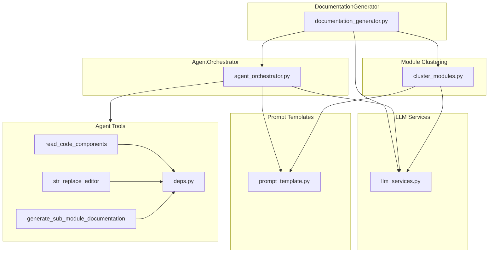

# Agent Backend

The Agent Backend module orchestrates AI agents to generate comprehensive documentation for code repositories. It uses a hierarchical approach with pydantic-ai agents to analyze code, cluster components into modules, and produce structured documentation.

## Architecture



## Core Components

### DocumentationGenerator

The main orchestrator that coordinates the entire documentation generation process.

**Key responsibilities:**
- Build dependency graphs via `DependencyGraphBuilder`
- Cluster components into hierarchical module trees
- Process modules in dependency order (leaf-first using dynamic programming)
- Generate parent module overviews from child documentation
- Create metadata files with generation statistics

**Processing workflow:**
1. Build dependency graph from repository
2. Cluster leaf nodes into module tree
3. Process modules bottom-up (leaves first)
4. Generate repository overview

### AgentOrchestrator

Manages pydantic-ai Agent instances for documentation generation.

**Key responsibilities:**
- Create appropriate agents based on module complexity
- Configure agent tools and system prompts
- Execute agents with proper dependencies
- Handle idempotency (skip if docs already exist)

**Agent types:**
- **Complex modules**: Agents with 3 tools (`read_code_components`, `str_replace_editor`, `generate_sub_module_documentation`)
- **Leaf modules**: Agents with 2 tools (`read_code_components`, `str_replace_editor`)

### cluster_modules

Hierarchical clustering algorithm that groups code components into logical modules.

**Algorithm:**
1. Format potential core components by file
2. Check token count against `max_token_per_module` threshold
3. Call LLM to group components into modules
4. Recursively cluster sub-modules until size threshold is met
5. Build hierarchical module tree with paths and component lists

### LLM Services

Factory for creating configured LLM clients with fallback support.

**Key features:**
- `AutoResponseFixOpenAIModel`: Fixes stringified JSON arrays in tool call arguments (workaround for non-standard APIs like glm-5)
- `FallbackModel`: Chains main model to fallback model for reliability
- Direct OpenAI client for non-agent LLM calls

### Prompt Templates

Comprehensive prompt system for different documentation tasks.

**Prompt types:**
- `SYSTEM_PROMPT`: For complex modules with sub-module generation capability
- `LEAF_SYSTEM_PROMPT`: For simple/leaf modules
- `USER_PROMPT`: Module-specific user prompt with component codes
- `REPO_OVERVIEW_PROMPT`: Repository-level overview generation
- `MODULE_OVERVIEW_PROMPT`: Parent module overview from children
- `CLUSTER_REPO_PROMPT`/`CLUSTER_MODULE_PROMPT`: Component clustering prompts

## Agent Tools

### read_code_components

Reads source code for specified component IDs from the component registry.

**Usage:** Agent uses this to explore dependencies not included in initial context.

### str_replace_editor

File system editor adapted from SWE-agent for documentation file operations.

**Commands:**
- `view`: Display file/directory contents
- `create`: Create new files
- `str_replace`: Replace text in files
- `insert`: Insert text at specific lines
- `undo_edit`: Revert last edit

**Security:** Only `view` command allowed on `repo` working directory; all commands allowed on `docs` directory.

**Mermaid validation:** Automatically validates Mermaid diagram syntax after markdown edits.

### generate_sub_module_documentation

Recursively spawns sub-agents for complex modules.

**Recursion control:**
- Checks `current_depth` against `max_depth` config
- Checks token count against `max_token_per_leaf_module`
- Only recurses if module is complex (multi-file) and exceeds thresholds

### CodeWikiDeps

Dataclass containing all dependencies passed to agents:
- `absolute_docs_path`: Output directory for documentation
- `absolute_repo_path`: Source repository path
- `registry`: File history for undo operations
- `components`: Dictionary of all code components
- `path_to_current_module`: Navigation path in module tree
- `current_module_name`: Active module name
- `module_tree`: Hierarchical module structure
- `max_depth`/`current_depth`: Recursion limits
- `config`: LLM and processing configuration
- `custom_instructions`: Optional user-provided instructions

## Module Complexity Detection

A module is considered **complex** if it spans multiple files:

```python
def is_complex_module(components, core_component_ids):
    files = set()
    for component_id in core_component_ids:
        if component_id in components:
            files.add(components[component_id].file_path)
    return len(files) > 1
```

Complex modules get the `generate_sub_module_documentation` tool; leaf modules do not.

## Token Counting

Uses tiktoken with `gpt-4` encoding to count tokens for:
- Determining if clustering is needed
- Checking if sub-module recursion should continue
- Respecting model context limits

## Utilities

### Mermaid Diagram Validation

Validates Mermaid diagram syntax using:
1. Primary: `mermaid_parser.parser.parse_mermaid_py`
2. Fallback: `mermaid-py` library

Handles parse errors with line number mapping to markdown file locations.

<!-- ORACLE-ENHANCED
Generated by codebase-oracle to validate and enhance CodeWiki output.
Validation timestamp: 2026-02-12
Audience: new engineer, feature owner
Primary tasks: modify agent behavior, add new tools, debug generation
-->

## Oracle Validation

### Validation Status

| Section | Status | Notes |
|---------|--------|-------|
| Components | Validated | All 8 core files analyzed |
| Agent Orchestration | Validated | pydantic-ai Agent with tool registration confirmed |
| LLM Integration | Validated | OpenAI-compatible with fallback chain |
| Module Clustering | Validated | Recursive LLM-based clustering |
| Tool System | Validated | 3 tools with deps injection |
| Prompt System | Validated | 7 prompt templates identified |

### Claim Ledger

| Claim | Evidence | Confidence | Impact |
|-------|----------|------------|--------|
| AgentOrchestrator uses pydantic-ai Agent | `codewiki/src/be/agent_orchestrator.py:1` | ▓▓▓▓▓ | Core dependency |
| Two agent types: complex vs leaf | `codewiki/src/be/agent_orchestrator.py:71-90` | ▓▓▓▓▓ | Architecture decision |
| Complex agents have 3 tools | `codewiki/src/be/agent_orchestrator.py:76-80` | ▓▓▓▓▓ | Tool availability |
| Leaf agents have 2 tools | `codewiki/src/be/agent_orchestrator.py:88` | ▓▓▓▓▓ | Tool availability |
| Idempotent processing (skips existing docs) | `codewiki/src/be/agent_orchestrator.py:119-129` | ▓▓▓▓▓ | Performance feature |
| Uses FallbackModel for reliability | `codewiki/src/be/llm_services.py:111-115` | ▓▓▓▓▓ | Resilience pattern |
| AutoResponseFixOpenAIModel fixes stringified JSON | `codewiki/src/be/llm_services.py:54-78` | ▓▓▓▓▓ | API compatibility |
| Module clustering uses LLM | `codewiki/src/be/cluster_modules.py:61-62` | ▓▓▓▓▓ | Core algorithm |
| Recursive clustering until token threshold | `codewiki/src/be/cluster_modules.py:57-59` | ▓▓▓▓▓ | Hierarchical decomposition |
| str_replace_editor adapted from SWE-agent | `codewiki/src/be/agent_tools/str_replace_editor.py:3-4` | ▓▓▓▓▓ | Attribution |
| Only view allowed on repo directory | `codewiki/src/be/agent_tools/str_replace_editor.py:728` | ▓▓▓▓▓ | Security boundary |
| Mermaid validation after markdown edits | `codewiki/src/be/agent_tools/str_replace_editor.py:769-771` | ▓▓▓▓▓ | Quality check |
| Sub-agent recursion depth controlled | `codewiki/src/be/agent_tools/generate_sub_module_documentations.py:49` | ▓▓▓▓▓ | Safety limit |
| Complexity = multi-file module | `codewiki/src/be/utils.py:15-23` | ▓▓▓▓▓ | Simple heuristic |
| Processing order: leaf-first (DP approach) | `codewiki/src/be/documentation_generator.py:74-92` | ▓▓▓▓▓ | Algorithm design |

### Design Rationale and Trade-offs

**1. pydantic-ai over raw OpenAI**
- **Rationale:** Structured tool calling, type safety, dependency injection
- **Trade-off:** Additional abstraction layer, framework-specific patterns

**2. Recursive sub-agents vs single-pass**
- **Rationale:** Handles large codebases exceeding context limits
- **Trade-off:** Increased LLM calls, potential consistency issues across sub-agent boundaries

**3. Leaf-first processing (dynamic programming)**
- **Rationale:** Parent overviews can reference child documentation
- **Trade-off:** Requires complete module tree upfront, no incremental updates

**4. File-based complexity heuristic**
- **Rationale:** Simple, fast, correlates with actual complexity
- **Trade-off:** May misclassify single-file modules with high internal complexity

**5. AutoResponseFixOpenAIModel**
- **Rationale:** Compatibility with non-standard OpenAI-compatible APIs (glm-5, z.ai)
- **Trade-off:** Maintenance burden, parsing overhead on every response

**6. str_replace_editor over simple file I/O**
- **Rationale:** Rich editing capabilities (view ranges, undo, validation)
- **Trade-off:** Complex codebase (790 lines), SWE-agent dependency

### Failure Modes and Recovery

| Failure | Cause | Detection | Recovery |
|---------|-------|-----------|----------|
| LLM returns invalid clustering format | Missing XML tags | `codewiki/src/be/cluster_modules.py:66-68` | Returns empty dict, skips clustering |
| LLM returns non-dict module tree | Type error | `codewiki/src/be/cluster_modules.py:73-75` | Returns empty dict, skips clustering |
| Component ID not in registry | Stale data | `codewiki/src/be/cluster_modules.py:101-106` | Logs warning, skips invalid node |
| Agent execution error | LLM failure | `codewiki/src/be/agent_orchestrator.py:149-152` | Logs error with traceback, raises |
| Mermaid syntax error | Invalid diagram | `codewiki/src/be/utils.py:127-199` | Reports line number, continues |
| File read encoding error | Binary/non-UTF8 | `codewiki/src/be/agent_tools/str_replace_editor.py:666-684` | Tries 4 encodings, fails gracefully |
| str_replace non-unique match | Ambiguous edit | `codewiki/src/be/agent_tools/str_replace_editor.py:545-555` | Reports line numbers, no change |

### Blast Radius and Safe Change Plan

**Adding a new agent tool:**
1. Create tool function in `agent_tools/` with `RunContext[CodeWikiDeps]` parameter
2. Wrap with `Tool()` specifying `takes_ctx=True`
3. Import and add to agent tool lists in `agent_orchestrator.py:76-80,88`
4. Update system prompts in `prompt_template.py` to document tool
5. **Blast radius:** Tool availability only affects new agent runs

**Modifying prompt templates:**
1. Edit constants in `prompt_template.py:1-198`
2. **Risk:** Changes affect all future documentation generation
3. **Mitigation:** Test with sample repository before deployment
4. **Blast radius:** All modules, all documentation quality

**Changing complexity threshold:**
1. Modify `is_complex_module()` logic in `utils.py:15-23`
2. **Risk:** Misclassification affects tool availability
3. **Blast radius:** Module granularity, sub-agent spawning

**Modifying clustering algorithm:**
1. Changes in `cluster_modules.py` affect module tree structure
2. **Risk:** Poor clustering produces incoherent documentation
3. **Blast radius:** Entire documentation structure
4. **Mitigation:** A/B test clustering on sample repos

**LLM model changes:**
1. Update `Config` model definitions
2. **Risk:** Token counting, API compatibility
3. **Blast radius:** All LLM interactions
4. **Mitigation:** Test `AutoResponseFixOpenAIModel` with new provider

### Unknowns and Verification

| Unknown | Verification Approach | Priority |
|---------|----------------------|----------|
| Optimal `max_token_per_module` threshold | Benchmark on repos of varying sizes | Medium |
| Sub-agent consistency across boundaries | Manual review of parent-child doc coherence | Medium |
| Mermaid parser reliability in production | Monitor validation error rates | Low |
| Token counting accuracy for non-English code | Test with Unicode-heavy repositories | Low |
| Fallback model trigger frequency | Add metrics/logging | Low |
| Clustering quality vs speed trade-off | A/B test different clustering strategies | Medium |

### Confidence Assessment

| Area | Confidence | Rationale |
|------|------------|-----------|
| Agent architecture | ▓▓▓▓▓ | Clear pydantic-ai patterns, well-structured |
| Tool system | ▓▓▓▓░ | 3 tools well-defined, deps injection solid |
| LLM integration | ▓▓▓▓▓ | Fallback chain, response fixing robust |
| Module clustering | ▓▓▓▓░ | Recursive algorithm clear, LLM dependency is risk |
| Prompt engineering | ▓▓▓░░ | Templates extensive but not empirically validated |
| Error handling | ▓▓▓▓░ | Good coverage, some edge cases may be unhandled |
| Documentation workflow | ▓▓▓▓▓ | Leaf-first DP approach is sound |

**Overall Confidence:** ▓▓▓▓░ (High)

The Agent Backend is well-architected with clear separation of concerns. The main risks are:
1. LLM-dependent clustering quality (inherent to approach)
2. Sub-agent recursion depth limits may not suit all repositories
3. Prompt templates lack empirical validation metrics
