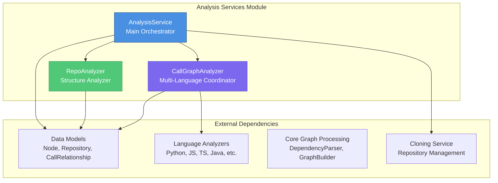
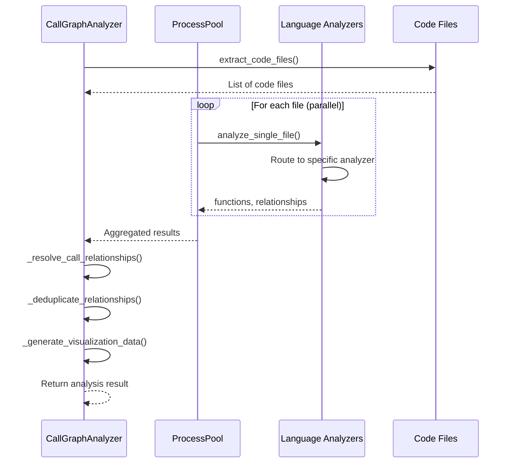
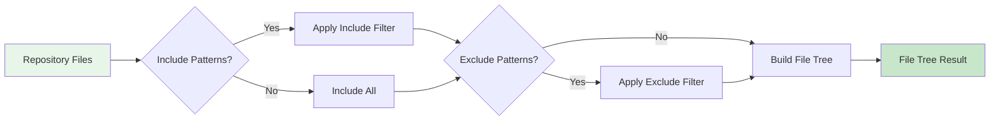
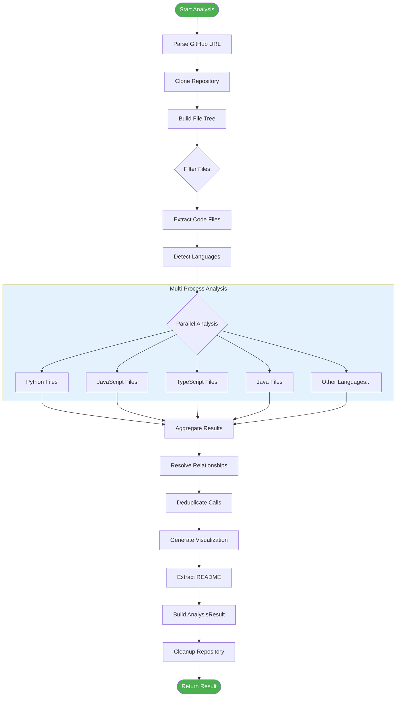
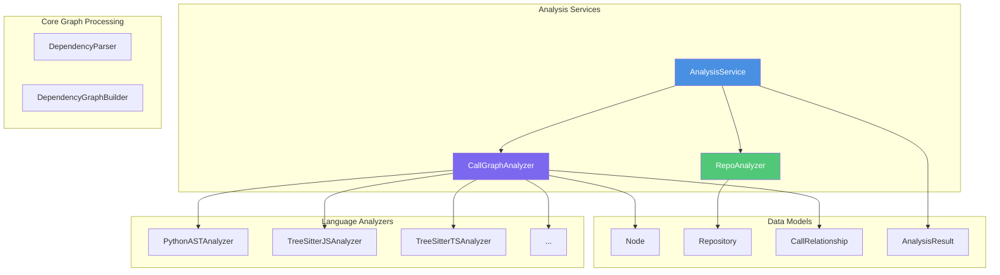

# Analysis Services Module

## Overview

The **Analysis Services** module is the core orchestration layer of the Dependency Analyzer system, responsible for coordinating repository analysis workflows and multi-language call graph generation. This module serves as the central hub that connects repository management, file structure analysis, and language-specific AST parsing into a cohesive analysis pipeline.

## Purpose

The Analysis Services module provides:

- **Centralized Analysis Orchestration**: Coordinates the complete analysis workflow from repository cloning to result generation
- **Multi-Language Support**: Handles 9+ programming languages through a unified interface
- **Scalable Processing**: Utilizes parallel processing for efficient analysis of large codebases
- **Flexible Analysis Modes**: Supports both full analysis with call graphs and lightweight structure-only analysis
- **Resource Management**: Automatic cleanup of temporary resources and repositories

## Architecture

### Module Structure



### Component Relationships

The module consists of three main components that work together to provide comprehensive repository analysis:

| Component | Responsibility | Key Features |
|-----------|---------------|--------------|
| **AnalysisService** | Main orchestration and workflow management | Repository cloning, analysis coordination, resource cleanup |
| **CallGraphAnalyzer** | Multi-language call graph generation | Parallel processing, relationship resolution, visualization data generation |
| **RepoAnalyzer** | File structure analysis and filtering | Pattern-based filtering, file tree generation, size calculation |

## Core Components

### 1. AnalysisService

The `AnalysisService` class is the primary entry point for repository analysis. It orchestrates the entire analysis workflow and manages the lifecycle of temporary resources.

#### Key Features

- **Multi-Language Support**: Supports Python, JavaScript, TypeScript, Java, C#, C, C++, PHP, and Go
- **Flexible Analysis Modes**: Full analysis with call graphs or structure-only lightweight analysis
- **Automatic Resource Management**: Tracks and cleans up temporary directories
- **Security-Conscious**: Safe path handling and repository URL sanitization

#### Main Methods

##### `analyze_repository_full()`
Performs complete repository analysis including:
- Repository cloning
- File structure analysis
- Multi-language AST parsing
- Call graph generation
- README extraction

```python
result = service.analyze_repository_full(
    github_url="https://github.com/user/repo",
    include_patterns=["*.py", "*.js"],
    exclude_patterns=["tests/*"]
)
```

##### `analyze_local_repository()`
Analyzes a local repository folder without cloning:
- Direct file system analysis
- Language filtering support
- File count limiting

```python
result = service.analyze_local_repository(
    repo_path="/path/to/repo",
    max_files=100,
    languages=["python", "javascript"]
)
```

##### `analyze_repository_structure_only()`
Lightweight structure analysis without call graph generation:
- File tree generation
- Pattern-based filtering
- Fast execution for large repositories

### 2. CallGraphAnalyzer

The `CallGraphAnalyzer` coordinates language-specific analyzers to build comprehensive call graphs across multiple programming languages.

#### Analysis Flow



#### Key Features

- **Parallel Processing**: Uses `ProcessPoolExecutor` for concurrent file analysis
- **Language Routing**: Automatically routes files to appropriate language analyzers
- **Relationship Resolution**: Matches function calls to their definitions
- **Deduplication**: Removes duplicate relationships for cleaner graphs
- **Visualization Support**: Generates Cytoscape.js compatible graph data

#### Supported Languages

The analyzer supports the following programming languages through specialized analyzers:

| Language | Analyzer | Implementation |
|----------|----------|----------------|
| Python | `PythonASTAnalyzer` | Native Python AST |
| JavaScript | `TreeSitterJSAnalyzer` | Tree-sitter based |
| TypeScript | `TreeSitterTSAnalyzer` | Tree-sitter based |
| Java | `TreeSitterJavaAnalyzer` | Tree-sitter based |
| C# | `TreeSitterCSharpAnalyzer` | Tree-sitter based |
| C | `TreeSitterCAnalyzer` | Tree-sitter based |
| C++ | `TreeSitterCppAnalyzer` | Tree-sitter based |
| PHP | `TreeSitterPHPAnalyzer` | Tree-sitter based |
| Go | `GoAnalyzer` | Tree-sitter based |

For detailed information about language-specific analyzers, see [Language Analyzers](Language Analyzers.md).

### 3. RepoAnalyzer

The `RepoAnalyzer` provides file structure analysis with intelligent filtering capabilities.

#### Filtering System



#### Pattern Matching

The analyzer supports glob-style patterns for flexible filtering:

**Include Patterns** (whitelist approach):
- `*.py` - All Python files
- `src/**/*.js` - All JavaScript files in src directory
- `README.md` - Specific file

**Exclude Patterns** (blacklist approach):
- `tests/*` - Exclude test directories
- `*.min.js` - Exclude minified files
- `node_modules/*` - Exclude dependencies

#### Security Features

- **Symlink Detection**: Rejects symbolic links to prevent path traversal
- **Path Validation**: Ensures all paths remain within repository boundaries
- **Permission Handling**: Gracefully handles permission errors

## Data Flow

### Complete Analysis Workflow



### Data Models Integration

The Analysis Services module uses the following data models from the [Data Models](Data Models.md) module:

- **Repository**: Stores repository metadata (URL, name, clone path, analysis ID)
- **Node**: Represents code components (functions, methods, classes) with metadata
- **CallRelationship**: Represents function call relationships between nodes
- **AnalysisResult**: Container for complete analysis results

## Usage Examples

### Basic Repository Analysis

```python
from codewiki.src.be.dependency_analyzer.analysis.analysis_service import AnalysisService

# Initialize service
service = AnalysisService()

# Analyze a GitHub repository
result = service.analyze_repository_full(
    github_url="https://github.com/user/repo"
)

# Access results
print(f"Total functions: {len(result.functions)}")
print(f"Total relationships: {len(result.relationships)}")
print(f"Languages found: {result.summary['languages_analyzed']}")
```

### Filtered Analysis with Patterns

```python
# Analyze only Python and JavaScript files, excluding tests
result = service.analyze_repository_full(
    github_url="https://github.com/user/repo",
    include_patterns=["*.py", "*.js", "*.ts"],
    exclude_patterns=["tests/*", "test_*", "*_test.py"]
)
```

### Structure-Only Lightweight Analysis

```python
# Quick structure analysis without call graph
structure = service.analyze_repository_structure_only(
    github_url="https://github.com/user/repo"
)

print(f"Total files: {structure['file_summary']['total_files']}")
print(f"Total size: {structure['file_summary']['total_size_kb']} KB")
```

### Local Repository Analysis

```python
# Analyze local repository
result = service.analyze_local_repository(
    repo_path="/path/to/local/repo",
    max_files=100,
    languages=["python", "javascript"]
)
```

## Performance Considerations

### Parallel Processing

The `CallGraphAnalyzer` leverages Python's `ProcessPoolExecutor` for parallel file analysis:

- **Default Workers**: Uses `os.cpu_count()` or falls back to 4 workers
- **Automatic Fallback**: Gracefully falls back to sequential processing if parallel processing fails
- **Memory Efficiency**: Each process handles a single file to minimize memory footprint

### Optimization Strategies

1. **Shallow Cloning**: Uses `--depth 1` for faster repository cloning
2. **File Filtering**: Early filtering reduces the number of files to analyze
3. **Lazy Loading**: Language analyzers are imported only when needed
4. **Deduplication**: Removes redundant relationships to reduce result size

### Resource Management

```python
# Automatic cleanup on service destruction
service = AnalysisService()
result = service.analyze_repository_full(url)
# Cleanup happens automatically when service is destroyed

# Manual cleanup of all tracked directories
service.cleanup_all()
```

## Integration with Other Modules

### Dependency Graph



### Related Modules

- **[Data Models](Data Models.md)**: Core data structures used throughout the analysis
- **[Language Analyzers](Language Analyzers.md)**: Language-specific AST parsing and analysis
- **[Core Graph Processing](Core Graph Processing.md)**: Dependency graph building and manipulation
- **[Logging Utilities](Logging Utilities.md)**: Colored logging for analysis output

## Error Handling

### Common Errors and Solutions

| Error Type | Cause | Solution |
|------------|-------|----------|
| `RuntimeError: Git executable not found` | Git not installed or not in PATH | Install Git and ensure it's accessible |
| `RuntimeError: Repository cloning timed out` | Large repository or slow network | Use structure-only analysis or increase timeout |
| `RuntimeError: Analysis failed` | Invalid repository URL or access denied | Verify URL and repository permissions |
| `PermissionError` | Insufficient file system permissions | Run with appropriate permissions |

### Graceful Degradation

The module implements graceful degradation:

1. **Parallel Processing Failure**: Falls back to sequential processing
2. **Language Analyzer Import Failure**: Logs error and continues with other files
3. **File Read Errors**: Skips problematic files and continues analysis

## Visualization Output

### Cytoscape.js Format

The `CallGraphAnalyzer` generates visualization data compatible with Cytoscape.js:

```javascript
{
  "cytoscape": {
    "elements": [
      {
        "data": {
          "id": "func_id",
          "label": "function_name",
          "file": "path/to/file.py",
          "type": "function",
          "language": "python"
        },
        "classes": "node-function lang-python"
      },
      {
        "data": {
          "id": "caller->callee",
          "source": "caller_id",
          "target": "callee_id",
          "line": 42
        },
        "classes": "edge-call"
      }
    ]
  },
  "summary": {
    "total_nodes": 150,
    "total_edges": 230,
    "unresolved_calls": 15
  }
}
```

### LLM-Optimized Format

The module also provides a cleaner format optimized for LLM consumption:

```python
llm_format = analyzer.generate_llm_format()
# Returns simplified structure with function purposes, parameters, and call relationships
```

## Best Practices

1. **Use Structure-Only for Initial Exploration**: Run lightweight structure analysis first to understand repository size and composition
2. **Apply Pattern Filters**: Use include/exclude patterns to focus analysis on relevant code
3. **Limit File Count for Large Repositories**: Use `max_files` parameter for very large repositories
4. **Handle Cleanup**: Allow automatic cleanup or manually call `cleanup_all()` for long-running processes
5. **Check Language Support**: Verify target languages are supported before full analysis

## Configuration

The module uses default patterns from the utility modules:

- **Default Include Patterns**: Defined in `codewiki.src.be.dependency_analyzer.utils.patterns`
- **Default Exclude Patterns**: Includes common exclusions like `node_modules`, `.git`, `__pycache__`, etc.
- **Code Extensions**: Maps file extensions to languages for automatic language detection

## Summary

The Analysis Services module is a sophisticated orchestration layer that transforms raw repository code into structured, analyzable data. By coordinating repository management, file structure analysis, and multi-language call graph generation, it provides a comprehensive foundation for code analysis and documentation generation workflows throughout the CodeWiki system.

### Key Strengths

✅ **Multi-Language Support** - Handles 9+ programming languages through a unified interface  
✅ **Scalable Architecture** - Parallel processing for efficient large-scale analysis  
✅ **Flexible Filtering** - Pattern-based include/exclude for targeted analysis  
✅ **Resource Management** - Automatic cleanup and lifecycle management  
✅ **Visualization Ready** - Generates graph data for multiple visualization formats  
✅ **Error Resilient** - Graceful degradation and comprehensive error handling
