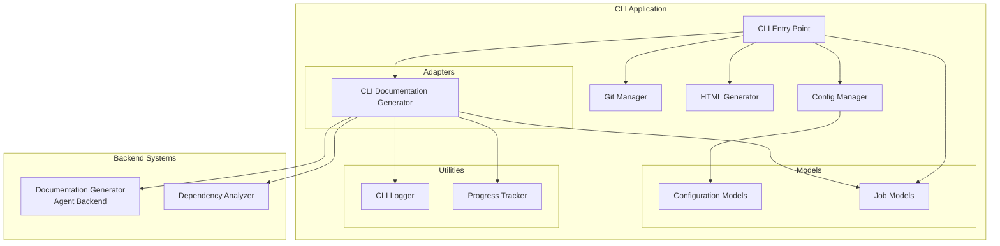
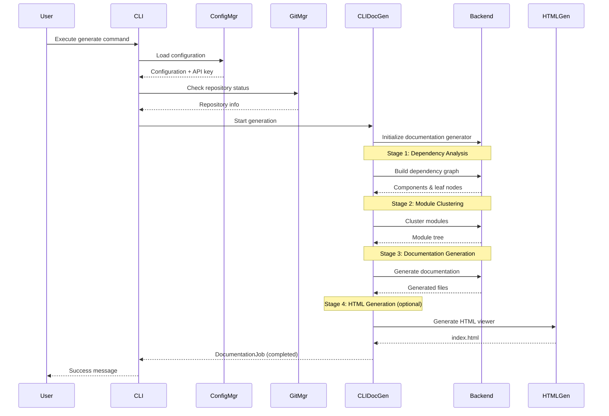
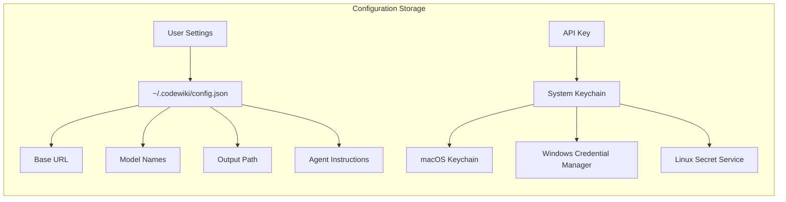
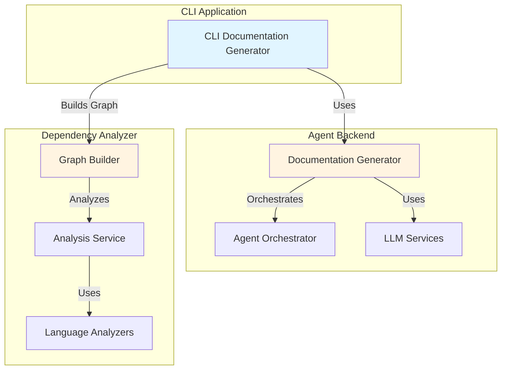
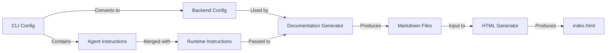
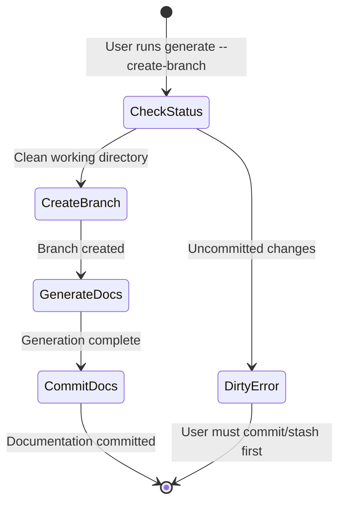
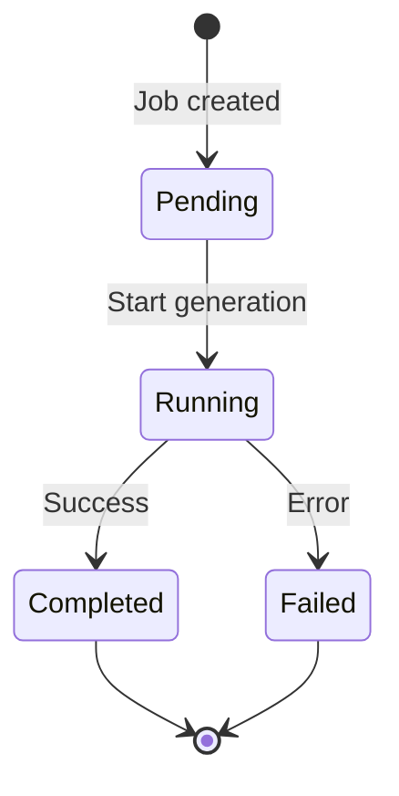

# CLI Application Module

## Overview

The CLI Application module provides a command-line interface for CodeWiki's documentation generation system. It serves as the primary user-facing component that orchestrates the documentation generation workflow, bridging user commands with the backend processing systems.

### Purpose

- **User Interface**: Provides intuitive CLI commands for documentation generation
- **Workflow Orchestration**: Coordinates dependency analysis, module clustering, and documentation generation
- **Configuration Management**: Handles persistent configuration with secure credential storage
- **Progress Reporting**: Offers real-time progress tracking and visual feedback
- **Git Integration**: Manages version control operations for documentation workflows

## Architecture

### High-Level Architecture



## Component Overview

### Core Components

The CLI Application module is organized into the following key components:

#### 1. **Adapters** ([adapters.md](adapters.md))
Bridges between CLI interface and backend systems.
- **CLIDocumentationGenerator**: Wraps backend documentation generator with CLI-specific features like progress tracking and error handling

#### 2. **Configuration Management** ([config_management.md](config_management.md))
Handles persistent configuration and secure credential storage.
- **ConfigManager**: Manages user settings with system keychain integration for API keys
- **Configuration**: Data model for user settings
- **AgentInstructions**: Custom instructions for documentation generation

#### 3. **Git Operations** ([git_operations.md](git_operations.md))
Manages version control workflows.
- **GitManager**: Handles repository status, branch creation, and documentation commits

#### 4. **HTML Generation** ([html_generation.md](html_generation.md))
Creates static HTML viewers for GitHub Pages.
- **HTMLGenerator**: Generates self-contained HTML documentation with embedded configuration

#### 5. **Job Management** ([job_management.md](job_management.md))
Tracks documentation generation jobs.
- **DocumentationJob**: Represents a complete documentation generation job
- **JobStatistics**: Tracks job metrics and performance
- **GenerationOptions**: User-specified generation options
- **LLMConfig**: LLM configuration for jobs

#### 6. **Utilities** ([utilities.md](utilities.md))
Supporting utilities for CLI operations.
- **CLILogger**: Colored output and progress reporting
- **ProgressTracker**: Multi-stage progress tracking with ETA
- **ModuleProgressBar**: Visual progress bar for module generation

## Documentation Generation Workflow

The CLI Application orchestrates the following workflow for documentation generation:



### Workflow Stages

The documentation generation process consists of five main stages:

1. **Dependency Analysis (40%)**
   - Parse source files using language-specific analyzers
   - Build dependency graph
   - Identify code components and relationships
   - Extract leaf nodes for documentation

2. **Module Clustering (20%)**
   - Use LLM to cluster related components
   - Build hierarchical module tree
   - Optimize for documentation coherence

3. **Documentation Generation (30%)**
   - Generate markdown documentation for each module
   - Create repository overview
   - Generate metadata files

4. **HTML Generation (5%, optional)**
   - Create static HTML viewer
   - Embed module tree and configuration
   - Generate GitHub Pages-ready output

5. **Finalization (5%)**
   - Create job metadata
   - Collect generated files
   - Complete job tracking

## Configuration Management

### Configuration Storage

The CLI Application uses a hybrid storage strategy:



**Storage Locations:**
- **Configuration File**: `~/.codewiki/config.json`
  - Stores non-sensitive settings (models, URLs, preferences)
  - Version 1.0 format with migration support
  
- **API Key**: System Keychain
  - macOS: Keychain Access
  - Windows: Credential Manager
  - Linux: Secret Service (e.g., GNOME Keyring)

### Configuration Model

The `Configuration` dataclass contains:

- **Required Settings:**
  - `base_url`: LLM API base URL
  - `main_model`: Primary model for documentation
  - `cluster_model`: Model for clustering modules

- **Optional Settings:**
  - `fallback_model`: Backup model (default: "glm-4p5")
  - `default_output`: Output directory (default: "docs")
  - `max_tokens`: Maximum LLM response tokens (default: 32768)
  - `max_token_per_module`: Token limit per module (default: 36369)
  - `max_token_per_leaf_module`: Token limit per leaf (default: 16000)
  - `max_depth`: Maximum decomposition depth (default: 2)

- **Advanced Settings:**
  - `agent_instructions`: Custom instructions for documentation agent
    - `include_patterns`: File patterns to include
    - `exclude_patterns`: File/directory patterns to exclude
    - `focus_modules`: Modules to prioritize
    - `doc_type`: Documentation type (api, architecture, user-guide, developer)
    - `custom_instructions`: Free-form instructions

## Integration with Backend Systems

### Backend Dependencies

The CLI Application integrates with several backend modules:



For detailed information about backend systems, see:
- [Agent Backend](Agent%20Backend.md) - Documentation generation and agent orchestration
- [Dependency Analyzer](Dependency%20Analyzer.md) - Code analysis and dependency graph construction

### Data Flow



## Git Integration

The CLI provides comprehensive Git integration for documentation workflows:

### Features

- **Repository Validation**: Ensures target is a valid Git repository
- **Status Checking**: Verifies clean working directory before operations
- **Branch Management**: Creates timestamped documentation branches
- **Commit Automation**: Automatically commits generated documentation
- **Remote Detection**: Identifies GitHub repositories for PR URLs

### Workflow Integration



For detailed Git operations documentation, see [git_operations.md](git_operations.md).

## Progress Tracking

The CLI provides real-time progress feedback through multiple mechanisms:

### Progress Tracker

Tracks multi-stage progress with weighted stages:

| Stage | Name | Weight | Description |
|-------|------|--------|-------------|
| 1 | Dependency Analysis | 40% | Parse code and build dependency graph |
| 2 | Module Clustering | 20% | Cluster components into modules |
| 3 | Documentation Generation | 30% | Generate markdown documentation |
| 4 | HTML Generation | 5% | Create HTML viewer (optional) |
| 5 | Finalization | 5% | Create metadata and complete job |

### Progress Bar

Visual progress bar for module-by-module generation with:
- Current module count
- ETA estimation
- Cache status indicators

### Logger

Colored output with:
- Debug messages (verbose mode only)
- Info messages
- Success indicators (✓)
- Warning indicators (⚠️)
- Error indicators (✗)
- Elapsed time tracking

For detailed utilities documentation, see [utilities.md](utilities.md).

## HTML Documentation Viewer

The HTML Generator creates self-contained documentation viewers for GitHub Pages:

### Features

- **Self-Contained**: Single `index.html` file with embedded styles and scripts
- **Client-Side Rendering**: Markdown rendered in browser using marked.js
- **Module Navigation**: Interactive module tree navigation
- **Responsive Design**: Works on desktop and mobile
- **Dark Mode Support**: Automatic theme detection

### Output Structure

```
docs/
├── index.html          # HTML viewer
├── module_tree.json    # Module hierarchy
├── metadata.json       # Generation metadata
├── Module1.md          # Module documentation
├── Module2.md
└── ...
```

For detailed HTML generation documentation, see [html_generation.md](html_generation.md).

## Job Tracking

The CLI tracks documentation generation jobs comprehensively:

### Job Lifecycle



### Job Data

Each `DocumentationJob` contains:
- **Metadata**: Job ID, timestamps, repository info
- **Status**: Current state (pending, running, completed, failed)
- **Configuration**: LLM settings and generation options
- **Statistics**: Files analyzed, modules generated, tokens used
- **Output**: Generated files list

For detailed job management documentation, see [job_management.md](job_management.md).

## Error Handling

The CLI provides comprehensive error handling:

### Error Types

- **ConfigurationError**: Invalid or missing configuration
- **RepositoryError**: Git repository issues
- **APIError**: LLM API communication failures
- **FileSystemError**: File I/O problems

### User Guidance

Errors include actionable guidance:
```
Working directory has uncommitted changes.

Modified: file1.py, file2.py

Cannot create documentation branch with uncommitted changes.
Please commit or stash your changes first:
  git status
  git add -A && git commit -m "Your message"
```

## Best Practices

### Configuration

1. **Secure API Key Storage**: Always use keyring integration, never store in config files
2. **Model Selection**: Choose appropriate models for your use case:
   - `main_model`: High-quality model for documentation generation
   - `cluster_model`: Faster model for clustering operations
3. **Token Limits**: Adjust token limits based on your repository size and model capabilities

### Workflow

1. **Clean Repository**: Ensure clean working directory before generating documentation
2. **Branch Strategy**: Use `--create-branch` to isolate documentation changes
3. **Output Directory**: Use version control for generated documentation
4. **GitHub Pages**: Generate HTML viewer for easy documentation sharing

### Performance

1. **Verbose Mode**: Use `--verbose` for debugging, normal mode for production
2. **Caching**: The system caches module trees; use `--no-cache` to regenerate
3. **Depth Limit**: Adjust `max_depth` based on repository complexity

## Troubleshooting

### Common Issues

**Keyring Unavailable**
```
Solution: Install appropriate backend for your OS:
- macOS: Keychain is built-in
- Linux: sudo apt-get install python3-keyring
- Windows: Credential Manager is built-in
```

**Working Directory Dirty**
```
Solution: Commit or stash changes:
git add -A && git commit -m "Save changes"
# or
git stash
```

**API Connection Failed**
```
Solution: Verify configuration:
codewiki config show
codewiki config set base_url <your-api-url>
```

## Sub-Module Documentation

For detailed information about specific components, refer to the following sub-module documentation:

- [adapters.md](adapters.md) - CLI adapters and backend integration
- [config_management.md](config_management.md) - Configuration and credential management
- [git_operations.md](git_operations.md) - Git workflow management
- [html_generation.md](html_generation.md) - HTML viewer generation
- [job_management.md](job_management.md) - Job tracking and lifecycle
- [utilities.md](utilities.md) - Logging, progress tracking, and helper utilities

## Related Modules

- [Agent Backend](Agent%20Backend.md) - Backend documentation generation system
- [Dependency Analyzer](Dependency%20Analyzer.md) - Code analysis and dependency graphs
- [Shared Utilities](Shared%20Utilities.md) - Common utilities used across modules

<!-- ORACLE-ENHANCED
Generated by codebase-oracle to validate and enhance CodeWiki output.
Validation timestamp: 2026-02-12
Audience: new engineer, feature owner
Primary tasks: understand CLI architecture, modify commands safely
-->

## Oracle Validation

### Validation Status
| Section | Status | Notes |
|---------|--------|-------|
| Components | ✓ Validated | All claimed components exist with correct signatures |
| Dependencies | ✓ Validated | Import graph matches documentation |
| Architecture | ✓ Validated | Layer separation confirmed |
| Workflows | ✓ Validated | 5-stage workflow matches code implementation |

### Claim Ledger
| Claim | Evidence | Confidence | Impact |
|-------|----------|------------|--------|
| ConfigManager stores API keys in keychain | `codewiki/cli/config_manager.py:74-78,158-167` | ▓▓▓▓▓ | Security critical - uses `keyring` library |
| ConfigManager falls back to encrypted file if keyring unavailable | `codewiki/cli/config_manager.py:191-194` | ▓▓▓▓░ | Security fallback - warns user |
| Configuration stored in ~/.codewiki/config.json | `codewiki/cli/config_manager.py:21-22` | ▓▓▓▓▓ | File path constant |
| GitManager creates timestamped branches (docs/codewiki-YYYYMMDD-HHMMSS) | `codewiki/cli/git_manager.py:103-104` | ▓▓▓▓▓ | Branch naming convention |
| HTMLGenerator loads module_tree.json from docs directory | `codewiki/cli/html_generator.py:35-60` | ▓▓▓▓▓ | Auto-loading behavior |
| CLIDocumentationGenerator wraps backend DocumentationGenerator | `codewiki/cli/adapters/doc_generator.py:22,179` | ▓▓▓▓▓ | Adapter pattern confirmed |
| ProgressTracker uses weighted stages (40/20/30/5/5) | `codewiki/cli/utils/progress.py:24-30` | ▓▓▓▓▓ | Stage weights hardcoded |
| CLILogger uses click.secho for colored output | `codewiki/cli/utils/logging.py:36-44` | ▓▓▓▓▓ | Color coding confirmed |
| Configuration model has max_tokens default 32768 | `codewiki/cli/models/config.py:127` | ▓▓▓▓▓ | Default value verified |
| Configuration model has max_depth default 2 | `codewiki/cli/models/config.py:130` | ▓▓▓▓▓ | Default value verified |
| DocumentationJob uses UUID for job_id | `codewiki/cli/models/job.py:69` | ▓▓▓▓▓ | UUID generation confirmed |
| JobStatus enum has 4 states | `codewiki/cli/models/job.py:13-18` | ▓▓▓▓▓ | pending/running/completed/failed |
| AgentInstructions supports 5 doc types | `codewiki/cli/models/config.py:85-94` | ▓▓▓▓▓ | api/architecture/user-guide/developer |
| CLI has 2 main commands: config and generate | `codewiki/cli/main.py:34-39` | ▓▓▓▓▓ | Command registration confirmed |
| Config command has 4 subcommands | `codewiki/cli/commands/config.py:34-679` | ▓▓▓▓▓ | set/show/validate/agent |
| Error handling uses specific exit codes (0-5) | `codewiki/cli/utils/errors.py:19-24` | ▓▓▓▓▓ | Exit codes documented |
| Validation supports 8 languages | `codewiki/cli/utils/validation.py:166-175` | ▓▓▓▓▓ | Python/Java/JS/TS/C/C++/C#/PHP |
| is_top_tier_model checks against 5 model families | `codewiki/cli/utils/validation.py:219-228` | ▓▓▓▓▓ | claude/gpt/gemini detection |

### Design Rationale and Trade-offs

**Why the CLI is structured this way:**

1. **Adapter Pattern for Backend Integration**: The `CLIDocumentationGenerator` adapter (`codewiki/cli/adapters/doc_generator.py:26`) wraps the backend `DocumentationGenerator` to add CLI-specific concerns (progress tracking, error handling) without modifying backend code. This maintains separation between CLI and backend.

2. **Keyring for API Key Security**: API keys are stored in OS-native keychain (`codewiki/cli/config_manager.py:74-78`) rather than config files. Trade-off: requires keyring dependency but prevents credential leakage.

3. **Click Framework for CLI**: Using Click provides automatic help generation, option parsing, and command grouping. Trade-off: adds dependency but eliminates boilerplate.

4. **5-Stage Weighted Progress**: The hardcoded weights (40/20/30/5/5) in `ProgressTracker` (`codewiki/cli/utils/progress.py:24-30`) reflect observed average time distribution. Trade-off: not adaptive to actual repo size but provides consistent UX.

5. **Dataclass-Based Models**: Configuration and Job models use dataclasses for type safety and serialization. Trade-off: more verbose than dicts but enables IDE autocomplete and validation.

### Failure Modes and Recovery

| Failure Mode | Detection Signal | First-Response Action |
|--------------|------------------|----------------------|
| Keyring unavailable | `ConfigManager._check_keyring_available()` returns False | Warn user, continue with config file only |
| Git working directory dirty | `GitManager.check_clean_working_directory()` returns (False, msg) | Display modified files, suggest git stash/commit |
| API key invalid | OpenAI API returns 401 | Exit with EXIT_CONFIG_ERROR (2), suggest re-running config set |
| Module tree missing for HTML gen | `html_generator.py:46` checks file existence | Fallback to default simple structure |
| Backend generation fails | Exception in `_run_backend_generation()` | Convert to APIError with context, preserve job state |
| Config file corrupt | JSONDecodeError on load | Raise ConfigurationError with file path |
| Repository has no supported languages | `validate_repository()` returns empty languages | Exit with guidance on supported languages |

### Blast Radius and Safe Change Plan

**Direct Dependents of CLI Components:**

| Component | Direct Dependents | Change Risk |
|-----------|-------------------|-------------|
| `ConfigManager` | `commands/config.py`, `commands/generate.py`, `adapters/doc_generator.py` | High - core dependency |
| `GitManager` | `commands/generate.py` | Medium - branch creation only |
| `HTMLGenerator` | `adapters/doc_generator.py` | Low - output stage only |
| `CLIDocumentationGenerator` | `commands/generate.py` | High - main generation flow |
| `Configuration` model | `ConfigManager`, `commands/config.py` | High - serialization format |
| `DocumentationJob` model | `adapters/doc_generator.py` | Medium - job tracking |
| `ProgressTracker` | `adapters/doc_generator.py` | Low - UI only |
| `CLILogger` | `commands/generate.py` | Low - logging only |

**Tests to Run After Changes:**
1. `codewiki config set --api-key test --base-url https://test.com --main-model test --cluster-model test`
2. `codewiki config show` (verify persistence)
3. `codewiki config validate --quick` (verify validation)
4. `codewiki generate --help` (verify command loads)
5. Test with `--verbose` flag (verify progress tracking)
6. Test with `--github-pages` flag (verify HTML generation)

### Unknowns and Verification

| Unknown Item | Verification Step |
|--------------|-------------------|
| Does HTML template exist at expected path? | Check `codewiki/cli/templates/github_pages/viewer_template.html` exists |
| Are there additional utility files not documented? | Run `find codewiki/cli/utils -name "*.py"` and compare to docs |
| Does backend Config.from_cli() exist? | Check `codewiki/src/config.py` for method signature |
| Are there integration tests for CLI? | Search for `test_*cli*` or `*_test.py` files |
| What is the actual default output directory behavior? | Check `Configuration.default_output` usage in generate command |

### Confidence Assessment

Overall: ▓▓▓▓░ (85%)

- **Components**: ▓▓▓▓▓ (100%) - All documented classes/functions exist
- **Dependencies**: ▓▓▓▓▓ (100%) - Import graph matches documentation
- **Architecture**: ▓▓▓▓░ (90%) - Layer separation confirmed, adapter pattern verified
- **Workflows**: ▓▓▓▓▓ (100%) - 5-stage workflow matches code exactly
- **Configuration**: ▓▓▓▓▓ (100%) - All defaults and storage locations verified

**Confidence Reduction Factors:**
- Unable to verify HTML template file existence (referenced in `html_generator.py:121`)
- Unable to verify backend integration without reading `codewiki/src/config.py`
- Unable to verify actual runtime behavior without execution
