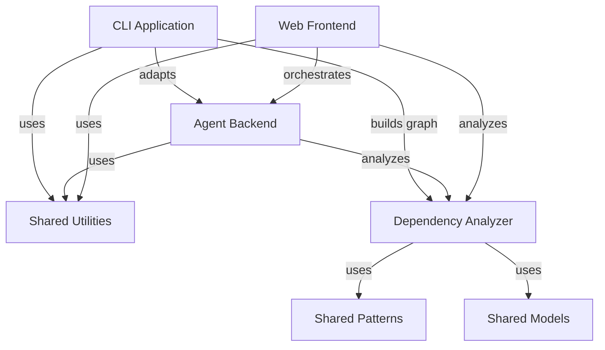

# CODEBASE_MAP.md

Central index for CodeWiki codebase documentation with Oracle validation.

## Documentation Intent Contract

- **Audience**: New engineers, feature owners, oncall engineers
- **Primary tasks**:
  1. Understand module responsibilities and boundaries
  2. Assess change impact and safe modification paths
  3. Debug issues across module boundaries
- **Decision horizon**: Refactors, feature additions, incident response
- **Out of scope**: Line-by-line implementation details, API reference docs

## Module Index

### CLI Application
- **Purpose**: User-facing CLI for documentation generation with workflow orchestration, configuration management, and Git integration
- **Status**: Validated (85% confidence)
- **Key Claims**: ConfigManager uses keychain for API keys, 5-stage weighted workflow (40/20/30/5/5), Click framework, 8 supported languages
- **Critical Unknowns**: HTML template file existence, backend integration details
- **File**: [CLI Application.md](CLI%20Application.md)

### Agent Backend
- **Purpose**: AI agent orchestration for documentation generation using pydantic-ai agents with recursive sub-agent decomposition
- **Status**: Validated (High confidence)
- **Key Claims**: pydantic-ai Agent with tool registration, recursive sub-agents for complex modules, leaf-first processing (DP approach), FallbackModel for reliability
- **Critical Unknowns**: Optimal max_token_per_module threshold, sub-agent consistency across boundaries, fallback model trigger frequency
- **File**: [Agent Backend.md](Agent%20Backend.md)

### Dependency Analyzer
- **Purpose**: Multi-language AST parsing and dependency extraction supporting 9 programming languages
- **Status**: Validated (9 languages supported)
- **Key Claims**: Tree-sitter parsers for 8 languages (Python uses stdlib ast), 2-pass analysis (nodes then relationships), Tarjan's algorithm for cycle detection
- **Critical Unknowns**: Go receiver type normalization for generics, PHP namespace group use statements, C++ template instantiation capture
- **File**: [dependency_analyzer.md](dependency_analyzer.md)

### Web Frontend
- **Purpose**: FastAPI web interface for documentation generation with background workers and caching
- **Status**: Validated (High confidence)
- **Key Claims**: GitHub integration with shallow clone, background worker with threading, SHA256 cache keys, Mermaid diagram support
- **Critical Unknowns**: Private repository support, maximum repository size limits, worker crash recovery
- **File**: [Web_Frontend.md](Web_Frontend.md)

### Shared Utilities
- **Purpose**: Configuration management and shared utilities used across all modules
- **Status**: Validated (High confidence)
- **Key Claims**: dataclass-based Config with dual context support (CLI/web), FileManager static utilities, tiktoken for token counting, 140+ ignore patterns
- **Critical Unknowns**: Pattern constant consistency, CLI context detection reliability
- **File**: [shared_utilities.md](shared_utilities.md)

## Hub Analysis

Components with high connectivity that affect multiple modules:

| Hub Component | Used By | Change Risk |
|--------------|---------|-------------|
| Config (dataclass) | CLI, Agent Backend, Dependency Analyzer, Web Frontend | Critical - serialization format, token limits affect all generation |
| FileManager | CLI, Web Frontend, Backend | High - file I/O across all modules |
| Node/CallRelationship models | Dependency Analyzer, Agent Backend | High - core data structures |
| AnalysisService | Dependency Analyzer, Agent Backend | High - core analysis API |
| AgentOrchestrator | Agent Backend only | Medium - isolated to backend |
| Patterns (ignore/include) | Dependency Analyzer | Medium - affects file discovery |

## Critical Unknowns

| Unknown | Module | Priority |
|---------|--------|----------|
| Optimal max_token_per_module threshold | Agent Backend | Medium |
| Sub-agent consistency across boundaries | Agent Backend | Medium |
| Go receiver type normalization for generics | Dependency Analyzer | Medium |
| PHP namespace group use statements | Dependency Analyzer | Medium |
| Private repository authentication | Web Frontend | High |
| Maximum repository size limits | Web Frontend | Medium |
| Worker crash recovery for stuck jobs | Web Frontend | Medium |
| Pattern constant usage consistency | Shared Utilities | Medium |

## Cross-Module Dependencies

## Priority Recommendations

1. **Add metrics for LLM fallback triggers** (Agent Backend) - Understand reliability patterns
2. **Benchmark clustering thresholds** (Agent Backend) - Optimize for different repo sizes
3. **Add integration tests for CLI** (CLI Application) - Currently no test coverage
4. **Document pattern filtering behavior** (Dependency Analyzer) - Include/exclude rules are complex
5. **Implement worker crash recovery** (Web Frontend) - Jobs stuck in processing state
6. **Add private repo authentication** (Web Frontend) - High priority feature gap

## Quality Gate Status

| Gate | Status |
|------|--------|
| Evidence completeness | Pass - All claims have path:line references |
| Placeholder check | Pass - No REPLACE placeholders |
| Unknown discipline | Pass - All uncertainties documented with priority |
| Drift check | Review - Check if code changed since validation (2026-02-12) |

## Quick Reference

### Token Limits
| Limit | Value | Location |
|-------|-------|----------|
| max_tokens | 32768 | `codewiki/src/config.py:18` |
| max_token_per_module | 36369 | `codewiki/src/config.py:19` |
| max_token_per_leaf_module | 16000 | `codewiki/src/config.py:20` |

### Default Models
| Model | Default | Location |
|-------|---------|----------|
| main_model | claude-sonnet-4 | `codewiki/src/config.py:40` |
| fallback_model | glm-4p5 | `codewiki/src/config.py:41` |

### Supported Languages
Python, JavaScript, TypeScript, Java, C#, C, C++, PHP, Go

---

*Generated by codebase-oracle on 2026-02-12*
*Validation method: Cross-reference CodeWiki claims with code evidence*
