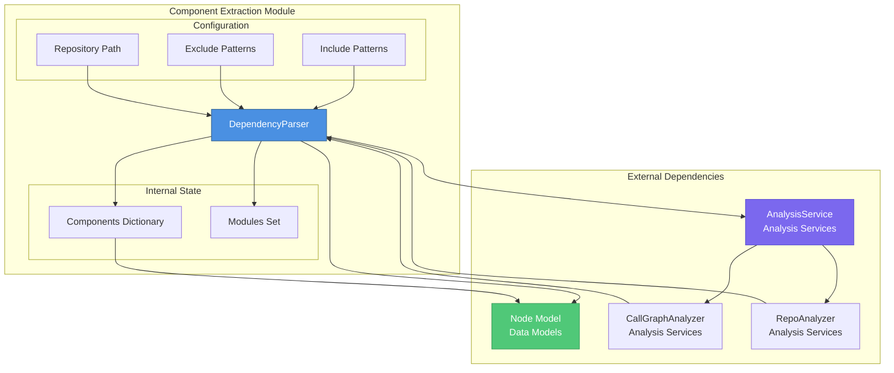
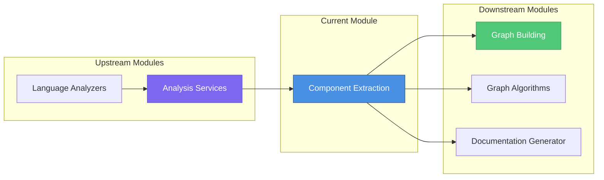
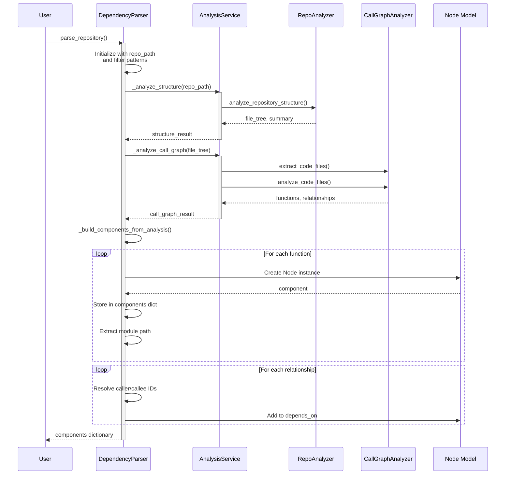
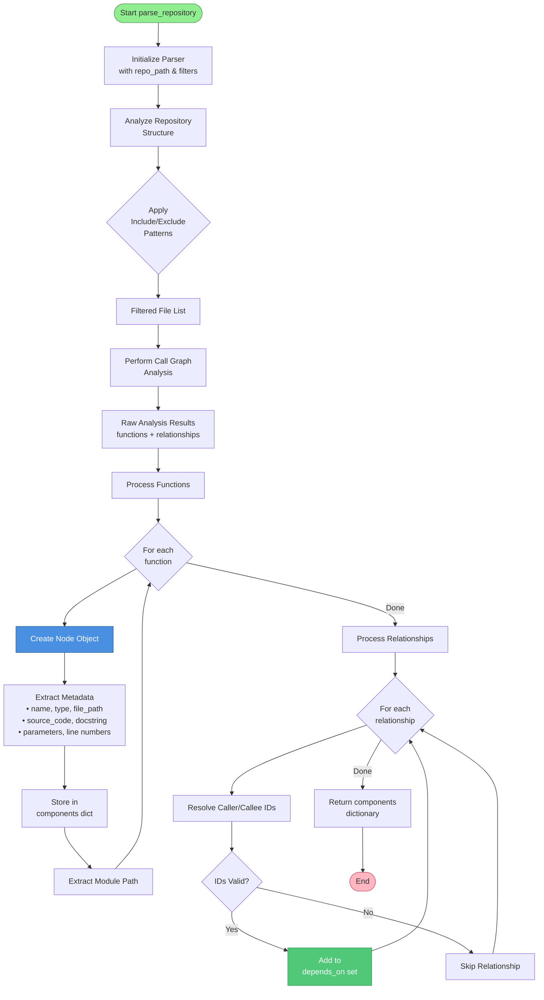
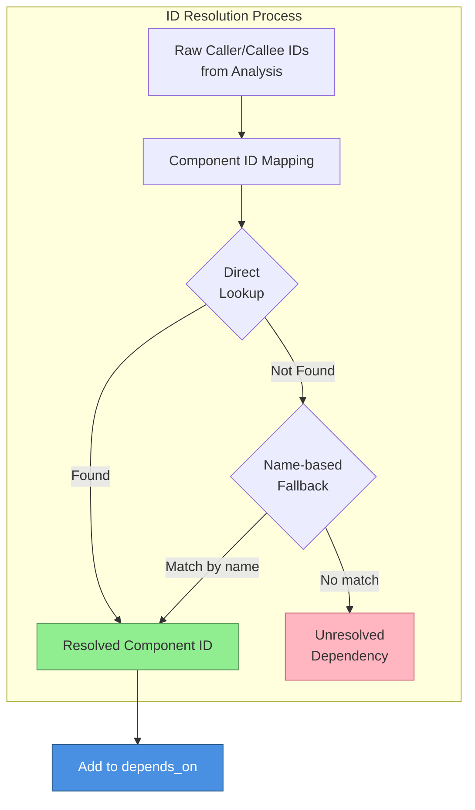
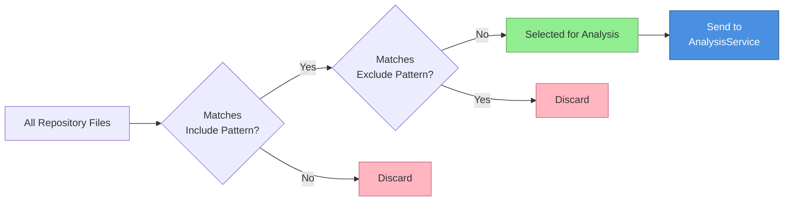
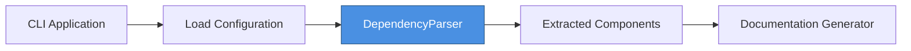

# Component Extraction Module

## Overview

The **Component Extraction** module is a core component of the Dependency Analyzer system responsible for parsing multi-language code repositories and extracting structural code components (functions, methods, classes, etc.) along with their dependency relationships. This module serves as the foundational layer for building comprehensive code dependency graphs.

The module bridges the gap between raw source code and structured, analyzable data models by leveraging the [Analysis Services](Analysis Services.md) for multi-language AST parsing and producing standardized [Data Models - Core Models](Data Models - Core Models.md) that can be consumed by downstream modules like [Graph Building](Graph Building.md) and [Graph Algorithms](Graph Algorithms.md).

---

## Core Component

### DependencyParser

**Location**: `codewiki.src.be.dependency_analyzer.ast_parser.DependencyParser`

The `DependencyParser` class is the primary entry point for component extraction. It orchestrates the complete workflow of:
1. Repository scanning with configurable filtering
2. Multi-language code analysis via [Analysis Services](Analysis Services.md)
3. Component model construction using [Node](Data Models - Core Models.md#node) entities
4. Dependency relationship extraction
5. Dependency graph serialization

#### Key Capabilities

- **Multi-Language Support**: Extracts components from Python, JavaScript, TypeScript, Java, C#, C, C++, PHP, and Go repositories
- **Flexible Filtering**: Configurable include/exclude patterns for fine-grained control over which files to analyze
- **Rich Metadata Extraction**: Captures source code, docstrings, parameters, class hierarchies, and line information
- **Dependency Tracking**: Identifies and records caller-callee relationships between components
- **Module Organization**: Automatically organizes components into logical module hierarchies

---

## Architecture

### Component Structure



### Integration Architecture



---

## Extraction Workflow

### Processing Pipeline



### Component Extraction Process



---

## Component Model

### Node Structure

The extraction process creates `Node` instances with the following structure (see [Data Models - Core Models](Data Models - Core Models.md#node) for complete reference):

| Field | Type | Description | Example |
|-------|------|-------------|---------|
| `id` | str | Unique component identifier | `"src.utils.helpers.calculate_sum"` |
| `name` | str | Component name | `"calculate_sum"` |
| `component_type` | str | Type of component | `"function"`, `"method"`, `"class"` |
| `file_path` | str | Absolute file path | `"/repo/src/utils/helpers.py"` |
| `relative_path` | str | Path relative to repo root | `"src/utils/helpers.py"` |
| `depends_on` | Set[str] | IDs of dependencies | `{"src.utils.validators.check_input"}` |
| `source_code` | Optional[str] | Full source code | `"def calculate_sum(..."` |
| `start_line` | int | Starting line number | `42` |
| `end_line` | int | Ending line number | `55` |
| `has_docstring` | bool | Has documentation | `True` |
| `docstring` | str | Documentation text | `"Calculates the sum..."` |
| `parameters` | Optional[List[str]] | Function parameters | `["a", "b"]` |
| `node_type` | Optional[str] | AST node type | `"function"`, `"class"` |
| `base_classes` | Optional[List[str]] | Parent classes | `["BaseCalculator"]` |
| `class_name` | Optional[str] | Containing class | `"Calculator"` |
| `display_name` | Optional[str] | Display-friendly name | `"Calculator.calculate_sum"` |

---

## Dependency Resolution

### ID Mapping Strategy



The module uses a two-tier resolution strategy:

1. **Direct ID Mapping**: Matches IDs from the analysis results to component IDs
2. **Name-based Fallback**: Searches for components by name when direct ID lookup fails

This ensures maximum dependency detection even when analysis results use inconsistent identifier formats.

---

## Configuration & Filtering

### Include/Exclude Patterns

The `DependencyParser` supports flexible file filtering through glob patterns:

```python
# Include only specific file types
include_patterns = ["*.py", "*.js", "*.ts"]

# Exclude test files and generated code
exclude_patterns = ["*Test*", "*test*", "*generated*", "*/vendor/*"]
```

### Pattern Application Flow



---

## Multi-Language Support

The module inherits multi-language capabilities from [Analysis Services](Analysis Services.md) and supports:

| Language | Analyzer Component | File Extensions |
|----------|-------------------|-----------------|
| Python | PythonASTAnalyzer | `.py` |
| JavaScript | TreeSitterJSAnalyzer | `.js`, `.jsx`, `.mjs`, `.cjs` |
| TypeScript | TreeSitterTSAnalyzer | `.ts`, `.tsx` |
| Java | TreeSitterJavaAnalyzer | `.java` |
| C# | TreeSitterCSharpAnalyzer | `.cs` |
| C | TreeSitterCAnalyzer | `.c`, `.h` |
| C++ | TreeSitterCppAnalyzer | `.cpp`, `.hpp`, `.cc`, `.cxx` |
| PHP | TreeSitterPHPAnalyzer | `.php` |
| Go | GoAnalyzer | `.go` |

For detailed information about language-specific analyzers, see [Language Analyzers](Language Analyzers.md).

---

## Usage Examples

### Basic Repository Parsing

```python
from codewiki.src.be.dependency_analyzer.ast_parser import DependencyParser

# Initialize parser
parser = DependencyParser(
    repo_path="/path/to/repository"
)

# Parse all files
components = parser.parse_repository()

# Access extracted components
for component_id, node in components.items():
    print(f"{node.name} ({node.component_type})")
    print(f"  Dependencies: {len(node.depends_on)}")
    print(f"  Location: {node.relative_path}:{node.start_line}")
```

### Filtered Analysis

```python
# Parse only Python files, excluding tests
parser = DependencyParser(
    repo_path="/path/to/repository",
    include_patterns=["*.py"],
    exclude_patterns=["*test*", "*Test*"]
)

components = parser.parse_repository()
```

### Saving Dependency Graph

```python
parser = DependencyParser(repo_path="/path/to/repository")
components = parser.parse_repository()

# Save to JSON file
parser.save_dependency_graph("dependency_graph.json")
```

### Working with Module Hierarchy

```python
parser = DependencyParser(repo_path="/path/to/repository")
components = parser.parse_repository()

# Access discovered modules
for module_path in parser.modules:
    print(f"Module: {module_path}")
    
    # Find all components in this module
    module_components = [
        comp for comp_id, comp in components.items()
        if comp_id.startswith(module_path)
    ]
    print(f"  Components: {len(module_components)}")
```

---

## Output Format

### Component Dictionary Structure

The `parse_repository()` method returns a dictionary mapping component IDs to `Node` objects:

```json
{
  "src.utils.helpers.calculate_sum": {
    "id": "src.utils.helpers.calculate_sum",
    "name": "calculate_sum",
    "component_type": "function",
    "file_path": "/repo/src/utils/helpers.py",
    "relative_path": "src/utils/helpers.py",
    "depends_on": ["src.utils.validators.check_input"],
    "source_code": "def calculate_sum(a, b):\n    ...",
    "start_line": 42,
    "end_line": 55,
    "has_docstring": true,
    "docstring": "Calculates the sum of two numbers.",
    "parameters": ["a", "b"],
    "node_type": "function",
    "display_name": "calculate_sum"
  }
}
```

---

## Integration Points

### With Analysis Services

The module delegates actual code analysis to [Analysis Services](Analysis Services.md):

- **Structure Analysis**: `AnalysisService._analyze_structure()` → Uses `RepoAnalyzer`
- **Call Graph Analysis**: `AnalysisService._analyze_call_graph()` → Uses `CallGraphAnalyzer` and [Language Analyzers](Language Analyzers.md)

### With Data Models

All extracted components are represented as `Node` instances from [Data Models - Core Models](Data Models - Core Models.md#node), ensuring compatibility with:
- [Graph Building](Graph Building.md) for dependency graph construction
- [Graph Algorithms](Graph Algorithms.md) for topological sorting and cycle detection
- [Documentation Generator](Agent Backend.md) for automated documentation generation

### With CLI Application

The [CLI Application](CLI Application.md) uses this module through the processing pipeline to extract components before documentation generation:



---

## Performance Considerations

### Memory Efficiency

- Components are stored in a dictionary keyed by component ID for O(1) lookup
- Dependency relationships use sets to avoid duplicates
- Source code is stored only once per component

### Large Repository Handling

For large repositories:
1. Use `include_patterns` to limit scope (e.g., specific file types)
2. Use `exclude_patterns` to skip generated code, tests, or vendor directories
3. The module processes files incrementally through AnalysisService

### Scalability

The extraction process scales linearly with:
- Number of files in the repository
- Number of functions/classes per file
- Number of dependency relationships

---

## Error Handling

The module handles various edge cases:

- **Unresolved Dependencies**: Relationships with unresolved callee IDs are logged and skipped
- **Missing Metadata**: Optional fields default to `None` or empty values
- **File Path Normalization**: All paths are converted to absolute paths for consistency
- **Module Path Extraction**: Gracefully handles various file extension formats

---

## Related Modules

- **[Analysis Services](Analysis Services.md)**: Provides the underlying analysis capabilities
- **[Language Analyzers](Language Analyzers.md)**: Language-specific AST parsing
- **[Data Models - Core Models](Data Models - Core Models.md)**: Node and relationship models
- **[Graph Building](Graph Building.md)**: Constructs dependency graphs from extracted components
- **[Graph Algorithms](Graph Algorithms.md)**: Processes extracted dependency graphs
- **[CLI Application](CLI Application.md)**: User interface for component extraction
- **[Agent Backend](Agent Backend.md)**: Uses extraction for documentation generation

---

## Summary

The Component Extraction module serves as the critical bridge between raw source code and structured dependency information in the CodeWiki system. By leveraging [Analysis Services](Analysis Services.md) for multi-language parsing and producing standardized [Node](Data Models - Core Models.md#node) models, it enables downstream modules to perform graph analysis, documentation generation, and code comprehension tasks without needing to understand language-specific parsing complexities.

Its flexible filtering system, robust dependency resolution, and comprehensive metadata extraction make it suitable for repositories of any size and complexity, from small Python packages to large polyglot codebases.
