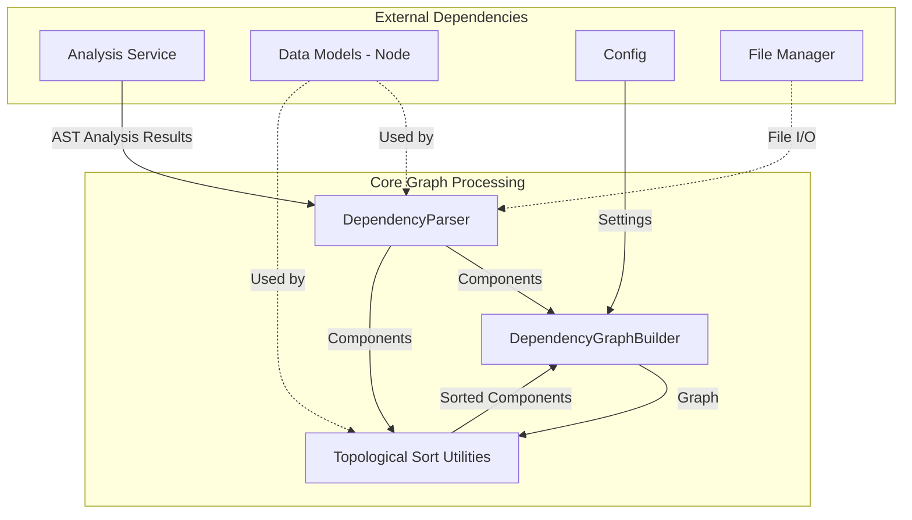
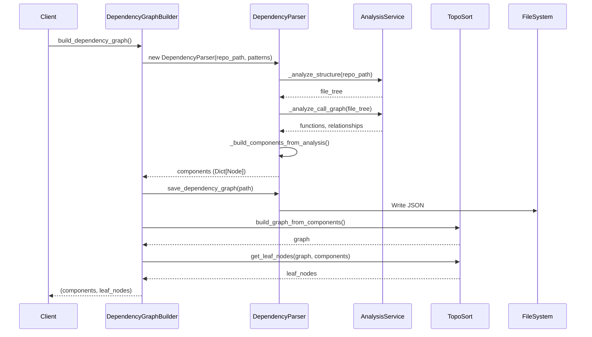
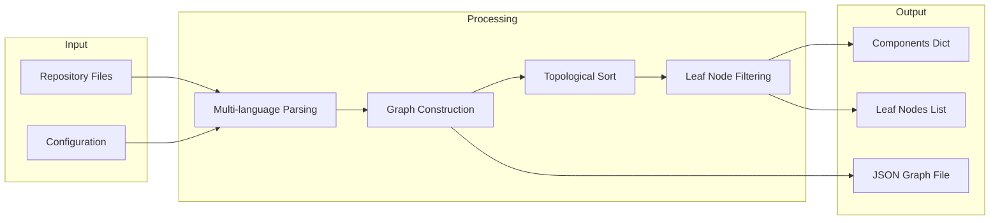

# Core Graph Processing

## Overview

The **Core Graph Processing** module serves as the computational backbone of the dependency analysis system, transforming raw repository analysis results into structured dependency graphs. This module bridges the gap between language-specific AST analysis and high-level documentation generation by providing robust graph construction, traversal, and manipulation capabilities.

## Purpose

This module is responsible for:
- **Component Extraction**: Converting AST analysis results into unified component representations
- **Dependency Graph Construction**: Building directed graphs that represent code dependencies
- **Topological Processing**: Ordering components based on their dependency relationships
- **Cycle Detection & Resolution**: Identifying and handling circular dependencies
- **Leaf Node Identification**: Finding terminal components in dependency chains

## Architecture

### Module Structure



### Component Interaction Flow



## Sub-Modules

The Core Graph Processing module is organized into three focused sub-modules:

- **[Component Extraction](Component Extraction.md)**: Multi-language repository parsing and component extraction
- **[Graph Building](Graph Building.md)**: High-level graph orchestration and configuration management
- **[Graph Algorithms](Graph Algorithms.md)**: Topological sorting, cycle detection, and graph traversal utilities

## Core Components

### 1. DependencyParser

**Location**: `codewiki.src.be.dependency_analyzer.ast_parser.DependencyParser`

**Detailed Documentation**: See [Component Extraction](Component Extraction.md)

The `DependencyParser` is responsible for parsing multi-language repositories and extracting structured code components with their dependency relationships.

#### Key Responsibilities:
- Parse repository files using language-specific analyzers
- Extract functions, classes, methods, and other code structures
- Build dependency relationships between components
- Convert raw analysis results into unified `Node` objects
- Persist dependency graphs to JSON format

#### Configuration Options:
- `repo_path`: Path to the target repository
- `include_patterns`: File patterns to include (e.g., `["*.py", "*.js"]`)
- `exclude_patterns`: File/directory patterns to exclude (e.g., `["*Tests*"]`)

#### Usage Example:
```python
parser = DependencyParser(
    repo_path="/path/to/repo",
    include_patterns=["*.py", "*.js"],
    exclude_patterns=["*test*", "*__pycache__*"]
)

# Parse repository and get components
components = parser.parse_repository()

# Save dependency graph
parser.save_dependency_graph("output.json")
```

#### Internal Workflow:
1. **Structure Analysis**: Delegates to `AnalysisService._analyze_structure()`
2. **Call Graph Analysis**: Delegates to `AnalysisService._analyze_call_graph()`
3. **Component Building**: Creates `Node` objects from analysis results
4. **Dependency Mapping**: Establishes relationships based on call graph

### 2. DependencyGraphBuilder

**Location**: `codewiki.src.be.dependency_analyzer.dependency_graphs_builder.DependencyGraphBuilder`

**Detailed Documentation**: See [Graph Building](Graph Building.md)

The `DependencyGraphBuilder` provides a high-level interface for building complete dependency graphs with intelligent filtering and organization.

#### Key Responsibilities:
- Orchestrate the complete graph building process
- Manage output file paths and directory structure
- Apply configuration-driven filtering patterns
- Perform language-aware component filtering
- Extract leaf nodes for documentation generation

#### Language-Aware Features:
- **Go Repositories**: Includes functions and methods as valid leaf nodes
- **C-Style Repositories**: Adapts to functional programming paradigms
- **OOP Repositories**: Focuses on classes, interfaces, and structs

#### Usage Example:
```python
from codewiki.src.config import Config

config = Config(
    repo_path="/path/to/repo",
    dependency_graph_dir="./output/graphs",
    include_patterns=["*.py"],
    exclude_patterns=["*test*"]
)

builder = DependencyGraphBuilder(config)
components, leaf_nodes = builder.build_dependency_graph()

print(f"Found {len(components)} components")
print(f"Found {len(leaf_nodes)} leaf nodes")
```

#### Output Files:
- `{repo_name}_dependency_graph.json`: Complete component data
- `{repo_name}_filtered_folders.json`: Filtered folder structure (optional)

### 3. Topological Sort Utilities

**Location**: `codewiki.src.be.dependency_analyzer.topo_sort`

**Detailed Documentation**: See [Graph Algorithms](Graph Algorithms.md)

This module provides essential graph algorithms for dependency graph processing.

#### Key Functions:

##### `build_graph_from_components(components: Dict[str, Node]) -> Dict[str, Set[str]]`
Builds a directed dependency graph from component dictionary.

**Graph Direction**: Natural dependency direction
- Edge `A → B` means "A depends on B"
- Root nodes have no dependencies
- Leaf nodes are not depended upon by others

##### `topological_sort(graph: Dict[str, Set[str]]) -> List[str]`
Performs topological sorting with automatic cycle resolution.

**Returns**: List of nodes where dependencies appear before dependents

##### `get_leaf_nodes(graph: Dict[str, Set[str]], components: Dict[str, Node]) -> List[str]`
Identifies terminal components in dependency chains with intelligent filtering.

**Filtering Criteria**:
- Component type validation (class, interface, struct, function, method)
- Language-specific adaptations
- Invalid identifier exclusion

##### `detect_cycles(graph: Dict[str, Set[str]]) -> List[List[str]]`
Detects cycles using Tarjan's strongly connected components algorithm.

##### `resolve_cycles(graph: Dict[str, Set[str]]) -> Dict[str, Set[str]]`
Breaks cycles by removing "weak" dependencies to create a DAG.

## Data Flow

### Input → Processing → Output



### Component Data Structure

Each component is represented as a `Node` object with the following structure:

```python
class Node:
    id: str                          # Unique identifier
    name: str                        # Component name
    component_type: str              # "class", "function", "method", etc.
    file_path: str                   # Absolute file path
    relative_path: str               # Path relative to repo root
    depends_on: Set[str]             # Set of dependency IDs
    source_code: Optional[str]       # Full source code
    start_line: int                  # Starting line number
    end_line: int                    # Ending line number
    has_docstring: bool              # Whether docstring exists
    docstring: str                   # Documentation string
    parameters: Optional[List[str]]  # Function/method parameters
    node_type: Optional[str]         # Detailed type info
    base_classes: Optional[List[str]] # For classes
    class_name: Optional[str]        # For methods
    display_name: Optional[str]      # Human-readable name
    component_id: Optional[str]      # Alternative ID
```

## Multi-Language Support

### Supported Languages

The module supports dependency analysis for the following languages:

| Language | File Extensions | Analyzer Type | Notes |
|----------|----------------|---------------|-------|
| Python | `.py` | AST-based | Native Python AST parsing |
| JavaScript | `.js`, `.jsx`, `.mjs`, `.cjs` | Tree-sitter | Modern JS support |
| TypeScript | `.ts`, `.tsx` | Tree-sitter | Full type system support |
| Java | `.java` | Tree-sitter | Class and method analysis |
| C# | `.cs` | Tree-sitter | .NET ecosystem support |
| C | `.c`, `.h` | Tree-sitter | C-style codebases |
| C++ | `.cpp`, `.hpp`, `.cc`, `.cxx` | Tree-sitter | Complex C++ features |
| PHP | `.php` | Tree-sitter | Namespace resolution |
| Go | `.go` | Custom analyzer | Special function/method handling |

### Language-Specific Behavior

#### Go Repositories
- Functions and methods are treated as valid leaf nodes
- Maintains behavior-centric architecture representation
- Avoids over-filtering in functional-style Go code

#### C-Style Repositories
- Automatically includes functions when no classes are found
- Adapts to procedural programming paradigms
- Maintains flat dependency structures

#### Object-Oriented Repositories
- Focuses on classes, interfaces, and structs as primary components
- Methods are attached to their parent classes
- Inheritance relationships are preserved

## Integration with Other Modules

### Upstream Dependencies

#### [Analysis Services](Analysis Services.md)
- **Purpose**: Provides raw AST analysis and call graph data
- **Integration**: `DependencyParser` delegates structure and call graph analysis
- **Data Flow**: Analysis results → Component extraction

#### [Data Models](Data Models.md)
- **Purpose**: Provides the `Node` model for component representation
- **Integration**: All graph operations use `Node` objects
- **Data Flow**: Node definitions → Component instances

#### [Shared Utilities](Shared Utilities.md)
- **Purpose**: Provides configuration management and file utilities
- **Integration**: `DependencyGraphBuilder` uses `Config` and `FileManager`
- **Data Flow**: Settings → Graph building process

### Downstream Consumers

#### [Agent Backend](Agent Backend.md)
- **Purpose**: Uses dependency graphs for documentation generation
- **Integration**: Receives components and leaf nodes
- **Data Flow**: Graph data → LLM prompts

## Performance Considerations

### Optimization Strategies

1. **Incremental Parsing**: Only analyze changed files when possible
2. **Pattern-Based Filtering**: Reduce analysis scope with include/exclude patterns
3. **Component Caching**: Reuse parsed components across multiple operations
4. **Lazy Loading**: Load component source code on demand

### Scalability Limits

- **Maximum Files**: Configurable via `max_files` parameter
- **Maximum Components**: Limited by available memory
- **Leaf Node Threshold**: Automatic filtering when >400 leaf nodes (except Go)

## Error Handling

### Common Issues

1. **Circular Dependencies**
   - **Detection**: Tarjan's algorithm identifies SCCs
   - **Resolution**: Automatic cycle breaking with logging
   - **Impact**: DAG created for successful topological sort

2. **Invalid Identifiers**
   - **Detection**: Pattern matching for error keywords
   - **Resolution**: Automatic exclusion from leaf nodes
   - **Examples**: "error", "exception", "failed", "invalid"

3. **Missing Dependencies**
   - **Detection**: References to non-existent components
   - **Resolution**: Dependencies filtered to known components only
   - **Logging**: Warning messages for missing dependencies

## Configuration

### Environment Variables

The module respects configuration from `Config` class:

```python
config = Config(
    repo_path="/path/to/repo",
    dependency_graph_dir="./graphs",
    include_patterns=["*.py", "*.js"],
    exclude_patterns=["*test*", "*vendor*"],
    agent_instructions={
        "focus_modules": ["core", "api"],
        "custom_instructions": "Focus on public APIs"
    }
)
```

### Advanced Options

- **Include Patterns**: Whitelist specific file types or directories
- **Exclude Patterns**: Blacklist test files, vendor code, etc.
- **Focus Modules**: Prioritize specific modules for deeper analysis
- **Custom Instructions**: Add context-specific processing rules

## Usage Examples

### Basic Usage

```python
from codewiki.src.be.dependency_analyzer.dependency_graphs_builder import DependencyGraphBuilder
from codewiki.src.config import Config

# Configure
config = Config.from_cli(
    repo_path="/path/to/repo",
    output_dir="./output",
    llm_base_url="https://api.openai.com/v1",
    llm_api_key="your-key",
    main_model="gpt-4"
)

# Build graph
builder = DependencyGraphBuilder(config)
components, leaf_nodes = builder.build_dependency_graph()

# Process results
for node_id in leaf_nodes:
    component = components[node_id]
    print(f"{component.name} ({component.component_type})")
    print(f"  Dependencies: {len(component.depends_on)}")
```

### Advanced Filtering

```python
# Custom patterns for specific analysis
parser = DependencyParser(
    repo_path="/path/to/repo",
    include_patterns=["src/**/*.py"],  # Only Python in src/
    exclude_patterns=["**/migrations/*", "**/tests/*"]
)

components = parser.parse_repository()

# Filter by component type
classes = {
    id: comp for id, comp in components.items()
    if comp.component_type == "class"
}

# Find components with most dependencies
complex_components = sorted(
    components.items(),
    key=lambda x: len(x[1].depends_on),
    reverse=True
)[:10]
```

## Best Practices

### 1. Pattern Configuration
- Start with broad patterns and refine based on results
- Use `exclude_patterns` to skip generated code and tests
- Combine file extension patterns with directory patterns

### 2. Performance Optimization
- Use `include_patterns` to limit scope early
- Set appropriate `max_files` limits for large repos
- Cache dependency graphs when analyzing multiple times

### 3. Language-Specific Handling
- Let the module auto-detect language types
- Don't override Go-specific leaf node behavior
- Trust the automatic C-style repository adaptations

### 4. Error Recovery
- Monitor logs for cycle detection warnings
- Review excluded leaf nodes for validity
- Validate component counts against expectations

## Troubleshooting

### Issue: Too Many Leaf Nodes

**Symptoms**: Over 400 leaf nodes detected, performance issues

**Solutions**:
- Increase `exclude_patterns` to filter utility code
- Focus on specific modules using `focus_modules`
- Review component types for unexpected inclusions

### Issue: Missing Dependencies

**Symptoms**: Expected relationships not appearing

**Solutions**:
- Verify include patterns don't exclude relevant files
- Check if dependencies are in different languages
- Review analysis service logs for parsing errors

### Issue: Circular Dependencies

**Symptoms**: Cycles detected in logs

**Solutions**:
- Review cycle resolution logs
- Consider refactoring to break cycles
- Accept automatic resolution for documentation purposes

## API Reference

### DependencyParser

```python
class DependencyParser:
    def __init__(
        self,
        repo_path: str,
        include_patterns: List[str] = None,
        exclude_patterns: List[str] = None
    )
    
    def parse_repository(
        self,
        filtered_folders: List[str] = None
    ) -> Dict[str, Node]
    
    def save_dependency_graph(
        self,
        output_path: str
    ) -> Dict[str, Any]
```

### DependencyGraphBuilder

```python
class DependencyGraphBuilder:
    def __init__(self, config: Config)
    
    def build_dependency_graph(
        self
    ) -> tuple[Dict[str, Any], List[str]]
```

### Topological Sort Functions

```python
def build_graph_from_components(
    components: Dict[str, Any]
) -> Dict[str, Set[str]]

def topological_sort(
    graph: Dict[str, Set[str]]
) -> List[str]

def get_leaf_nodes(
    graph: Dict[str, Set[str]],
    components: Dict[str, Node]
) -> List[str]

def detect_cycles(
    graph: Dict[str, Set[str]]
) -> List[List[str]]

def resolve_cycles(
    graph: Dict[str, Set[str]]
) -> Dict[str, Set[str]]
```

## See Also

- [Analysis Services](Analysis Services.md) - Multi-language AST analysis
- [Data Models](Data Models.md) - Core data structures
- [Shared Utilities](Shared Utilities.md) - Configuration and file management
- [Agent Backend](Agent Backend.md) - Documentation generation from graphs
