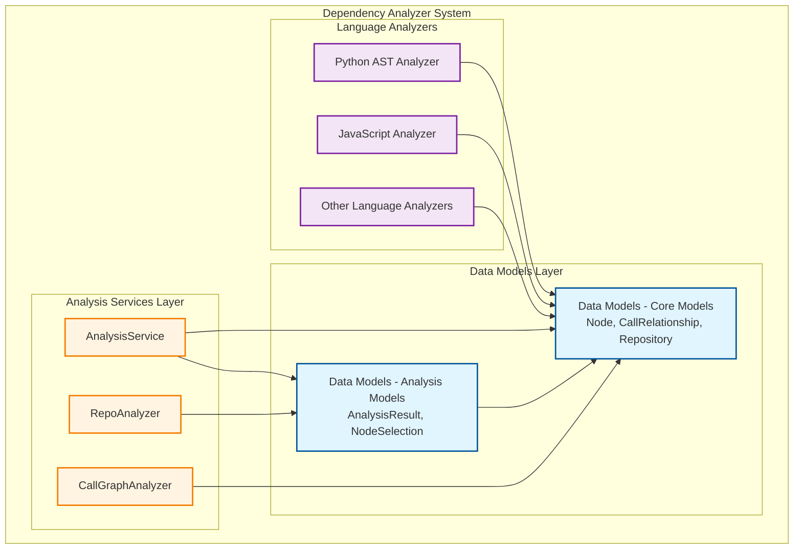
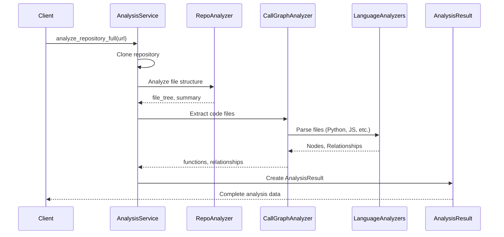
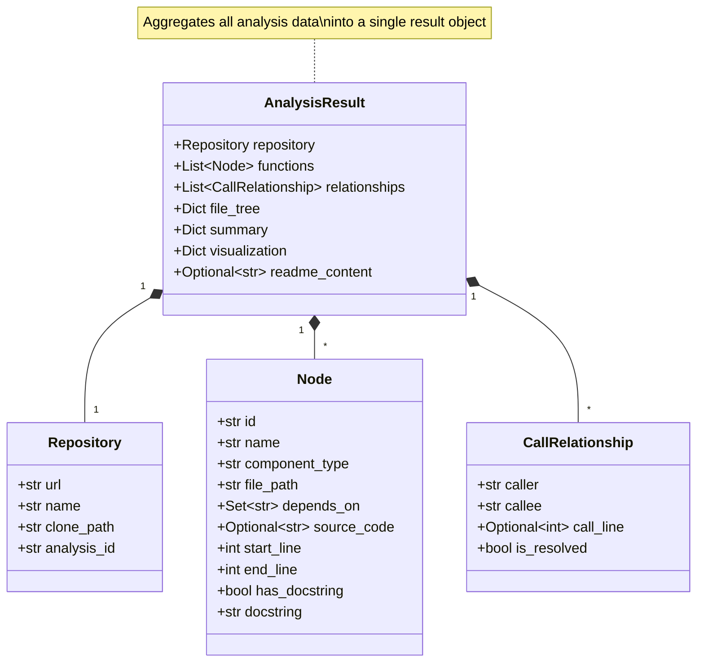
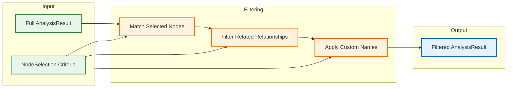

# Data Models - Analysis Models

## Overview

The **Data Models - Analysis Models** module provides Pydantic-based data structures for representing and managing the results of repository analysis operations within the CodeWiki dependency analyzer system. These models serve as the primary data transfer objects (DTOs) that encapsulate comprehensive analysis results and support flexible node selection for partial exports.

This module is a critical component of the [Dependency Analyzer](Dependency Analyzer.md) system, specifically sitting within the Data Models layer alongside its sibling module [Data Models - Core Models](Data Models - Core Models.md).

## Purpose

The Analysis Models module serves several key purposes:

1. **Result Aggregation**: Consolidates all analysis outputs into structured, type-safe objects
2. **Data Transfer**: Provides standardized formats for passing analysis results between system components
3. **Partial Export Support**: Enables selective extraction of analysis data through node selection mechanisms
4. **Visualization Data Preparation**: Structures data for frontend visualization components

## Core Components

### 1. AnalysisResult

The `AnalysisResult` model is the primary container for complete repository analysis outputs. It aggregates all aspects of an analysis operation into a single, cohesive object.

#### Structure

```python
class AnalysisResult(BaseModel):
    """Result of analyzing a repository"""
    
    repository: Repository              # Repository metadata
    functions: List[Node]               # Analyzed code functions/components
    relationships: List[CallRelationship]  # Function call relationships
    file_tree: Dict[str, Any]          # Hierarchical file structure
    summary: Dict[str, Any]             # Analysis statistics and metadata
    visualization: Dict[str, Any] = {}  # Visualization-ready data
    readme_content: Optional[str] = None  # Repository README content
```

#### Fields Description

| Field | Type | Required | Description |
|-------|------|----------|-------------|
| `repository` | `Repository` | Yes | Contains repository metadata (URL, name, clone path, analysis ID). See [Data Models - Core Models](Data Models - Core Models.md#repository) for details. |
| `functions` | `List[Node]` | Yes | List of all discovered code components (functions, classes, methods). Each `Node` includes metadata like name, file path, source code, docstrings, and dependencies. See [Data Models - Core Models](Data Models - Core Models.md#node) for details. |
| `relationships` | `List[CallRelationship]` | Yes | List of caller-callee relationships representing function calls. Includes information about call locations and resolution status. See [Data Models - Core Models](Data Models - Core Models.md#callrelationship) for details. |
| `file_tree` | `Dict[str, Any]` | Yes | Hierarchical representation of the repository's file structure, including file types, sizes, and organization. |
| `summary` | `Dict[str, Any]` | Yes | Aggregated statistics including total files, functions, relationships, languages analyzed, and analysis type. |
| `visualization` | `Dict[str, Any]` | No | Pre-processed data structures optimized for frontend visualization (e.g., graph layouts, dependency matrices). |
| `readme_content` | `Optional[str]` | No | Content of the repository's README file, if available. |

#### Key Characteristics

- **Immutable by Design**: Uses Pydantic's BaseModel for validation and immutability
- **Self-Contained**: All analysis data is present in a single object
- **Serialization-Ready**: Can be easily serialized to JSON for API responses or storage
- **Type-Safe**: Leverages Python type hints and Pydantic validation

#### Usage Example

```python
from codewiki.src.be.dependency_analyzer.models.analysis import AnalysisResult
from codewiki.src.be.dependency_analyzer.models.core import Repository, Node, CallRelationship

# Created by AnalysisService after repository analysis
analysis_result = AnalysisResult(
    repository=Repository(
        url="https://github.com/user/repo",
        name="repo",
        clone_path="/tmp/repo_123",
        analysis_id="user-repo"
    ),
    functions=[...],  # List of Node objects
    relationships=[...],  # List of CallRelationship objects
    file_tree={...},  # Hierarchical file structure
    summary={
        "total_files": 42,
        "total_functions": 150,
        "total_relationships": 320,
        "analysis_type": "full",
        "languages_analyzed": ["python", "javascript"]
    },
    visualization={...},
    readme_content="# Project Title\n..."
)
```

### 2. NodeSelection

The `NodeSelection` model supports partial export and filtering of analysis results, enabling users to focus on specific components of interest.

#### Structure

```python
class NodeSelection(BaseModel):
    """Selected nodes for partial export"""
    
    selected_nodes: List[str] = []       # Node IDs to include
    include_relationships: bool = True   # Whether to include relationships
    custom_names: Dict[str, str] = {}    # Custom naming overrides
```

#### Fields Description

| Field | Type | Default | Description |
|-------|------|---------|-------------|
| `selected_nodes` | `List[str]` | `[]` | List of node IDs (typically fully qualified function/class names) to include in the export. Empty list implies no selection. |
| `include_relationships` | `bool` | `True` | Flag indicating whether relationships between selected nodes should be included in the export. |
| `custom_names` | `Dict[str, str]` | `{}` | Dictionary mapping node IDs to custom display names, allowing users to override default naming. |

#### Key Characteristics

- **Flexible Filtering**: Supports selective export of specific nodes
- **Relationship Control**: Configurable inclusion of inter-node relationships
- **Naming Customization**: Allows custom display names for better readability
- **Default-Friendly**: Provides sensible defaults for all fields

#### Usage Example

```python
from codewiki.src.be.dependency_analyzer.models.analysis import NodeSelection

# Select specific functions for focused documentation
selection = NodeSelection(
    selected_nodes=[
        "myapp.handlers.user_handler.UserHandler.create",
        "myapp.handlers.user_handler.UserHandler.update",
        "myapp.services.auth.AuthService.authenticate"
    ],
    include_relationships=True,
    custom_names={
        "myapp.handlers.user_handler.UserHandler.create": "Create User",
        "myapp.handlers.user_handler.UserHandler.update": "Update User"
    }
)

# Use selection to filter AnalysisResult
filtered_functions = [
    f for f in analysis_result.functions 
    if f.id in selection.selected_nodes
]
```

## Architecture and Component Relationships

### Module Position in System Architecture



### Data Flow: From Analysis to Result



### AnalysisResult Internal Structure



### NodeSelection Usage Patterns



## Integration Points

### With Analysis Services

The `AnalysisResult` model is created by the [Analysis Services](Analysis Services.md) module, specifically by the `AnalysisService.analyze_repository_full()` method:

```python
# In AnalysisService
def analyze_repository_full(self, github_url: str, ...) -> AnalysisResult:
    # ... perform analysis ...
    
    return AnalysisResult(
        repository=Repository(...),
        functions=call_graph_result["functions"],
        relationships=call_graph_result["relationships"],
        file_tree=structure_result["file_tree"],
        summary={...},
        visualization=call_graph_result["visualization"],
        readme_content=readme_content
    )
```

### With Core Models

Analysis models depend heavily on [Data Models - Core Models](Data Models - Core Models.md):

- **Repository**: Stores repository metadata
- **Node**: Represents analyzed code components
- **CallRelationship**: Represents function call relationships

These core models provide the foundational data structures that AnalysisResult aggregates.

### With CLI Application

The [CLI Application](CLI Application.md) uses `AnalysisResult` objects when generating documentation:

- Documentation generators extract functions and relationships
- Summary statistics inform progress reporting
- Visualization data supports diagram generation

### With Web Frontend

The [Web Frontend](Web Frontend.md) consumes `AnalysisResult` objects for:

- Displaying repository analysis results
- Generating interactive dependency graphs
- Showing file tree browsers
- Presenting analysis summaries

### With Agent Backend

The [Agent Backend](Agent Backend.md) may use `NodeSelection` for:

- Focused documentation generation on specific components
- Selective code analysis during agent-driven documentation tasks
- Custom naming in generated documentation

## Data Serialization and Persistence

### JSON Serialization

Both models leverage Pydantic's built-in serialization:

```python
# Serialize AnalysisResult to JSON
result_dict = analysis_result.model_dump()
result_json = analysis_result.model_dump_json()

# Deserialize from JSON
analysis_result = AnalysisResult.model_validate_json(json_string)
```

### File Tree Structure Format

The `file_tree` dictionary follows a recursive structure:

```json
{
  "type": "directory",
  "name": "src",
  "path": "src",
  "children": [
    {
      "type": "file",
      "name": "main.py",
      "path": "src/main.py",
      "extension": ".py",
      "_size_bytes": 2048
    },
    {
      "type": "directory",
      "name": "utils",
      "path": "src/utils",
      "children": [...]
    }
  ]
}
```

### Summary Structure Format

The `summary` dictionary typically includes:

```json
{
  "total_files": 42,
  "total_size_kb": 128.5,
  "total_functions": 150,
  "total_relationships": 320,
  "analysis_type": "full",
  "languages_analyzed": ["python", "javascript"],
  "supported_languages": ["python", "javascript", "typescript"],
  "unsupported_files": 5
}
```

## Best Practices

### Using AnalysisResult

1. **Validation**: Always validate data before creating `AnalysisResult` instances
   ```python
   # Ensure all required fields are present
   if not functions or not relationships:
       raise ValueError("Analysis incomplete")
   ```

2. **Immutable Access**: Treat `AnalysisResult` as read-only after creation
   ```python
   # Good: Access data
   for func in analysis_result.functions:
       process(func)
   
   # Avoid: Modifying result
   analysis_result.functions.append(new_func)  # Not recommended
   ```

3. **Selective Access**: Use summary statistics before processing full data
   ```python
   if analysis_result.summary["total_functions"] > 1000:
       # Large repository - consider pagination or filtering
       apply_pagination()
   ```

### Using NodeSelection

1. **Explicit Selection**: Provide explicit node IDs for better control
   ```python
   selection = NodeSelection(
       selected_nodes=["module.function1", "module.function2"]
   )
   ```

2. **Relationship Management**: Set `include_relationships=False` for isolated component documentation
   ```python
   # For standalone function documentation
   selection = NodeSelection(
       selected_nodes=target_functions,
       include_relationships=False
   )
   ```

3. **Custom Naming**: Use `custom_names` for improved readability in exports
   ```python
   selection = NodeSelection(
       selected_nodes=["myapp.core.UserService.create_user"],
       custom_names={
           "myapp.core.UserService.create_user": "Create User Endpoint"
       }
   )
   ```

## Design Decisions

### Why Pydantic?

- **Type Safety**: Automatic validation of data types
- **Serialization**: Built-in JSON serialization/deserialization
- **Immutability**: Prevents accidental modification of analysis results
- **Documentation**: Self-documenting through type hints and field descriptions

### Why Separate NodeSelection?

- **Flexibility**: Allows multiple selection strategies for the same analysis
- **Reusability**: Selections can be saved and reused across sessions
- **Separation of Concerns**: Keeps filtering logic separate from result data
- **Performance**: Enables lazy evaluation of filtered results

### Why Dict Types for file_tree, summary, and visualization?

- **Flexibility**: These structures vary based on analysis type and configuration
- **Extensibility**: Easy to add new fields without breaking changes
- **Performance**: Direct dictionary access for frequently accessed data
- **Third-Party Integration**: Compatible with external tools expecting dict structures

## Common Use Cases

### 1. Full Repository Documentation

```python
# Generate documentation for entire repository
result = analysis_service.analyze_repository_full(github_url)

for function in result.functions:
    generate_docs(function, result.relationships)
```

### 2. Focused Component Analysis

```python
# Analyze and document specific components
result = analysis_service.analyze_repository_full(github_url)

selection = NodeSelection(
    selected_nodes=["api.handlers.UserHandler"],
    include_relationships=True
)

filtered_functions = filter_by_selection(result.functions, selection)
generate_focused_docs(filtered_functions, result.relationships)
```

### 3. Dependency Visualization

```python
# Prepare data for dependency graph visualization
result = analysis_service.analyze_repository_full(github_url)

# visualization field contains pre-processed graph data
render_dependency_graph(result.visualization)
```

### 4. Repository Statistics

```python
# Display repository overview
result = analysis_service.analyze_repository_full(github_url)

print(f"Repository: {result.repository.name}")
print(f"Total Files: {result.summary['total_files']}")
print(f"Languages: {', '.join(result.summary['languages_analyzed'])}")
print(f"Total Functions: {result.summary['total_functions']}")
```

## Error Handling

### Validation Errors

Pydantic automatically validates data types and structure:

```python
from pydantic import ValidationError

try:
    result = AnalysisResult(
        repository="invalid",  # Should be Repository object
        functions=[],
        relationships=[],
        file_tree={},
        summary={}
    )
except ValidationError as e:
    print(f"Validation error: {e}")
```

### Missing Fields

Required fields must be provided:

```python
# This will raise ValidationError
try:
    result = AnalysisResult(
        repository=valid_repo,
        functions=[],
        relationships=[],
        # file_tree is missing!
        summary={}
    )
except ValidationError as e:
    print(f"Missing required field: {e}")
```

### Null Safety

Optional fields are handled safely:

```python
# readme_content is Optional[str]
if result.readme_content:
    process_readme(result.readme_content)
else:
    print("No README found")
```

## Performance Considerations

### Large Repositories

For repositories with many functions/relationships:

1. **Use Summary First**: Check summary statistics before processing
   ```python
   if result.summary['total_functions'] > 10000:
       # Apply pagination or streaming
       process_in_batches(result.functions)
   ```

2. **Selective Processing**: Use `NodeSelection` to focus on relevant components
   ```python
   selection = NodeSelection(selected_nodes=critical_functions)
   # Process only selected nodes
   ```

3. **Lazy Loading**: Consider lazy evaluation for visualization data
   ```python
   # visualization field can be populated on-demand
   if needs_visualization:
       result.visualization = build_visualization(result.functions)
   ```

### Memory Management

- `AnalysisResult` objects can be large for big repositories
- Consider serializing to disk for long-term storage
- Use streaming when transmitting over network

## Testing

### Unit Testing with AnalysisResult

```python
import pytest
from codewiki.src.be.dependency_analyzer.models.analysis import AnalysisResult
from codewiki.src.be.dependency_analyzer.models.core import Repository, Node

def test_analysis_result_creation():
    repo = Repository(
        url="https://github.com/test/repo",
        name="repo",
        clone_path="/tmp/repo",
        analysis_id="test-repo"
    )
    
    result = AnalysisResult(
        repository=repo,
        functions=[],
        relationships=[],
        file_tree={"type": "directory", "children": []},
        summary={"total_files": 0}
    )
    
    assert result.repository.name == "repo"
    assert len(result.functions) == 0
```

### Unit Testing with NodeSelection

```python
def test_node_selection_defaults():
    selection = NodeSelection()
    
    assert selection.selected_nodes == []
    assert selection.include_relationships == True
    assert selection.custom_names == {}

def test_node_selection_custom():
    selection = NodeSelection(
        selected_nodes=["func1", "func2"],
        include_relationships=False,
        custom_names={"func1": "Function One"}
    )
    
    assert len(selection.selected_nodes) == 2
    assert "func1" in selection.selected_nodes
    assert selection.custom_names["func1"] == "Function One"
```

## Related Modules

- **[Data Models - Core Models](Data Models - Core Models.md)**: Provides foundational models (Node, CallRelationship, Repository)
- **[Analysis Services](Analysis Services.md)**: Creates and populates AnalysisResult instances
- **[CLI Application](CLI Application.md)**: Consumes AnalysisResult for documentation generation
- **[Web Frontend](Web Frontend.md)**: Displays AnalysisResult data in web interface
- **[Agent Backend](Agent Backend.md)**: May use NodeSelection for focused analysis

## Future Enhancements

Potential improvements to this module:

1. **Incremental Analysis**: Support for delta updates to AnalysisResult
2. **Caching**: Built-in caching for frequently accessed data
3. **Streaming**: Support for streaming large analysis results
4. **Versioning**: Schema versioning for backward compatibility
5. **Compression**: Built-in compression for large datasets
6. **Validation Rules**: More sophisticated validation rules for analysis data
7. **Export Formats**: Support for alternative export formats (Protocol Buffers, MessagePack)

## Conclusion

The Data Models - Analysis Models module provides essential data structures for representing repository analysis results within the CodeWiki system. By using Pydantic models with clear type definitions and flexible field structures, it ensures type safety, validation, and easy serialization while supporting both full and partial analysis workflows. The separation of AnalysisResult (complete analysis container) and NodeSelection (filtering mechanism) provides a clean, extensible architecture that supports diverse documentation and analysis use cases.
