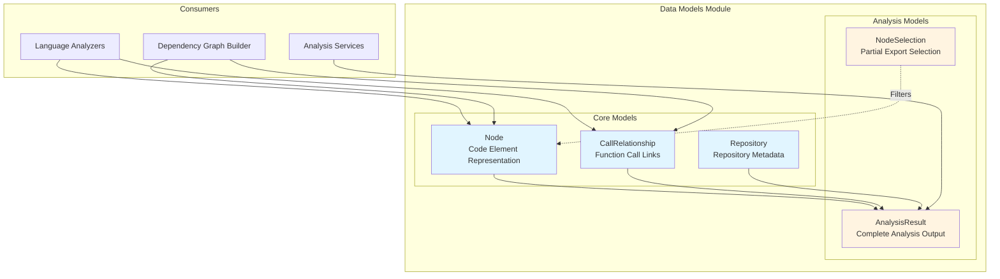
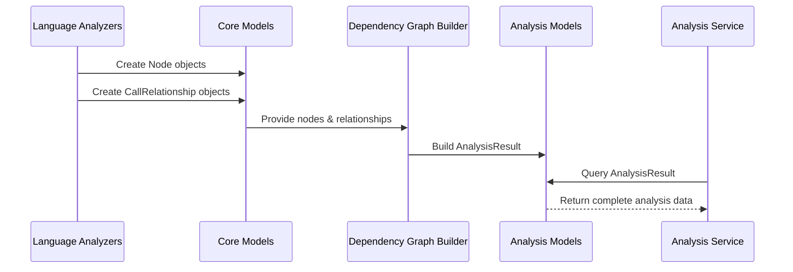

# Data Models Module

## Overview

The **Data Models** module provides the foundational data structures used throughout the Dependency Analyzer system. It defines the core domain models that represent code elements, their relationships, and repository analysis results.

This module serves as the data layer for the entire dependency analysis pipeline, providing type-safe, validated structures using Pydantic models.

## Architecture

## Module Structure

The Data Models module is organized into two primary sub-modules:

### 1. [Core Models](data_models_core_models.md)
**Purpose:** Define fundamental domain entities for code representation

**Key Components:**
- **Node**: Represents code elements (functions, classes, methods) with metadata
- **Repository**: Stores repository identification and location information
- **CallRelationship**: Captures function/method call relationships

**File:** `codewiki/src/be/dependency_analyzer/models/core.py`

### 2. [Analysis Models](Data Models - Analysis Models.md)
**Purpose:** Structure analysis results and selection criteria

**Key Components:**
- **AnalysisResult**: Complete output of repository analysis containing all discovered nodes and relationships
- **NodeSelection**: Configuration for selective node export and filtering

**File:** `codewiki/src/be/dependency_analyzer/models/analysis.py`

## Data Flow

## Key Features

### Type Safety & Validation
All models use **Pydantic** for:
- Automatic type validation
- JSON serialization/deserialization
- IDE autocompletion support
- Schema enforcement

### Flexibility
- **Optional fields**: Many fields are optional to accommodate different programming languages
- **Extensible metadata**: `Dict` and `Any` types allow custom attributes
- **Set-based dependencies**: Efficient dependency tracking using sets

### Integration Points

This module is consumed by:

| Module | Usage |
|--------|-------|
| [Analysis Services](Dependency Analyzer.md#analysis-services) | Create and populate AnalysisResult objects |
| [Language Analyzers](Dependency Analyzer.md#language-analyzers) | Generate Node and CallRelationship instances |
| [Dependency Graph Builder](Dependency Analyzer.md#core-graph-processing) | Build graphs from Node collections |
| [CLI Application](CLI Application.md) | Serialize results for output |

## Design Principles

1. **Immutability by Default**: Pydantic models are immutable unless explicitly configured
2. **Explicit Relationships**: Clear distinction between identity (`id`) and display (`name`, `display_name`)
3. **Language Agnostic**: Models support multiple programming languages through optional fields
4. **Traceability**: Every element includes source location (`file_path`, `start_line`, `end_line`)

## Dependencies

**External Dependencies:**
- `pydantic`: Data validation and serialization
- `datetime`: Timestamp support
- `typing`: Type hints and generics

## Related Documentation

- **Parent Module:** [Dependency Analyzer](Dependency Analyzer.md)
- **Consumers:** [Language Analyzers](Dependency Analyzer.md#language-analyzers), [Analysis Services](Dependency Analyzer.md#analysis-services)
- **Configuration:** [CLI Application](CLI Application.md) - Uses these models for job configuration
