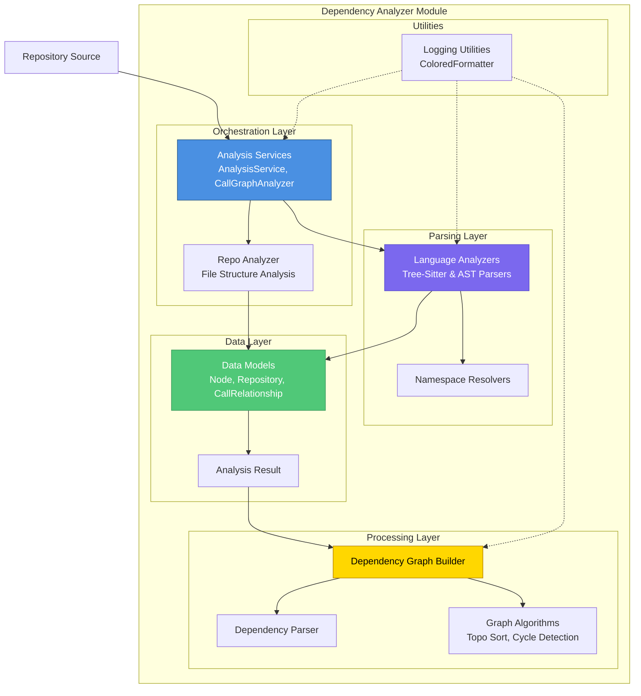

# Dependency Analyzer Module

## Overview

The **Dependency Analyzer** module is the core analytical engine of the CodeWiki system, responsible for parsing source code repositories, extracting structural metadata, and mapping dependency relationships across multiple programming languages. It transforms raw source code into structured data graphs that can be used for documentation generation and code visualization.

## Purpose

This module provides comprehensive static code analysis capabilities:

- **Multi-Language Parsing**: Supports 10 programming languages (Python, JavaScript, TypeScript, Java, C#, C, C++, PHP, Go) using both native AST and tree-sitter technologies.
- **Component Extraction**: Identifies code structures such as classes, functions, methods, interfaces, and variables.
- **Dependency Mapping**: Analyzes and records relationships between code components (inheritance, function calls, imports).
- **Graph Construction**: Builds directed dependency graphs and performs topological sorting to determine processing order.
- **Analysis Orchestration**: Manages the workflow from repository retrieval to final analysis result generation.

## Architecture

The module follows a layered architecture where **Analysis Services** orchestrate **Language Analyzers** to populate **Data Models**, which are then processed by **Core Graph Processing** utilities.

## Core Components

The module is organized into five primary sub-modules, each handling a specific aspect of the analysis pipeline:

| Sub-Module | Purpose | Key Components |
|------------|---------|----------------|
| **[Analysis Services](Analysis Services.md)** | Orchestrates the entire analysis workflow, manages repository cloning, and coordinates multi-language parsing. | `AnalysisService`, `CallGraphAnalyzer`, `RepoAnalyzer` |
| **[Language Analyzers](Language Analyzers.md)** | Provides language-specific parsing engines to extract code components and relationships. | `PythonASTAnalyzer`, `TreeSitterJSAnalyzer`, `TreeSitterJavaAnalyzer`, etc. |
| **[Data Models](Data Models.md)** | Defines the core data structures representing code elements and their relationships. | `Node`, `Repository`, `CallRelationship`, `AnalysisResult` |
| **[Core Graph Processing](Core Graph Processing.md)** | Builds dependency graphs, performs topological sorting, and identifies leaf nodes. | `DependencyParser`, `DependencyGraphBuilder`, `topo_sort` |
| **[Logging Utilities](Logging Utilities.md)** | Provides colored logging output for debugging and monitoring analysis processes. | `ColoredFormatter`, `setup_logging` |

## References

For detailed information about specific components, refer to the following documentation:

- **[Analysis Services](Analysis Services.md)** - Complete workflow orchestration and multi-language coordination
- **[Language Analyzers](Language Analyzers.md)** - Language-specific parsing implementation details
- **[Data Models](Data Models.md)** - Core data structure specifications and validation schemas
- **[Core Graph Processing](Core Graph Processing.md)** - Graph construction algorithms and topological utilities
- **[Logging Utilities](Logging Utilities.md)** - Logging configuration and colored output setup