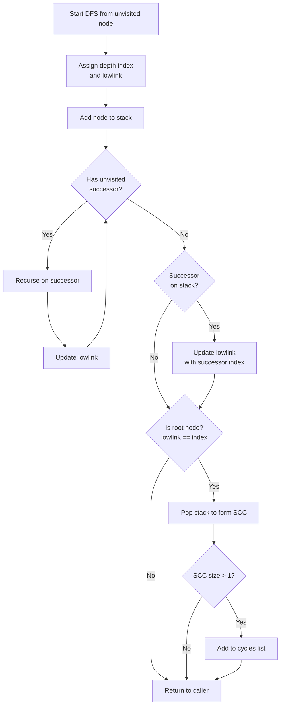

# Graph Algorithms Module

## Overview

The Graph Algorithms module provides core graph processing capabilities for dependency analysis within the Dependency Analyzer system. It implements sophisticated algorithms for topological sorting, cycle detection, and dependency graph traversal, enabling proper ordering and processing of code components based on their dependencies.

This module serves as the computational engine for understanding and navigating complex dependency relationships in codebases, supporting the generation of properly ordered documentation and analysis results.

## Module Context

The Graph Algorithms module is a sub-module of **Core Graph Processing** within the Dependency Analyzer. It works with:
- **Component Extraction** - provides parsed code components
- **Graph Building** - provides initial dependency graphs
- **Data Models** - provides Node and related data structures


## Core Functionality

### 1. Graph Construction

#### `build_graph_from_components`

Builds a dependency graph from a collection of code components using natural dependency direction.

```python
def build_graph_from_components(components: Dict[str, Any]) -> Dict[str, Set[str]]
```

**Key Characteristics:**
- Uses natural dependency direction: A → B if A depends on B
- Only includes dependencies that exist in the component repository
- Initializes adjacency lists for all components
- Filters external dependencies not present in the codebase

**Graph Direction:**
- Edge X → Y represents "X depends on Y"
- Root nodes (no dependencies) have empty dependency sets
- Leaf nodes (no dependents) are not referenced in other nodes' dependency sets

### 2. Cycle Management

#### `detect_cycles`

Detects cycles in dependency graphs using Tarjan's algorithm for finding strongly connected components (SCCs).

```python
def detect_cycles(graph: Dict[str, Set[str]]) -> List[List[str]]
```

**Algorithm:** Tarjan's Strongly Connected Components
- Time Complexity: O(V + E) where V is vertices, E is edges
- Uses depth-first search with index tracking
- Identifies SCCs with more than one node (actual cycles)

**Process:**
1. Assigns depth indices to nodes during DFS
2. Tracks lowlink values for SCC identification
3. Maintains a stack of nodes in current SCC
4. Returns list of cycles (each cycle is a list of node IDs)

#### `resolve_cycles`

Resolves cycles by identifying strongly connected components and breaking cycles strategically.

```python
def resolve_cycles(graph: Dict[str, Set[str]]) -> Dict[str, Set[str]]
```

**Resolution Strategy:**
- Detects all cycles using `detect_cycles`
- Creates a copy of the graph for modification
- Breaks each cycle by removing the last edge in the cycle
- Returns a new acyclic graph

**Note:** Current implementation uses a simple strategy of removing arbitrary edges. Future enhancements could use heuristics like:
- Module boundaries (prefer breaking cross-module edges)
- Dependency strength
- Component types

### 3. Graph Traversal

#### `topological_sort`

Performs topological sorting on dependency graphs using Kahn's algorithm.

```python
def topological_sort(graph: Dict[str, Set[str]]) -> List[str]
```

**Algorithm:** Kahn's Algorithm (BFS-based)
1. Resolves cycles to ensure DAG
2. Calculates in-degree for all nodes
3. Processes nodes with zero in-degree
4. Reduces in-degree for dependents
5. Returns nodes in dependency-first order (reversed)

**Output:** Nodes ordered so dependencies appear before their dependents

**Error Handling:** If sort fails (undetected cycles), returns all nodes in arbitrary order to prevent process breakage.

#### `dependency_first_dfs`

Performs depth-first traversal starting from root nodes (nodes with no dependencies).

```python
def dependency_first_dfs(graph: Dict[str, Set[str]]) -> List[str]
```

**Characteristics:**
- Identifies root nodes (no incoming edges)
- Uses DFS to traverse dependencies first
- Processes each node only after all its dependencies
- Handles disconnected components by finding unvisited nodes

**Difference from Topological Sort:**
- DFS-based vs BFS-based
- Explicitly identifies and starts from root nodes
- May handle disconnected graphs differently

### 4. Leaf Node Identification

#### `get_leaf_nodes`

Identifies leaf nodes (nodes that no other nodes depend on) with intelligent filtering.

```python
def get_leaf_nodes(graph: Dict[str, Set[str]], components: Dict[str, Node]) -> List[str]
```

**Filtering Strategy:**

1. **Component Type Filtering:**
   - Valid types: `class`, `interface`, `struct`
   - Go repositories: also includes `function`, `method`
   - C-style repositories without classes: includes `function`

2. **Node Cleaning:**
   - Consolidates `__init__` methods with their classes
   - Removes invalid/error identifiers

3. **Scalability Management:**
   - If >400 leaf nodes (non-Go): removes dependency nodes
   - Go repositories: keeps all leaves for function coverage

**Helper Functions:**
- `_has_go_components()` - Detects Go files in repository
- `_get_valid_leaf_types()` - Determines valid component types for leaves

## Architecture

### Component Interaction Flow


### Cycle Detection Algorithm (Tarjan's)



### Topological Sort Process


### Dependency Graph Structure


## Data Flow

### Input Format

**Components Dictionary:**
```python
{
    "module.ClassName": Node(
        component_id="module.ClassName",
        component_type="class",
        depends_on=["module.OtherClass", "module.utils"],
        file_path="/path/to/file.py",
        relative_path="module/file.py"
    ),
    ...
}
```

**Graph Structure:**
```python
{
    "module.ClassA": {"module.ClassB", "module.ClassC"},
    "module.ClassB": {"module.utils"},
    "module.ClassC": {"module.utils"},
    "module.utils": set()
}
```

### Output Formats

**Topological Order:**
```python
["module.utils", "module.ClassB", "module.ClassC", "module.ClassA"]
```

**Detected Cycles:**
```python
[
    ["module.A", "module.B", "module.C", "module.A"],
    ["service.X", "service.Y", "service.X"]
]
```

**Leaf Nodes:**
```python
["module.TopLevelClass", "app.Main", "api.Endpoint"]
```

## Integration Points

### Dependencies

- **[Data Models](Data%20Models.md)** - Uses `Node` class for component representation
- **Python Standard Library** - Uses `collections.deque`, `typing`, `logging`

### Consumers

- **Graph Building** - Uses graph construction algorithms
- **Analysis Services** - Uses topological ordering for analysis sequencing
- **Documentation Generator** - Uses dependency ordering for documentation structure

## Algorithm Complexity

| Function | Time Complexity | Space Complexity |
|----------|----------------|------------------|
| `build_graph_from_components` | O(C × D) | O(C + E) |
| `detect_cycles` | O(V + E) | O(V) |
| `resolve_cycles` | O(V + E) | O(V + E) |
| `topological_sort` | O(V + E) | O(V) |
| `dependency_first_dfs` | O(V + E) | O(V) |
| `get_leaf_nodes` | O(V + E) | O(V) |

Where:
- C = Number of components
- D = Average dependencies per component
- V = Number of vertices (nodes)
- E = Number of edges (dependencies)

## Design Decisions

### 1. Natural Dependency Direction

**Decision:** Use natural direction (A → B if A depends on B)

**Rationale:**
- Intuitive representation of dependency relationships
- Easier to understand and debug
- Natural mapping from component relationships

**Alternative:** Reverse direction (dependents point to dependencies)
- Would require mental model transformation
- Less intuitive for developers

### 2. Cycle Breaking Strategy

**Decision:** Simple edge removal (last edge in cycle)

**Current Implementation:**
- Arbitrarily removes the last edge in detected cycle
- Guarantees acyclic graph for topological sort

**Future Enhancements:**
- Consider module boundaries
- Analyze dependency strength
- Preserve critical dependencies

### 3. Leaf Node Filtering

**Decision:** Language-aware filtering with type preferences

**Implementation:**
- Prioritizes class-like structures (class, interface, struct)
- Adapts to language paradigms (Go includes functions)
- Handles scalability with intelligent pruning

**Rationale:**
- Reduces noise from utility functions
- Focuses on architecturally significant components
- Maintains coverage for function-centric languages

## Error Handling

### Cycle Resolution Failures

If cycles cannot be fully resolved:
- Logs warning message
- Returns all nodes in arbitrary order
- Prevents process termination

### Empty or Invalid Graphs

- Empty leaf nodes: Returns empty list with warning
- Missing components: Skips invalid leaf nodes
- Invalid identifiers: Filters out error strings

### Disconnected Components

- `dependency_first_dfs` handles disconnected graphs
- Processes remaining unvisited nodes
- Ensures complete coverage

## Usage Examples

### Basic Topological Sort

```python
from codewiki.src.be.dependency_analyzer.topo_sort import (
    build_graph_from_components,
    topological_sort
)

# Build graph from components
graph = build_graph_from_components(components)

# Get topological order
ordered = topological_sort(graph)

# Process components in dependency order
for comp_id in ordered:
    process_component(components[comp_id])
```

### Cycle Detection and Analysis

```python
from codewiki.src.be.dependency_analyzer.topo_sort import (
    detect_cycles,
    resolve_cycles
)

# Detect cycles
cycles = detect_cycles(graph)

if cycles:
    print(f"Found {len(cycles)} dependency cycles:")
    for i, cycle in enumerate(cycles, 1):
        print(f"  Cycle {i}: {' -> '.join(cycle)}")
    
    # Resolve cycles for further processing
    acyclic_graph = resolve_cycles(graph)
```

### Finding Entry Points

```python
from codewiki.src.be.dependency_analyzer.topo_sort import (
    get_leaf_nodes,
    build_graph_from_components
)

# Build graph
graph = build_graph_from_components(components)

# Find leaf nodes (entry points)
leaves = get_leaf_nodes(graph, components)

print(f"Found {len(leaves)} entry points:")
for leaf in leaves:
    comp = components[leaf]
    print(f"  - {comp.component_type}: {leaf}")
```

## Testing Considerations

### Test Scenarios

1. **Acyclic Graphs**
   - Linear dependencies
   - Tree structures
   - Diamond dependencies

2. **Cyclic Graphs**
   - Simple cycles (A → B → A)
   - Complex cycles (A → B → C → D → A)
   - Multiple independent cycles

3. **Edge Cases**
   - Empty graphs
   - Single node graphs
   - Fully connected graphs
   - Disconnected components

4. **Language-Specific**
   - Go repositories (function/method leaves)
   - C repositories (function leaves)
   - OOP languages (class/interface leaves)

## Performance Optimization

### Current Optimizations

- Efficient Tarjan's algorithm implementation
- Lazy cycle resolution (only when needed)
- Set-based operations for O(1) lookups

### Potential Improvements

1. **Caching:** Cache cycle detection results for unchanged graphs
2. **Incremental Updates:** Update topological order incrementally
3. **Parallel Processing:** Parallelize independent subgraph analysis
4. **Memory Optimization:** Use more compact graph representations for large codebases

## Related Modules

- **[Component Extraction](Component%20Extraction.md)** - Provides component data for graph building
- **[Graph Building](Graph%20Building.md)** - Initial graph construction
- **[Data Models](Data%20Models.md)** - Node and component definitions
- **[Analysis Services](Analysis%20Services.md)** - Consumers of graph algorithms
