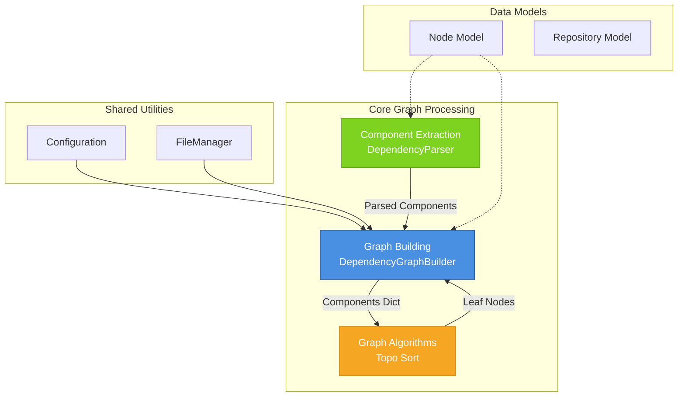
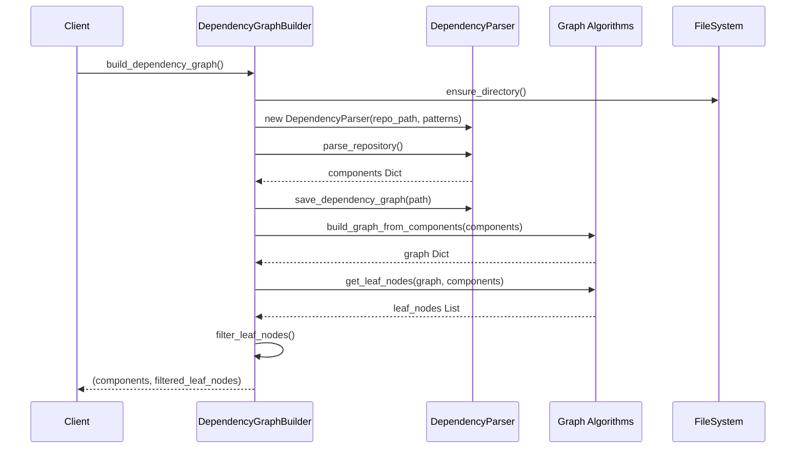
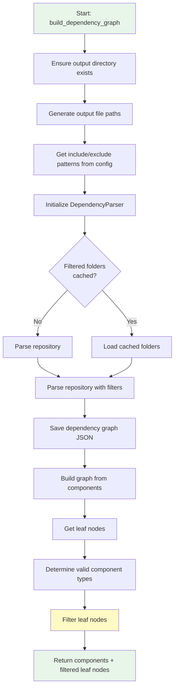
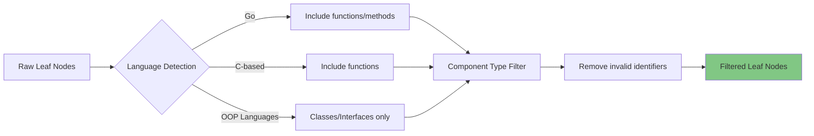
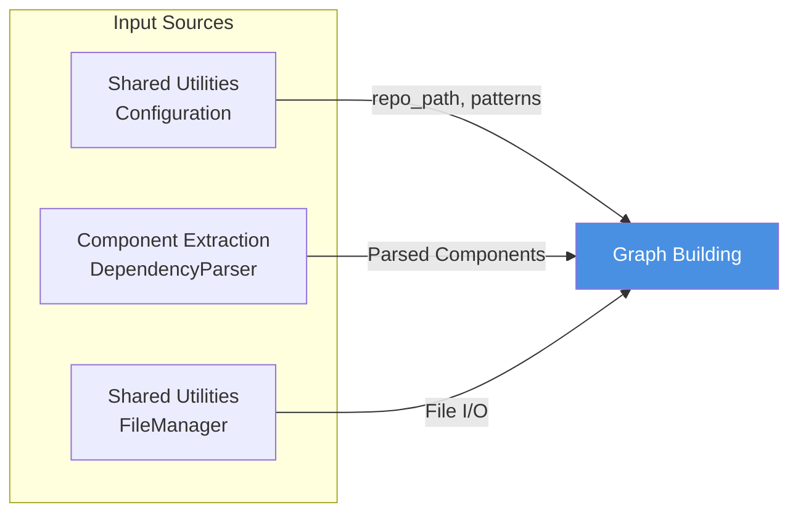
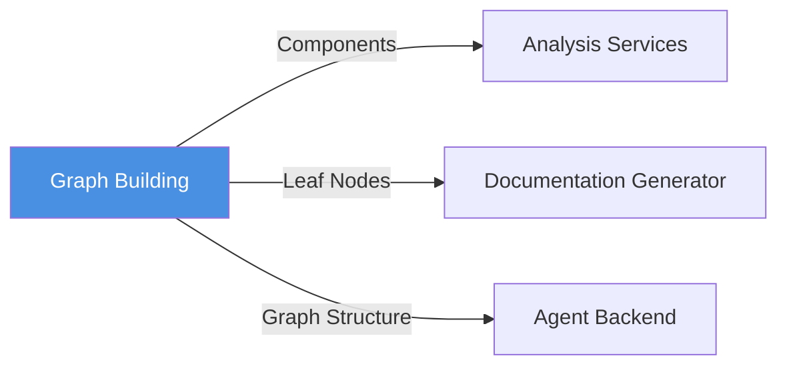

# Graph Building Module

## Overview

The **Graph Building** module is a critical component within the Dependency Analyzer's Core Graph Processing subsystem. It bridges the gap between raw component extraction and graph-based dependency analysis by constructing traversable dependency graphs from parsed code components.

This module transforms hierarchical component data into a graph structure that enables sophisticated dependency analysis, cycle detection, and leaf node identification—essential capabilities for understanding code architecture and generating intelligent documentation.

## Architecture

### Module Position

The Graph Building module operates as the central orchestration layer within the Core Graph Processing subsystem:



### Component Interaction Flow



## Core Component: DependencyGraphBuilder

### Class Overview

The `DependencyGraphBuilder` class serves as the primary orchestrator for constructing and managing dependency graphs. It coordinates parsing, graph building, and intelligent leaf node filtering.

**Location**: `codewiki.src.be.dependency_analyzer.dependency_graphs_builder.DependencyGraphBuilder`

### Responsibilities

1. **Repository Parsing Coordination**: Initializes and configures the DependencyParser
2. **Graph Construction**: Transforms component dictionaries into traversable graph structures
3. **Leaf Node Identification**: Identifies entry points for documentation generation
4. **Intelligent Filtering**: Applies language-specific and component-type-based filtering
5. **Persistence Management**: Saves dependency graphs to JSON for caching and reuse

### Key Methods

#### `build_dependency_graph()`

The primary method that orchestrates the entire graph building process.

```python
def build_dependency_graph(self) -> tuple[Dict[str, Any], List[str]]:
    """
    Build and save dependency graph, returning components and leaf nodes.
    
    Returns:
        Tuple of (components, leaf_nodes)
    """
```

**Process Flow:**



### Configuration Integration

The module integrates with the [Shared Utilities](Shared%20Utilities.md) configuration system:

```python
class DependencyGraphBuilder:
    def __init__(self, config: Config):
        self.config = config
```

**Configuration Properties Used:**

| Property | Type | Purpose |
|----------|------|---------|
| `repo_path` | `str` | Path to the repository being analyzed |
| `dependency_graph_dir` | `str` | Output directory for dependency graphs |
| `include_patterns` | `List[str]` | File patterns to include in analysis |
| `exclude_patterns` | `List[str]` | File/directory patterns to exclude |

See [Shared Utilities](Shared%20Utilities.md) for complete configuration documentation.

## Graph Construction Process

### Stage 1: Component Parsing

The module delegates parsing to the [Component Extraction](Component%20Extraction.md) module:

```python
parser = DependencyParser(
    self.config.repo_path,
    include_patterns=include_patterns,
    exclude_patterns=exclude_patterns
)
components = parser.parse_repository(filtered_folders)
```

**Output**: Dictionary mapping component IDs to `Node` objects containing:
- Component metadata (name, type, file path)
- Source code and documentation
- Dependency relationships
- Line numbers and positioning

### Stage 2: Graph Building

Transforms the component dictionary into an adjacency list representation:

```python
graph = build_graph_from_components(components)
```

**Graph Structure:**
```python
{
    "module.ClassA": {"module.ClassB", "module.utils"},
    "module.ClassB": {"module.helpers"},
    "module.utils": set(),  # No dependencies
    "module.helpers": set()
}
```

**Edge Direction**: Natural dependency direction (A→B means A depends on B)

See [Graph Algorithms](Graph%20Algorithms.md) for algorithmic details.

### Stage 3: Leaf Node Identification

Identifies components that no other components depend on:

```python
leaf_nodes = get_leaf_nodes(graph, components)
```

**Leaf Node Criteria:**
- Not present in any other component's dependency set
- Represents entry points or public APIs
- Ideal starting points for documentation generation

### Stage 4: Intelligent Filtering

Applies language-aware and component-type-based filtering:



#### Component Type Filtering Logic

```python
# Default valid types for OOP languages
valid_types = {"class", "interface", "struct"}

# Go: Include functions and methods (behavior-centric design)
if has_go_components:
    valid_types.update({"function", "method"})

# C-style: Include functions if no classes/structs exist
if not available_types.intersection({"class", "interface", "struct"}):
    valid_types.add("function")
```

#### Invalid Identifier Filtering

Removes leaf nodes with error-like identifiers:

```python
error_keywords = ['error', 'exception', 'failed', 'invalid']
if any(keyword in leaf_node.lower() for keyword in error_keywords):
    # Skip this leaf node
```

## Data Models

The module operates on core data models from the [Data Models](Data%20Models.md) module:

### Node Model

Primary data structure representing code components:

```python
class Node(BaseModel):
    id: str                      # Unique component identifier
    name: str                    # Component name
    component_type: str          # class, function, interface, etc.
    file_path: str               # Absolute file path
    relative_path: str           # Path relative to repository root
    depends_on: Set[str]         # Set of dependency component IDs
    source_code: Optional[str]   # Source code content
    start_line: int              # Starting line number
    end_line: int                # Ending line number
    has_docstring: bool          # Whether documentation exists
    docstring: str               # Existing documentation
    parameters: Optional[List[str]]
    # ... additional fields
```

See [Data Models - Core Models](Data%20Models%20-%20Core%20Models.md) for complete model documentation.

## Output and Persistence

### File Outputs

The module generates two primary output files:

#### 1. Dependency Graph JSON

**Path**: `{dependency_graph_dir}/{sanitized_repo_name}_dependency_graph.json`

**Format**:
```json
{
  "module.ClassName": {
    "id": "module.ClassName",
    "name": "ClassName",
    "component_type": "class",
    "file_path": "/path/to/module.py",
    "relative_path": "module.py",
    "depends_on": ["module.utils", "module.helpers"],
    "source_code": "class ClassName:\n    ...",
    "start_line": 10,
    "end_line": 50,
    "has_docstring": true,
    "docstring": "Class documentation..."
  }
}
```

#### 2. Filtered Folders JSON (Future Feature)

**Path**: `{dependency_graph_dir}/{sanitized_repo_name}_filtered_folders.json`

**Purpose**: Cache filtered folder structure for faster subsequent runs

## Integration with Other Modules

### Upstream Dependencies



### Downstream Consumers



**Primary Consumers:**
1. **[Analysis Services](Analysis%20Services.md)**: Uses components for call graph analysis
2. **[Agent Backend](Agent%20Backend.md)**: Uses leaf nodes as documentation entry points
3. **[Documentation Generator](Agent%20Backend.md)**: Processes filtered components for doc generation

## Usage Examples

### Basic Usage

```python
from codewiki.src.config import Config
from codewiki.src.be.dependency_analyzer.dependency_graphs_builder import DependencyGraphBuilder

# Initialize configuration
config = Config(
    repo_path="/path/to/repository",
    output_dir="/path/to/output",
    dependency_graph_dir="/path/to/graphs"
)

# Build dependency graph
builder = DependencyGraphBuilder(config)
components, leaf_nodes = builder.build_dependency_graph()

print(f"Found {len(components)} components")
print(f"Identified {len(leaf_nodes)} documentation entry points")
```

### With Custom Patterns

```python
# Configure include/exclude patterns
config = Config(
    repo_path="/path/to/repository",
    output_dir="/path/to/output",
    dependency_graph_dir="/path/to/graphs",
    agent_instructions={
        'include_patterns': ['*.py', '*.js'],
        'exclude_patterns': ['*test*', '*spec*', 'vendor/*']
    }
)

builder = DependencyGraphBuilder(config)
components, leaf_nodes = builder.build_dependency_graph()
```

### Processing Results

```python
# Access component details
for comp_id, component in components.items():
    print(f"{component.name} ({component.component_type})")
    print(f"  Dependencies: {len(component.depends_on)}")
    print(f"  Location: {component.relative_path}:{component.start_line}")

# Use leaf nodes for documentation
for leaf_id in leaf_nodes:
    leaf_component = components[leaf_id]
    print(f"Entry point: {leaf_component.get_display_name()}")
    # Generate documentation for this component...
```

## Performance Considerations

### Optimization Strategies

1. **Caching**: Dependency graphs are saved to JSON for reuse across runs
2. **Lazy Loading**: Filtered folders can be cached (currently commented out)
3. **Intelligent Filtering**: Reduces leaf node count to manageable levels (target: <400 nodes)
4. **Language-Specific Rules**: Avoids unnecessary processing based on language patterns

### Scalability

The module handles repositories of varying sizes through:
- **Configurable patterns**: Focus on relevant code subsets
- **Efficient graph algorithms**: O(V+E) complexity for graph operations
- **Memory-conscious design**: Uses sets for efficient lookups

## Error Handling

### Validation Checks

```python
# Invalid identifier detection
if not isinstance(leaf_node, str) or leaf_node.strip() == "":
    logger.warning(f"Skipping invalid leaf node identifier: '{leaf_node}'")
    continue

# Component existence verification
if leaf_node not in components:
    logger.warning(f"Leaf node {leaf_node} not found in components")
    continue

# Empty graph detection
if not leaf_nodes:
    logger.warning("No leaf nodes found in the graph")
    return []
```

### Common Issues

| Issue | Cause | Resolution |
|-------|-------|------------|
| Empty components | Invalid repository path or patterns | Verify `repo_path` and include patterns |
| No leaf nodes | Circular dependencies or empty repository | Check [Graph Algorithms](Graph%20Algorithms.md) cycle resolution |
| Too many leaf nodes | Granular analysis without filtering | Adjust exclude patterns or component type filters |

## Related Modules

- **[Component Extraction](Component%20Extraction.md)**: Parses repositories into components
- **[Graph Algorithms](Graph%20Algorithms.md)**: Provides graph traversal and topological sorting
- **[Data Models - Core Models](Data%20Models%20-%20Core%20Models.md)**: Defines Node and Repository structures
- **[Shared Utilities](Shared%20Utilities.md)**: Configuration and file management
- **[Analysis Services](Analysis%20Services.md)**: Consumes graph for further analysis
- **[Agent Backend](Agent%20Backend.md)**: Uses leaf nodes for documentation generation

## Summary

The Graph Building module serves as the transformation layer that converts parsed code components into actionable dependency graphs. Its intelligent filtering and language-aware processing make it essential for:

- **Documentation Generation**: Identifying optimal entry points
- **Dependency Analysis**: Understanding code relationships
- **Architecture Visualization**: Building graph structures for analysis

By coordinating between component extraction, graph algorithms, and downstream consumers, this module enables sophisticated code understanding and automated documentation workflows.
