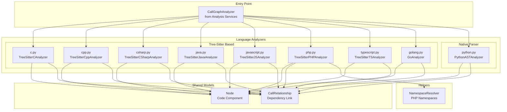
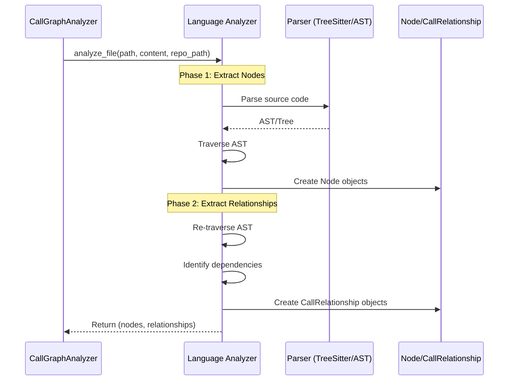

# Language Analyzers Module

## Overview

The **Language Analyzers** module provides multi-language source code analysis capabilities for extracting code components and their relationships. It serves as the parsing engine within the [Dependency Analyzer](dependency_analyzer.md) system, supporting 10 programming languages with both tree-sitter and native AST parsers.

**Supported Languages:** Python, JavaScript, TypeScript, Java, C#, C, C++, PHP, Go

## Table of Contents

- [Architecture](#architecture)
- [Analyzer Pattern](#analyzer-pattern)
- [Language Support Matrix](#language-support-matrix)
- [Common Features](#common-features)
- [Detailed Analyzer Documentation](#detailed-analyzer-documentation)
  - [Python Analyzer](#python-analyzer-pythonastanalyzer)
  - [C/C++ Analyzers](#cc-analyzers)
  - [Java Analyzer](#java-analyzer-treesitterjavaanalyzer)
  - [C# Analyzer](#c-analyzer-treesittercsharpanalyzer)
  - [JavaScript Analyzer](#javascript-analyzer-treesitterjsanalyzer)
  - [TypeScript Analyzer](#typescript-analyzer-treesittertsanalyzer)
  - [PHP Analyzer](#php-analyzer-treesitterphpanalyzer)
- [Data Flow](#data-flow)
- [Error Handling](#error-handling)
- [Performance Considerations](#performance-considerations)
- [Integration with Dependency Analyzer](#integration-with-dependency-analyzer)
- [Adding a New Language Analyzer](#adding-a-new-language-analyzer)
- [Dependencies](#dependencies)
- [Limitations](#limitations)
- [Related Modules](#related-modules)

## Architecture



## Analyzer Pattern

All language analyzers follow a consistent interface:

```python
def analyze_<language>_file(
    file_path: str,
    content: str,
    repo_path: str = None
) -> Tuple[List[Node], List[CallRelationship]]:
    """
    Analyze a source code file and extract components and relationships.
    
    Args:
        file_path: Absolute path to the source file
        content: Raw source code content
        repo_path: Repository root path for relative paths (optional)
    
    Returns:
        Tuple containing:
        - List of Node objects (classes, functions, methods, etc.)
        - List of CallRelationship objects (dependencies between nodes)
    """
```

## Language Support Matrix

| Language | Analyzer Class | Parser Technology | Node Types Extracted |
|----------|---------------|-------------------|---------------------|
| **Python** | `PythonASTAnalyzer` | Python stdlib `ast` | Classes, functions, methods, async functions |
| **JavaScript** | `TreeSitterJSAnalyzer` | tree-sitter-javascript | Classes, functions, arrow functions, methods |
| **TypeScript** | `TreeSitterTSAnalyzer` | tree-sitter-typescript | Classes, interfaces, types, enums, functions, arrow functions |
| **Java** | `TreeSitterJavaAnalyzer` | tree-sitter-java | Classes, interfaces, enums, records, annotations, methods |
| **C#** | `TreeSitterCSharpAnalyzer` | tree-sitter-c-sharp | Classes, interfaces, structs, enums, records, delegates |
| **C** | `TreeSitterCAnalyzer` | tree-sitter-c | Functions, structs, global variables |
| **C++** | `TreeSitterCppAnalyzer` | tree-sitter-cpp | Classes, structs, functions, methods, namespaces |
| **PHP** | `TreeSitterPHPAnalyzer` | tree-sitter-php | Classes, interfaces, traits, enums, functions, methods |
| **Go** | `GoAnalyzer` | tree-sitter-go | Functions, methods, structs, interfaces |

## Common Features

### Component Identification

All analyzers generate unique component IDs using the pattern:
```
{module_path}.{component_name}
{module_path}.{class_name}.{method_name}
```

Where `module_path` is derived from the file path relative to the repository root.

### Two-Pass Analysis

Most analyzers use a two-pass approach:

1. **Node Extraction Pass:** Identify all code components (functions, classes, etc.)
2. **Relationship Extraction Pass:** Analyze dependencies between extracted components

This allows forward references and circular dependencies to be properly tracked.

### Built-in Filtering

All analyzers filter out:
- Standard library/built-in functions
- Language primitives
- Test functions (in some languages)
- Template files (PHP Blade, Twig, etc.)

## Detailed Analyzer Documentation

### Python Analyzer (PythonASTAnalyzer)

Uses Python's built-in `ast` module for zero-dependency parsing.

**Unique Features:**
- Native AST parsing (no external dependencies)
- Extracts docstrings using `ast.get_docstring()`
- Handles both sync and async functions
- Tracks class inheritance with base class extraction

**Example:**
```python
from codewiki.src.be.dependency_analyzer.analyzers.python import analyze_python_file

nodes, relationships = analyze_python_file(
    file_path="/path/to/module.py",
    content=python_source_code,
    repo_path="/path/to/repo"
)

# nodes: List of Node objects (classes, functions)
# relationships: List of CallRelationship objects
```

**Extracted Node Types:**
- `class` - Class definitions with base classes
- `function` - Top-level functions
- `method` - Class methods (not tracked separately, part of class)
- Async variants of functions/methods

### C/C++ Analyzers

**TreeSitterCAnalyzer** and **TreeSitterCppAnalyzer** handle C and C++ code respectively.

**C Analyzer Features:**
- Extracts functions with full signatures
- Identifies struct definitions
- Tracks global variables
- Detects function calls (filters standard library)

**C++ Analyzer Features:**
- Extracts classes, structs, and namespaces
- Distinguishes methods from free functions
- Tracks inheritance (base class clause)
- Handles constructors and destructors
- Detects object creation (`new` expressions)

**Example:**
```python
from codewiki.src.be.dependency_analyzer.analyzers.c import analyze_c_file
from codewiki.src.be.dependency_analyzer.analyzers.cpp import analyze_cpp_file

# C file analysis
c_nodes, c_rels = analyze_c_file("/path/to/file.c", c_content, repo_path)

# C++ file analysis
cpp_nodes, cpp_rels = analyze_cpp_file("/path/to/file.cpp", cpp_content, repo_path)
```

### Java Analyzer (TreeSitterJavaAnalyzer)

**Extracted Node Types:**
- `class` / `abstract class` - Class definitions
- `interface` - Interface definitions
- `enum` - Enum types
- `record` - Java records (Java 14+)
- `annotation` - Annotation types
- `method` - Class methods

**Relationship Types:**
- Inheritance (`extends`)
- Interface implementation (`implements`)
- Field type usage
- Method calls
- Object creation (`new`)

**Example:**
```python
from codewiki.src.be.dependency_analyzer.analyzers.java import analyze_java_file

nodes, relationships = analyze_java_file(
    file_path="/path/to/MyClass.java",
    content=java_source,
    repo_path="/path/to/repo"
)

# Extracts: classes, interfaces, enums, records, methods
# Tracks: extends, implements, method calls, object creation
```

### C# Analyzer (TreeSitterCSharpAnalyzer)

**Extracted Node Types:**
- `class` / `abstract class` / `static class`
- `interface`
- `struct`
- `enum`
- `record` (C# 9+)
- `delegate`

**Relationship Types:**
- Inheritance (base class list)
- Interface implementation
- Property types
- Field types
- Method parameter types

**Example:**
```python
from codewiki.src.be.dependency_analyzer.analyzers.csharp import analyze_csharp_file

nodes, relationships = analyze_csharp_file(
    file_path="/path/to/MyClass.cs",
    content=csharp_source,
    repo_path="/path/to/repo"
)
```

### JavaScript Analyzer (TreeSitterJSAnalyzer)

**Extracted Node Types:**
- `class` / `abstract class` (TypeScript-style)
- `function` - Regular functions
- Arrow functions (extracted as functions)
- Generator functions
- Methods (within classes)

**Unique Features:**
- JSDoc type dependency extraction
- Handles `export` statements
- Tracks `export default` functions
- Async/generator function detection

**Example:**
```python
from codewiki.src.be.dependency_analyzer.analyzers.javascript import analyze_javascript_file_treesitter

nodes, relationships = analyze_javascript_file_treesitter(
    file_path="/path/to/module.js",
    content=js_source,
    repo_path="/path/to/repo"
)

# Handles: classes, functions, arrow functions, exports
# Extracts: call relationships, JSDoc type dependencies
```

### TypeScript Analyzer (TreeSitterTSAnalyzer)

**Extracted Node Types:**
- `class` / `abstract class`
- `interface`
- `type` - Type aliases
- `enum`
- `function` (including arrow functions)
- Ambient declarations

**Unique Features:**
- Depth-limited traversal (max 500 levels) to prevent stack overflow
- Constructor dependency extraction
- Type annotation relationships
- Generic type handling
- Distinguishes top-level vs nested declarations

**Example:**
```python
from codewiki.src.be.dependency_analyzer.analyzers.typescript import analyze_typescript_file_treesitter

nodes, relationships = analyze_typescript_file_treesitter(
    file_path="/path/to/module.ts",
    content=ts_source,
    repo_path="/path/to/repo"
)

# Extracts: classes, interfaces, types, enums, functions
# Tracks: inheritance, type annotations, constructor params
```

### PHP Analyzer (TreeSitterPHPAnalyzer)

**Extracted Node Types:**
- `class` / `abstract class`
- `interface`
- `trait` - PHP traits
- `enum` (PHP 8.1+)
- `function`
- `method`

**Unique Features:**
- **NamespaceResolver:** Resolves PHP namespaces and use statements
- Template file filtering (skips `.blade.php`, `.twig.php`)
- PHPDoc comment extraction
- Property promotion parameters (PHP 8+)
- Handles both mixed PHP/HTML and pure PHP files

**Namespace Resolution:**
```python
class NamespaceResolver:
    """Resolves class names using use statements"""
    
    def register_namespace(self, ns: str)
    def register_use(self, fqn: str, alias: str = None)
    def resolve(self, name: str) -> str  # Returns FQN
```

**Example:**
```python
from codewiki.src.be.dependency_analyzer.analyzers.php import analyze_php_file

nodes, relationships = analyze_php_file(
    file_path="/path/to/MyClass.php",
    content=php_source,
    repo_path="/path/to/repo"
)

# Extracts: classes, interfaces, traits, enums, functions
# Handles: namespaces, use statements, PHPDoc
# Skips: Blade templates, Twig templates
```

**Template Filtering:**
Skips files matching these patterns:
- Extensions: `.blade.php`, `.phtml`, `.twig.php`
- Directories: `views/`, `templates/`, `resources/views/`

## Data Flow



## Error Handling

### Common Error Scenarios

| Error Type | Cause | Handling Strategy |
|------------|-------|-------------------|
| **Syntax Error** | Invalid source code | Skip file, log warning, continue |
| **Parser Initialization Failure** | Missing tree-sitter library | Log error, return empty results |
| **Recursion Limit Exceeded** | Deeply nested AST | Stop traversal at max depth (PHP/TS) |
| **File Encoding Error** | Non-UTF8 files | Use UTF8 decoding with error handling |
| **Invalid Node Reference** | Missing class/function | Mark relationship as `is_resolved=False` |

### Resilience Features

**Depth Limiting:**
- TypeScript: 500 levels max
- PHP: 100 levels max
- Prevents stack overflow on deeply nested code

**Graceful Degradation:**
- Parser failures return empty results instead of crashing
- Invalid nodes are skipped
- Unknown references are tracked but marked unresolved

## Performance Considerations

### Optimization Strategies

1. **Lazy Loading:** Analyzers are imported on-demand
2. **Iterative Traversal:** Some analyzers use iterative (stack-based) traversal instead of recursion
3. **Caching:** Module paths and relative paths are cached within analyzer instances
4. **Early Filtering:** Built-in types and primitives are filtered before relationship creation

### Memory Usage

Each analyzer maintains:
- `nodes: List[Node]` - Extracted components
- `call_relationships: List[CallRelationship]` - Dependencies
- `top_level_nodes: Dict[str, Node]` - Lookup table for quick resolution

Typical memory footprint per file: 10-100 KB depending on code complexity.

## Integration with Dependency Analyzer

The Language Analyzers are invoked by the [CallGraphAnalyzer](dependency_analyzer.md#callgraph-analyzer) from the Analysis Services module:

```python
# In call_graph_analyzer.py
def analyze_code_files(self, code_files: List[Dict], repo_dir: str):
    all_nodes = []
    all_relationships = []
    
    for file_info in code_files:
        file_path = file_info['path']
        content = file_info['content']
        language = file_info['language']
        
        # Route to appropriate analyzer
        if language == 'python':
            nodes, rels = analyze_python_file(file_path, content, repo_dir)
        elif language == 'javascript':
            nodes, rels = analyze_javascript_file_treesitter(file_path, content, repo_dir)
        elif language == 'typescript':
            nodes, rels = analyze_typescript_file_treesitter(file_path, content, repo_dir)
        # ... other languages ...
        
        all_nodes.extend(nodes)
        all_relationships.extend(rels)
    
    return all_nodes, all_relationships
```

## Adding a New Language Analyzer

To add support for a new language:

1. **Create Analyzer File:** `codewiki/src/be/dependency_analyzer/analyzers/{language}.py`

2. **Implement Analyzer Class:**
```python
class TreeSitter{Language}Analyzer:
    def __init__(self, file_path: str, content: str, repo_path: str = None):
        self.file_path = Path(file_path)
        self.content = content
        self.repo_path = repo_path or ""
        self.nodes: List[Node] = []
        self.call_relationships: List[CallRelationship] = []
        self._analyze()
    
    def _analyze(self):
        # Parse and extract nodes
        # Extract relationships
        pass
```

3. **Implement Entry Point Function:**
```python
def analyze_{language}_file(
    file_path: str, 
    content: str, 
    repo_path: str = None
) -> Tuple[List[Node], List[CallRelationship]]:
    analyzer = TreeSitter{Language}Analyzer(file_path, content, repo_path)
    return analyzer.nodes, analyzer.call_relationships
```

4. **Register in CallGraphAnalyzer:** Add to language routing logic

5. **Update SUPPORTED_LANGUAGES:** Add to list in `analysis_service.py`

## Dependencies

### External Dependencies

```
# Tree-sitter core
tree-sitter

# Language-specific parsers
tree-sitter-javascript
tree-sitter-typescript
tree-sitter-java
tree-sitter-c-sharp
tree-sitter-c
tree-sitter-cpp
tree-sitter-php
tree-sitter-go

# Python (stdlib, no external dependency)
ast (built-in)
```

### Internal Dependencies

- `codewiki.src.be.dependency_analyzer.models.core` - Node and CallRelationship models
- All analyzers depend on the shared data models from [Data Models](Data Models.md)

## Testing

Each analyzer should be tested with:
- Simple function/class extraction
- Nested structures (classes within classes)
- Inheritance relationships
- Method calls and object creation
- Edge cases (syntax errors, malformed code)
- Language-specific features (namespaces, traits, etc.)

## Limitations

### Known Limitations

1. **Cross-file Resolution:** Relationships to components in other files are marked as `is_resolved=False` until the CallGraphAnalyzer performs global resolution
2. **Dynamic Features:** Dynamic method calls and reflection are not tracked
3. **Macro Expansion:** C/C++ macros are not expanded
4. **Template Metaprogramming:** C++ template instantiation is not analyzed
5. **Generics:** Generic type parameters are extracted but not fully resolved

### Language-Specific Limitations

- **C/C++:** No macro expansion, limited preprocessor support
- **JavaScript:** Dynamic property access not tracked
- **TypeScript:** Complex generic constraints not fully resolved
- **PHP:** Trait conflict resolution not analyzed
- **Go:** Interface satisfaction not verified

## Related Modules

- **Parent Module:** [Dependency Analyzer](dependency_analyzer.md) - Overall analysis system
- **Data Models:** [Data Models](Data Models.md) - Shared Node and CallRelationship models
  - [Core Models](data_models_core_models.md) - Detailed Node and CallRelationship specifications
- **Analysis Services:** [Analysis Services](dependency_analyzer.md#analysis-services) - Orchestrates language analyzer invocation
- **Call Graph Processing:** [Core Graph Processing](dependency_analyzer.md#core-graph-processing) - Builds dependency graphs from analyzer output

## Summary

The Language Analyzers module provides the foundational parsing capabilities for the CodeWiki documentation system. Each analyzer follows a consistent pattern while accommodating language-specific features. The module supports 10 programming languages using a mix of tree-sitter parsers and native AST parsing, producing standardized Node and CallRelationship objects that feed into the dependency graph construction pipeline.

---

<!-- ORACLE-ENHANCED
Generated for Language Analyzers module documentation
Focus: Multi-language code analysis and parsing
Audience: Developers adding language support or debugging parsing issues
-->
