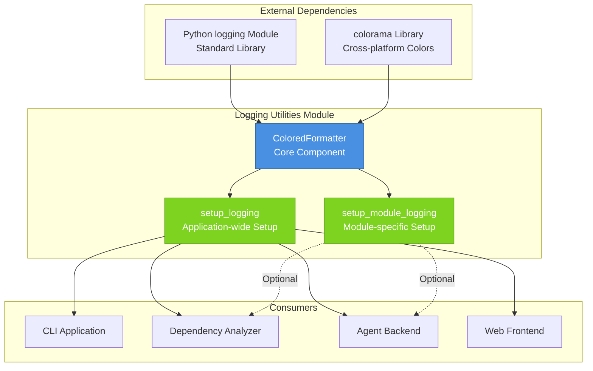
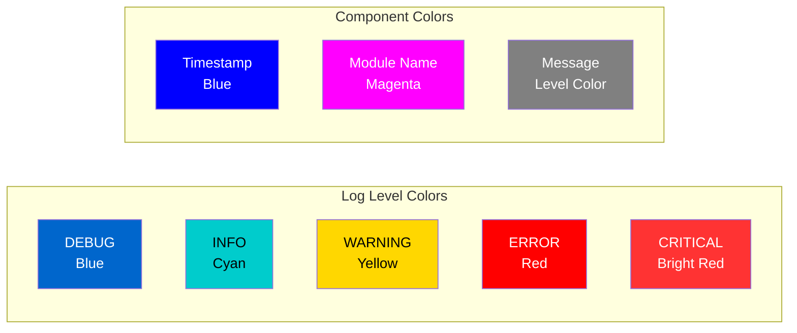
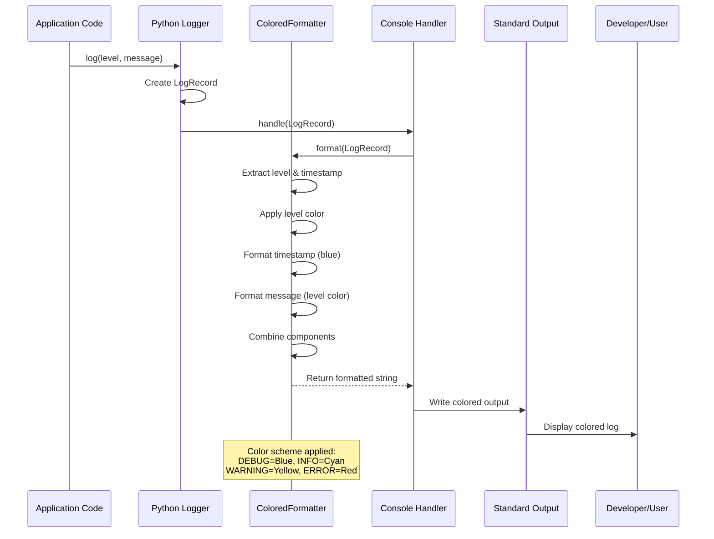
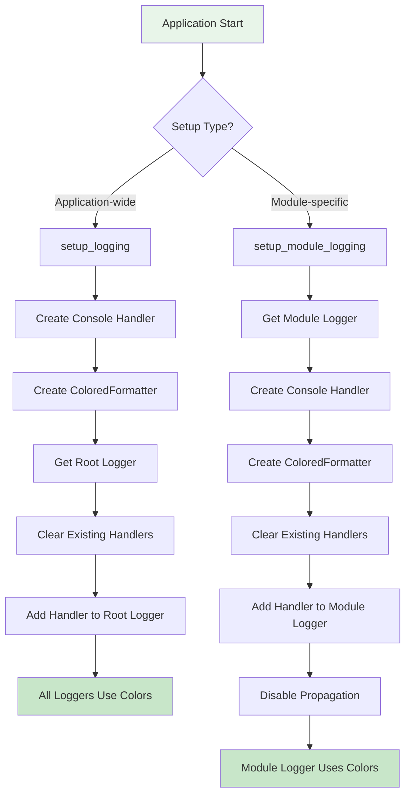
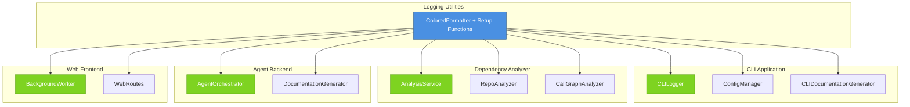
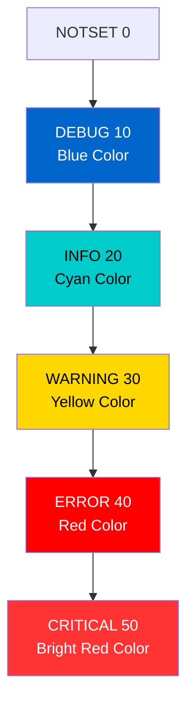

# Logging Utilities

## Overview

The **Logging Utilities** module provides colored logging configuration for the CodeWiki application. This lightweight but essential module enhances developer experience by offering visually distinct, color-coded log messages that improve readability and accelerate debugging across all system components.

As part of the [Dependency Analyzer](Dependency Analyzer.md) infrastructure, this module serves as the foundational logging layer used throughout the CodeWiki system, including the CLI Application, Agent Backend, and Web Frontend modules.

### Key Features

- **🎨 Color-Coded Log Levels**: Distinct colors for each log severity level (DEBUG, INFO, WARNING, ERROR, CRITICAL)
- **⏱️ Colored Timestamps**: Blue-colored timestamps for easy visual tracking
- **📦 Module Identification**: Magenta-colored module names for better context
- **🔧 Flexible Configuration**: Support for both application-wide and module-specific logging setup
- **🌐 Cross-Platform**: Uses `colorama` for consistent colored output across Windows, macOS, and Linux
- **🎯 Zero Dependencies Impact**: Minimal overhead with automatic color reset to prevent bleeding

---

## Architecture

### Component Structure

The Logging Utilities module is organized around a single core component with supporting utility functions:



### Color Scheme Architecture

The module implements a semantic color scheme designed for quick visual identification of log severity:



---

## Core Components

### ColoredFormatter

**Location**: `codewiki.src.be.dependency_analyzer.utils.logging_config.ColoredFormatter`

The `ColoredFormatter` is a custom logging formatter that extends Python's standard `logging.Formatter` to provide colored output for enhanced readability.

#### Responsibilities

1. **Log Level Coloring**: Applies distinct colors to different log levels for immediate visual identification
2. **Component Formatting**: Colors timestamps (blue) and module names (magenta) for structured output
3. **Exception Handling**: Properly formats exception information with traceback
4. **Color Management**: Ensures proper color reset to prevent bleeding between log messages

#### Color Configuration

```python
COLORS = {
    'DEBUG': Fore.BLUE,           # Development and debugging info
    'INFO': Fore.CYAN,            # Normal operational messages
    'WARNING': Fore.YELLOW,       # Warning messages needing attention
    'ERROR': Fore.RED,            # Error messages
    'CRITICAL': Fore.RED + Style.BRIGHT,  # Critical issues
}

COMPONENT_COLORS = {
    'timestamp': Fore.BLUE,       # Timestamps in blue
    'module': Fore.MAGENTA,       # Module names in magenta
    'reset': Style.RESET_ALL,     # Reset to default
}
```

#### Output Format

The formatter produces log lines in the following structure:
```
[HH:MM:SS] LEVEL    Message content
```

Where:
- `[HH:MM:SS]` - Timestamp in blue
- `LEVEL` - Log level name in level-specific color (8 characters padded)
- `Message content` - The actual log message in level-specific color

---

## Utility Functions

### setup_logging()

**Purpose**: Configure application-wide logging with colored output.

**Signature**:
```python
def setup_logging(level=logging.INFO) -> None
```

**Parameters**:
- `level` (int): Logging level (default: `logging.INFO`). Common values:
  - `logging.DEBUG` (10)
  - `logging.INFO` (20)
  - `logging.WARNING` (30)
  - `logging.ERROR` (40)
  - `logging.CRITICAL` (50)

**Behavior**:
1. Creates a console handler for stdout
2. Applies the `ColoredFormatter`
3. Configures the root logger
4. Clears existing handlers to prevent duplicates
5. Adds the configured console handler

**Use Case**: Call once at application startup to enable colored logging throughout the entire application.

---

### setup_module_logging()

**Purpose**: Configure logging for a specific module with colored output.

**Signature**:
```python
def setup_module_logging(module_name: str, level=logging.INFO) -> logging.Logger
```

**Parameters**:
- `module_name` (str): Name of the module to configure logging for
- `level` (int): Logging level (default: `logging.INFO`)

**Returns**: 
- `logging.Logger`: Configured logger instance for the module

**Behavior**:
1. Creates or retrieves a logger for the specified module
2. Creates a console handler with `ColoredFormatter`
3. Clears existing handlers for the module
4. Disables propagation to prevent duplicate logs
5. Returns the configured logger

**Use Case**: Use when you need fine-grained control over logging for specific modules, particularly useful in large applications where different modules may require different log levels.

---

## Usage Examples

### Basic Application-Wide Setup

```python
import logging
from codewiki.src.be.dependency_analyzer.utils.logging_config import setup_logging

# Setup colored logging for entire application
setup_logging(level=logging.INFO)

# Now all loggers will use colored output
logger = logging.getLogger(__name__)
logger.info("Application started")
logger.warning("Configuration file not found, using defaults")
logger.error("Failed to connect to database")
```

### Module-Specific Logging

```python
from codewiki.src.be.dependency_analyzer.utils.logging_config import setup_module_logging

# Setup verbose logging for a specific module during development
logger = setup_module_logging('my_module', level=logging.DEBUG)

logger.debug("Processing item 123")
logger.info("Successfully processed 100 items")
logger.warning("Memory usage above 80%")
```

### Integration with Dependency Analyzer

```python
# In AnalysisService or other Dependency Analyzer components
import logging
from codewiki.src.be.dependency_analyzer.utils.logging_config import setup_module_logging

class AnalysisService:
    def __init__(self):
        # Setup module-specific logging
        self.logger = setup_module_logging('dependency_analyzer.analysis', level=logging.INFO)
        
    def analyze_repository(self, repo_path):
        self.logger.info(f"Starting analysis of {repo_path}")
        try:
            # Analysis logic
            self.logger.debug("Parsing AST for main.py")
            self.logger.info("Analysis complete")
        except Exception as e:
            self.logger.error(f"Analysis failed: {e}")
            raise
```

---

## Data Flow

### Log Message Processing Flow



### Setup Flow



---

## Integration with Other Modules

The Logging Utilities module is a foundational component used across the CodeWiki system:

### Module Integration Map



### Integration Points

| Module | Integration Method | Use Case |
|--------|-------------------|----------|
| **[CLI Application](CLI Application.md)** | `setup_logging()` at startup | Colored output for CLI commands and progress tracking |
| **[Dependency Analyzer](Dependency Analyzer.md)** | `setup_module_logging()` per component | Detailed analysis logging with module identification |
| **[Agent Backend](Agent Backend.md)** | `setup_logging()` in orchestrator | AI agent operation logging and debugging |
| **[Web Frontend](Web Frontend.md)** | `setup_module_logging()` for workers | Background job processing logs |

---

## Configuration Options

### Log Level Hierarchy

The module supports all standard Python logging levels:



### Recommended Configurations

#### Development Environment
```python
setup_logging(level=logging.DEBUG)
```
- Shows all log messages
- Useful for debugging and development
- May be verbose in production

#### Production Environment
```python
setup_logging(level=logging.INFO)
```
- Shows operational messages and above
- Balances information with performance
- Recommended default

#### Troubleshooting Mode
```python
setup_logging(level=logging.WARNING)
```
- Shows only warnings, errors, and critical issues
- Minimal output for focused troubleshooting

---

## Implementation Details

### Colorama Integration

The module uses `colorama` for cross-platform colored terminal output:

```python
from colorama import Fore, Style, init

# Initialize colorama for automatic reset
init(autoreset=True)
```

**Benefits**:
- **Windows Support**: Enables ANSI color codes on Windows terminals
- **Automatic Reset**: `autoreset=True` prevents color bleeding
- **Consistent Output**: Same colors across all platforms

### Formatter Implementation

The `ColoredFormatter.format()` method:

1. **Retrieves Level Color**: Maps log level to corresponding color
2. **Formats Timestamp**: Applies blue color to timestamp in `[HH:MM:SS]` format
3. **Formats Level Name**: Pads to 8 characters and applies level color
4. **Formats Message**: Applies level color to the message content
5. **Combines Components**: Assembles final log line
6. **Handles Exceptions**: Appends exception traceback if present

### Handler Management

Both setup functions properly manage handlers to prevent issues:

```python
# Clear existing handlers to avoid duplicates
logger.handlers.clear()

# Add new handler
logger.addHandler(console_handler)
```

This ensures:
- No duplicate log messages
- Clean handler state
- Predictable logging behavior

---

## Best Practices

### 1. Initialize Early

Call `setup_logging()` at the very beginning of your application:

```python
# main.py or __main__.py
import logging
from codewiki.src.be.dependency_analyzer.utils.logging_config import setup_logging

# Setup logging before importing other modules
setup_logging(level=logging.INFO)

# Now import application modules
from my_app import Application
```

### 2. Use Appropriate Log Levels

```python
logger.debug("Variable x = 42")  # Detailed debugging info
logger.info("User logged in successfully")  # Normal operations
logger.warning("API rate limit approaching")  # Potential issues
logger.error("Failed to parse configuration file")  # Errors
logger.critical("Database connection lost")  # Critical failures
```

### 3. Module-Specific Logging for Libraries

When creating reusable components:

```python
class MyAnalyzer:
    def __init__(self):
        # Use module-specific logging for better control
        self.logger = logging.getLogger(f'{__name__}.{self.__class__.__name__}')
```

### 4. Avoid Logging Sensitive Information

```python
# Bad - logs sensitive data
logger.info(f"User password: {password}")

# Good - logs safe information
logger.info(f"User {username} authenticated successfully")
```

---

## Troubleshooting

### Common Issues

#### No Colors Appearing

**Symptom**: Log output is plain text without colors.

**Solutions**:
1. Ensure `colorama` is installed: `pip install colorama`
2. Verify terminal supports ANSI colors
3. Check that `init(autoreset=True)` is called

#### Duplicate Log Messages

**Symptom**: Each log message appears multiple times.

**Solution**: Ensure `setup_logging()` is called only once, typically in the application entry point.

#### Colors Bleeding

**Symptom**: Color from one message affects subsequent messages.

**Solution**: Ensure `colorama.init(autoreset=True)` is called. The module handles this automatically.

---

## Dependencies

### Required Dependencies

| Package | Purpose | Version |
|---------|---------|---------|
| `colorama` | Cross-platform colored terminal output | Latest |
| `logging` | Python standard logging (built-in) | Python 3.x |

### Installation

```bash
pip install colorama
```

---

## See Also

- **[CLI Application](CLI Application.md)** - See how CLI uses colored logging for user feedback
- **[Dependency Analyzer](Dependency Analyzer.md)** - Parent module using this logging system
- **[Agent Backend](Agent Backend.md)** - Agent orchestration with logging integration
- **Python logging documentation** - https://docs.python.org/3/library/logging.html
- **Colorama documentation** - https://github.com/tartley/colorama

---

## Summary

The Logging Utilities module provides a simple yet powerful colored logging solution for the CodeWiki system. By offering visually distinct log levels and flexible configuration options, it enhances developer productivity and simplifies debugging across all application components.

**Key Takeaways**:
- ✅ Single setup call enables colored logging application-wide
- ✅ Semantic color scheme for quick log level identification
- ✅ Module-specific logging for fine-grained control
- ✅ Cross-platform compatibility via colorama
- ✅ Minimal overhead with maximum readability improvement

This module exemplifies how small, well-designed utilities can significantly improve the developer experience across an entire application ecosystem.
