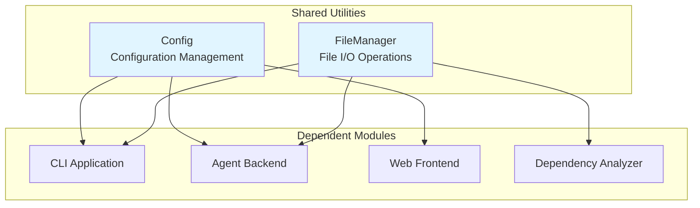
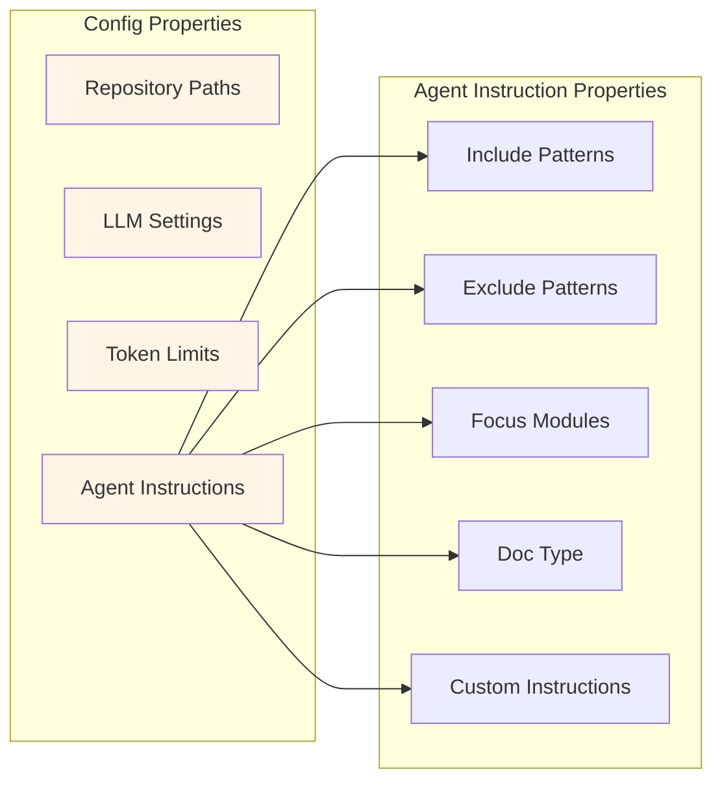
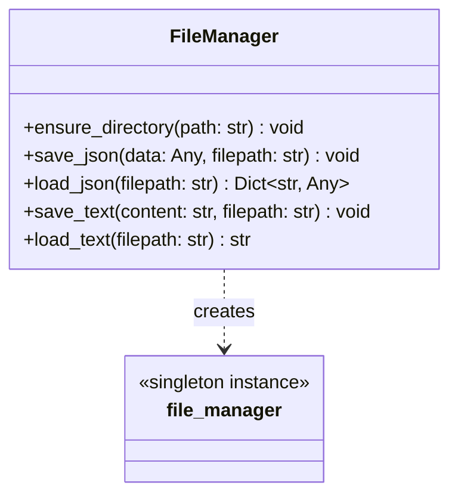
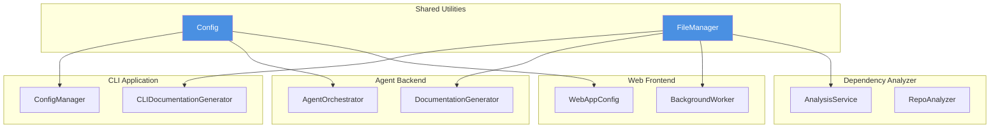

# Shared Utilities Module

## Overview

The **Shared Utilities** module provides foundational configuration management and file I/O operations for the CodeWiki system. This module serves as a core dependency for other modules, offering centralized configuration handling and simple file management utilities.

## Architecture

The Shared Utilities module consists of two primary components that work independently to support the broader CodeWiki ecosystem:



## Module Components

### 1. Config Class

**Location**: `codewiki/src/config.py`

The `Config` class is a comprehensive configuration dataclass that manages all settings required for CodeWiki's operation, including repository paths, LLM configurations, token limits, and agent customization options.

#### Key Responsibilities

- **Path Management**: Manages repository paths, output directories, and documentation locations
- **LLM Configuration**: Stores LLM service URLs, API keys, and model selection
- **Token Limits**: Controls token limits for LLM responses and module processing
- **Agent Instructions**: Provides customization options for documentation generation
- **Prompt Generation**: Generates context-specific prompt additions based on configuration

#### Configuration Properties



#### Configuration Fields

| Field | Type | Description |
|-------|------|-------------|
| `repo_path` | str | Path to the source repository |
| `output_dir` | str | Base output directory |
| `dependency_graph_dir` | str | Directory for dependency graph outputs |
| `docs_dir` | str | Directory for generated documentation |
| `max_depth` | int | Maximum depth for hierarchical decomposition |
| `llm_base_url` | str | Base URL for LLM API |
| `llm_api_key` | str | API key for LLM service |
| `main_model` | str | Primary LLM model identifier |
| `cluster_model` | str | Model used for clustering operations |
| `fallback_model` | str | Fallback model when primary fails |
| `max_tokens` | int | Maximum tokens for LLM responses |
| `max_token_per_module` | int | Token limit per module for clustering |
| `max_token_per_leaf_module` | int | Token limit for leaf modules |
| `agent_instructions` | Dict[str, Any] | Custom instructions for documentation generation |
| `use_agent_sdk` | bool | Flag to enable Agent SDK backend |

#### Factory Methods

##### `from_args(args: argparse.Namespace) -> Config`

Creates a configuration instance from parsed command-line arguments. Automatically sanitizes repository names and sets up directory structure.

**Parameters**:
- `args`: Parsed argparse namespace containing CLI arguments

**Returns**: Configured `Config` instance

##### `from_cli(...) -> Config`

Creates a configuration instance for CLI context with explicit parameters. Provides full control over all configuration options.

**Parameters**:
- `repo_path`: Repository path
- `output_dir`: Output directory for generated docs
- `llm_base_url`: LLM API base URL
- `llm_api_key`: LLM API key
- `main_model`: Primary model identifier
- `cluster_model`: Clustering model identifier
- `fallback_model`: Fallback model (optional)
- `max_tokens`: Maximum tokens for LLM response
- `max_token_per_module`: Maximum tokens per module
- `max_token_per_leaf_module`: Maximum tokens per leaf module
- `max_depth`: Maximum decomposition depth
- `agent_instructions`: Custom agent instructions dict
- `use_agent_sdk`: Enable Agent SDK backend

**Returns**: Configured `Config` instance

#### Agent Instruction Properties

The `Config` class provides convenient properties to access agent instructions:

```python
# File filtering
config.include_patterns  # List of file patterns to include
config.exclude_patterns  # List of file patterns to exclude

# Documentation focus
config.focus_modules     # List of modules to emphasize

# Documentation customization
config.doc_type          # Type: 'api', 'architecture', 'user-guide', 'developer'
config.custom_instructions  # Free-form custom instructions
```

#### Prompt Generation

The `get_prompt_addition()` method generates context-specific prompt additions based on configuration:

```python
additions = config.get_prompt_addition()
# Returns formatted instructions based on doc_type, focus_modules, and custom_instructions
```

**Supported Documentation Types**:
- `api`: Focuses on API endpoints, parameters, return types, and usage examples
- `architecture`: Focuses on system design, component relationships, and data flow
- `user-guide`: Focuses on user-facing features and step-by-step tutorials
- `developer`: Focuses on code structure, contribution guidelines, and implementation details

#### Global Configuration Functions

```python
# CLI context detection
set_cli_context(enabled: bool = True)  # Set CLI mode
is_cli_context() -> bool                # Check if in CLI mode
```

#### Default Configuration Values

```python
# Directory structure
OUTPUT_BASE_DIR = 'output'
DEPENDENCY_GRAPHS_DIR = 'dependency_graphs'
DOCS_DIR = 'docs'

# Processing limits
MAX_DEPTH = 2
DEFAULT_MAX_TOKENS = 32,768
DEFAULT_MAX_TOKEN_PER_MODULE = 36,369
DEFAULT_MAX_TOKEN_PER_LEAF_MODULE = 16,000

# Default LLM settings
MAIN_MODEL = 'claude-sonnet-4'
FALLBACK_MODEL_1 = 'glm-4p5'
LLM_BASE_URL = 'http://0.0.0.0:4000/'
```

---

### 2. FileManager Class

**Location**: `codewiki/src/utils.py`

The `FileManager` class provides static utility methods for common file I/O operations, abstracting away file system interactions throughout the CodeWiki system.

#### Key Responsibilities

- **Directory Management**: Ensures directories exist before file operations
- **JSON Operations**: Handles JSON serialization and deserialization
- **Text Operations**: Manages plain text file reading and writing

#### Class Structure



#### Static Methods

##### `ensure_directory(path: str) -> None`

Creates a directory if it doesn't exist. Uses `os.makedirs` with `exist_ok=True` for safe creation.

**Parameters**:
- `path`: Directory path to create

**Example**:
```python
FileManager.ensure_directory('/path/to/output')
```

##### `save_json(data: Any, filepath: str) -> None`

Serializes data to JSON format and saves to file with pretty formatting (indent=4).

**Parameters**:
- `data`: Any serializable Python object
- `filepath`: Target file path

**Example**:
```python
data = {'module': 'Shared Utilities', 'version': '1.0'}
FileManager.save_json(data, 'config.json')
```

##### `load_json(filepath: str) -> Optional[Dict[str, Any]]`

Loads and deserializes JSON from a file. Returns `None` if the file doesn't exist.

**Parameters**:
- `filepath`: Source file path

**Returns**: Dictionary with JSON data, or `None` if file doesn't exist

**Example**:
```python
config = FileManager.load_json('config.json')
if config:
    print(config['module'])
```

##### `save_text(content: str, filepath: str) -> None`

Saves plain text content to a file.

**Parameters**:
- `content`: Text content to save
- `filepath`: Target file path

**Example**:
```python
FileManager.save_text('# Documentation', 'README.md')
```

##### `load_text(filepath: str) -> str`

Loads plain text content from a file.

**Parameters**:
- `filepath`: Source file path

**Returns**: String content of the file

**Example**:
```python
content = FileManager.load_text('README.md')
```

#### Singleton Instance

The module provides a singleton instance for convenient access:

```python
from codewiki.src.utils import file_manager

# Use the singleton instance
file_manager.ensure_directory('/output')
file_manager.save_json(data, 'data.json')
```

---

## Usage Examples

### Creating a Configuration

```python
from codewiki.src.config import Config

# From CLI arguments
config = Config.from_args(parsed_args)

# With explicit parameters
config = Config.from_cli(
    repo_path='/path/to/repo',
    output_dir='/path/to/output',
    llm_base_url='http://0.0.0.0:4000/',
    llm_api_key='your-api-key',
    main_model='claude-sonnet-4',
    cluster_model='claude-sonnet-4',
    max_depth=2,
    agent_instructions={
        'doc_type': 'api',
        'focus_modules': ['auth', 'api'],
        'include_patterns': ['*.py'],
        'exclude_patterns': ['test_*.py']
    }
)

# Access configuration
print(config.docs_dir)
print(config.get_prompt_addition())
```

### Using FileManager

```python
from codewiki.src.utils import FileManager

# Create instance or use singleton
fm = FileManager()

# Directory management
fm.ensure_directory('/output/docs')

# JSON operations
config_data = {'setting': 'value'}
fm.save_json(config_data, '/output/config.json')
loaded_config = fm.load_json('/output/config.json')

# Text operations
fm.save_text('# Documentation', '/output/README.md')
content = fm.load_text('/output/README.md')
```

---

## Integration with Other Modules

The Shared Utilities module serves as a foundation for other CodeWiki modules:



### Dependencies

**Used by**:
- [CLI Application](CLI%20Application.md): Uses `Config` for CLI argument parsing and `FileManager` for output generation
- [Agent Backend](Agent%20Backend.md): Uses `Config` for LLM configuration and `FileManager` for documentation storage
- [Web Frontend](Web%20Frontend.md): Uses configuration patterns and file management for caching
- [Dependency Analyzer](Dependency%20Analyzer.md): Uses `FileManager` for storing analysis results

**External Dependencies**:
- `dataclasses`: For configuration dataclass definition
- `json`: For JSON serialization
- `os`: For file system operations
- `dotenv`: For environment variable loading

---

## Design Patterns

### 1. Dataclass Pattern (Config)

The `Config` class uses Python's `@dataclass` decorator for:
- Automatic `__init__` generation
- Type hints enforcement
- Clean, declarative configuration structure
- Easy serialization and debugging

### 2. Static Utility Pattern (FileManager)

The `FileManager` uses static methods for:
- Stateless operations
- No instance management required
- Easy testing and mocking
- Simple, functional interface

### 3. Factory Method Pattern

Both `Config.from_args()` and `Config.from_cli()` implement the factory method pattern:
- Encapsulate object creation logic
- Provide flexible instantiation options
- Handle complex initialization (e.g., path sanitization)

### 4. Singleton Instance

The `file_manager` singleton provides:
- Global access point
- Consistent interface across the application
- Memory efficiency

---

## Configuration Best Practices

### 1. Environment Variables

The module loads environment variables via `dotenv`:

```bash
# .env file
MAIN_MODEL=claude-sonnet-4
FALLBACK_MODEL_1=glm-4p5
LLM_BASE_URL=http://0.0.0.0:4000/
LLM_API_KEY=your-api-key
```

### 2. Agent Instructions Structure

```python
agent_instructions = {
    # File filtering
    'include_patterns': ['*.py', '*.js'],
    'exclude_patterns': ['test_*.py', '__pycache__/*'],
    
    # Documentation focus
    'focus_modules': ['auth', 'api', 'models'],
    
    # Documentation type
    'doc_type': 'api',  # or 'architecture', 'user-guide', 'developer'
    
    # Custom instructions
    'custom_instructions': 'Focus on REST API endpoints'
}
```

### 3. CLI vs Web Context

```python
# Set context appropriately
from codewiki.src.config import set_cli_context, is_cli_context

# In CLI mode
set_cli_context(True)

# Check context
if is_cli_context():
    # Use ~/.codewiki/config.json + keyring
    pass
else:
    # Use environment variables
    pass
```

---

## Error Handling

### FileManager

The `FileManager` class handles common error scenarios:

1. **Missing JSON files**: `load_json()` returns `None` instead of raising `FileNotFoundError`
2. **Directory creation**: `ensure_directory()` uses `exist_ok=True` to avoid errors if directory exists
3. **File operations**: Relies on Python's built-in exceptions for I/O errors (let them propagate for caller handling)

### Config

The `Config` class assumes valid inputs and doesn't perform extensive validation:
- Path validation is delegated to the file system
- Model identifiers are passed as-is to LLM services
- Agent instructions structure is not enforced (properties return `None` for missing keys)

---

## Performance Considerations

### Config
- Lightweight dataclass with minimal overhead
- Properties computed on-demand (no caching)
- Factory methods perform minimal processing

### FileManager
- No buffering or streaming (suitable for small to medium files)
- JSON formatting with `indent=4` creates larger files but improves readability
- No async support (synchronous I/O only)

---

## Future Enhancements

Potential improvements for the Shared Utilities module:

1. **Config Validation**: Add validation methods for configuration values
2. **Config Persistence**: Add `save()` and `load()` methods for configuration files
3. **FileManager Extensions**:
   - Async I/O support
   - File watching capabilities
   - Compression support
   - Binary file operations
4. **Logging Integration**: Add structured logging for file operations
5. **Configuration Schema**: Define JSON schema for agent instructions validation

---

## Summary

The Shared Utilities module provides essential foundational components for the CodeWiki system:

| Component | Purpose | Key Features |
|-----------|---------|--------------|
| **Config** | Configuration management | Dataclass structure, factory methods, agent instructions, prompt generation |
| **FileManager** | File I/O operations | Static methods, JSON support, directory management, singleton instance |

These utilities are designed to be:
- **Simple**: Minimal complexity, easy to understand and use
- **Reliable**: Proven patterns with clear error handling
- **Flexible**: Support multiple use cases through factory methods and properties
- **Foundational**: Provide core functionality used across all CodeWiki modules

For information about modules that depend on these utilities, see:
- [CLI Application](CLI%20Application.md)
- [Agent Backend](Agent%20Backend.md)
- [Web Frontend](Web%20Frontend.md)
- [Dependency Analyzer](Dependency%20Analyzer.md)
