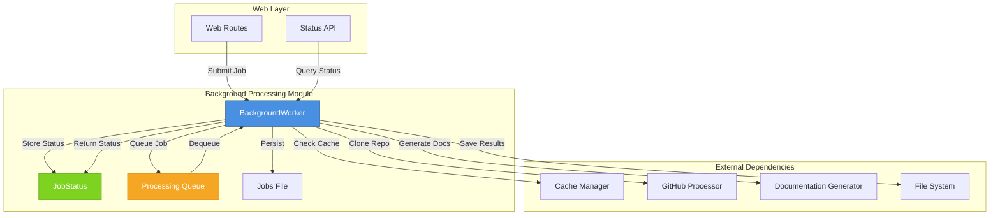
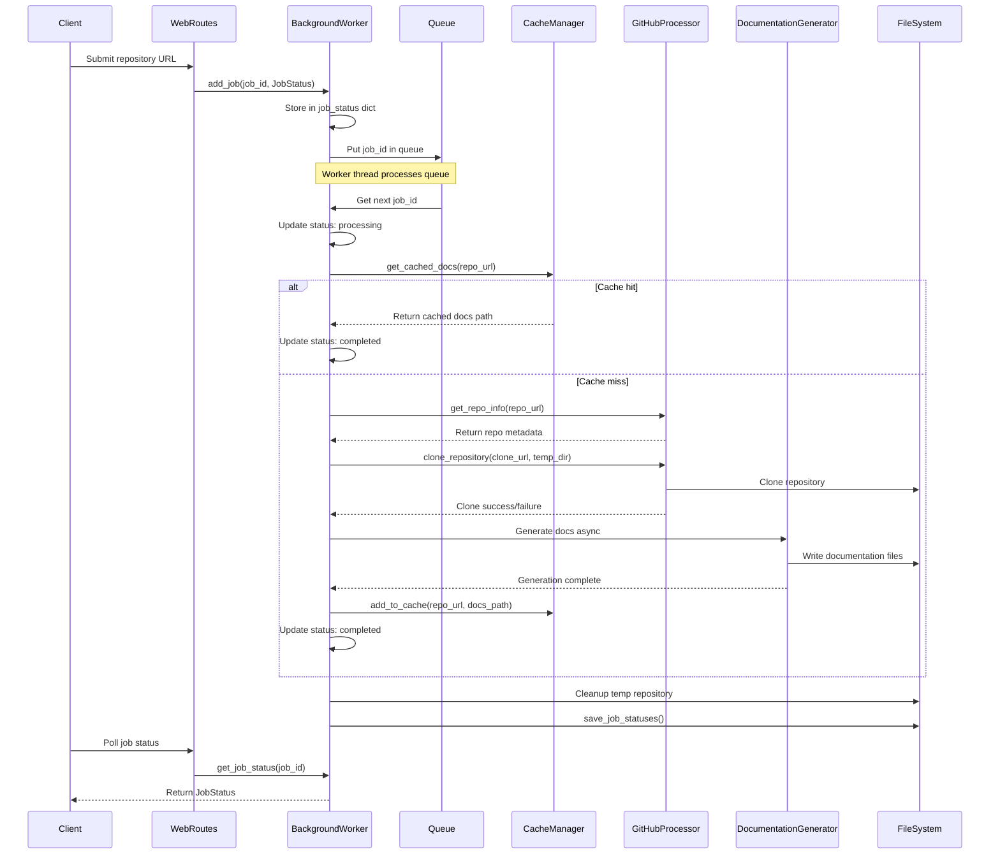
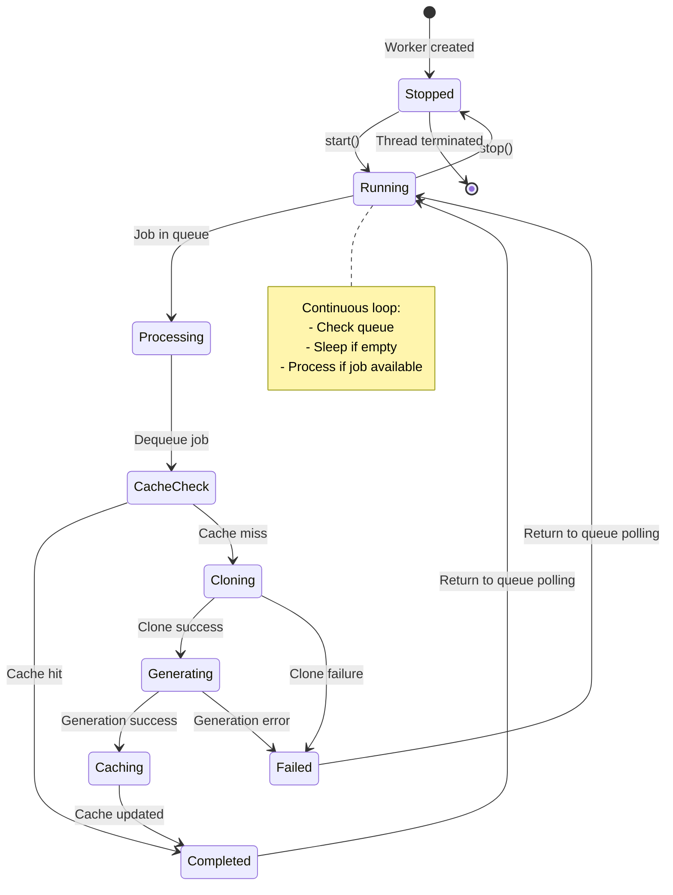
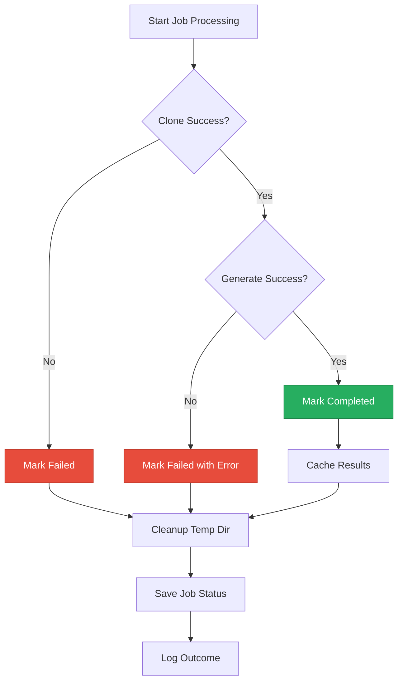

# Web Frontend - Background Processing

## Overview

The Web Frontend - Background Processing module provides asynchronous, queue-based processing for documentation generation jobs in the CodeWiki system. It manages the complete lifecycle of documentation generation tasks, from job submission through repository cloning, documentation generation, caching, and status tracking.

## Purpose

This module serves as the orchestration layer between web requests and the documentation generation pipeline, enabling:

- **Asynchronous Processing**: Non-blocking job execution in background threads
- **Job Persistence**: Durable storage of job statuses across server restarts
- **Intelligent Caching**: Integration with the cache manager to avoid redundant processing
- **Resource Management**: Controlled queue processing with cleanup of temporary resources
- **Status Tracking**: Real-time job progress monitoring and error reporting

## Architecture



## Core Components

### BackgroundWorker

The `BackgroundWorker` class is the central orchestrator for asynchronous documentation generation. It manages a dedicated worker thread that processes jobs from a queue, handles caching, and maintains persistent job status.

**Key Responsibilities:**
- Queue-based job processing with configurable queue size
- Thread-based background execution
- Job status persistence and recovery
- Cache integration for optimization
- Resource cleanup after job completion

**Configuration:**
- `cache_manager`: Instance of CacheManager for documentation caching
- `temp_dir`: Temporary directory for repository cloning (defaults to `WebAppConfig.TEMP_DIR`)
- `processing_queue`: Queue with max size from `WebAppConfig.QUEUE_SIZE`
- `jobs_file`: Persistent storage at `{CACHE_DIR}/jobs.json`

**Key Methods:**

| Method | Purpose |
|--------|---------|
| `start()` | Initialize and start the background worker thread |
| `stop()` | Gracefully stop the worker thread |
| `add_job(job_id, job)` | Add a new job to the processing queue |
| `get_job_status(job_id)` | Retrieve current status of a specific job |
| `get_all_jobs()` | Get all job statuses for monitoring |
| `load_job_statuses()` | Restore job statuses from disk on startup |
| `save_job_statuses()` | Persist current job states to disk |

### JobStatus

The `JobStatus` dataclass tracks the complete lifecycle of a documentation generation job, providing all metadata needed for monitoring and debugging.

**Fields:**

| Field | Type | Description |
|-------|------|-------------|
| `job_id` | `str` | Unique identifier for the job |
| `repo_url` | `str` | GitHub repository URL being processed |
| `status` | `str` | Current state: `queued`, `processing`, `completed`, `failed` |
| `created_at` | `datetime` | Job creation timestamp |
| `started_at` | `Optional[datetime]` | Processing start time |
| `completed_at` | `Optional[datetime]` | Job completion time |
| `error_message` | `Optional[str]` | Error details if job failed |
| `progress` | `str` | Human-readable progress description |
| `docs_path` | `Optional[str]` | Path to generated documentation |
| `main_model` | `Optional[str]` | LLM model used for generation |
| `commit_id` | `Optional[str]` | Specific commit ID for versioned docs |

## Job Processing Flow



## Worker Thread Lifecycle



## Integration with Other Modules

### Dependencies

The Background Processing module relies on several other modules in the CodeWiki system:

#### Cache Management Module
**Reference:** [Web Frontend - Cache Management](Web%20Frontend%20-%20Cache%20Management.md)

- **Purpose**: Avoid redundant documentation generation
- **Integration Points**:
  - `get_cached_docs(repo_url)`: Check for existing documentation before processing
  - `add_to_cache(repo_url, docs_path)`: Store newly generated documentation
  - Cache index recovery: Reconstruct job statuses from cache entries on startup

#### GitHub Processing Module
**Reference:** [Web Frontend - GitHub Processing](Web%20Frontend%20-%20GitHub%20Processing.md)

- **Purpose**: Repository validation and cloning
- **Integration Points**:
  - `get_repo_info(repo_url)`: Extract repository metadata (owner, name, clone URL)
  - `clone_repository(clone_url, target_dir, commit_id)`: Clone repository with optional version control

#### Documentation Generator (Agent Backend)
**Reference:** [Agent Backend](Agent%20Backend.md)

- **Purpose**: Core documentation generation logic
- **Integration Points**:
  - `DocumentationGenerator(config, commit_id)`: Initialize with repository configuration
  - `run()`: Execute async documentation generation pipeline
  - Creates structured documentation with module trees and metadata

#### Configuration
**Reference:** [Shared Utilities](Shared%20Utilities.md)

- **WebAppConfig**: Queue size, temporary directory, cache directory, timeout settings
- **Config**: Documentation generation settings (models, depth, output paths)

### Consumers

The Background Processing module is consumed by:

#### Web Routes Module
**Reference:** [Web Frontend - Web Routes](Web%20Frontend%20-%20Web%20Routes.md)

- Submits new documentation generation jobs
- Queries job status for progress updates
- Retrieves completed documentation paths

## Job Persistence and Recovery

The module implements robust persistence mechanisms to maintain job state across server restarts:

### Storage Format

Jobs are persisted to `{CACHE_DIR}/jobs.json` with the following structure:

```json
{
  "job-id-1": {
    "job_id": "job-id-1",
    "repo_url": "https://github.com/owner/repo",
    "status": "completed",
    "created_at": "2024-01-15T10:30:00",
    "started_at": "2024-01-15T10:30:05",
    "completed_at": "2024-01-15T10:35:00",
    "error_message": null,
    "progress": "Documentation generation completed",
    "docs_path": "/path/to/docs",
    "main_model": "gpt-4",
    "commit_id": null
  }
}
```

### Recovery Strategies

1. **Normal Recovery**: On startup, `load_job_statuses()` loads completed jobs from `jobs.json`
2. **Cache Reconstruction**: If `jobs.json` doesn't exist, `_reconstruct_jobs_from_cache()` rebuilds job history from the cache index
3. **Incomplete Job Handling**: Only completed jobs are loaded to avoid inconsistent states

## Error Handling

The module implements comprehensive error handling at multiple levels:

### Job Processing Errors



### Error Categories

| Error Type | Handling | User Feedback |
|------------|----------|---------------|
| Clone Failure | Mark job as failed, cleanup temp dir | "Failed to clone repository" |
| Generation Error | Mark job as failed with exception message | Error message with stack trace |
| Cache Error | Log warning, continue without caching | Job still completes |
| Async Event Loop Error | Create new event loop, close after completion | Transparent to user |
| Cleanup Failure | Log error, continue processing | Non-blocking |

## Resource Management

### Temporary Directory Handling

- **Creation**: Unique temp directory per job: `{TEMP_DIR}/{job_id}`
- **Usage**: Stores cloned repository during processing
- **Cleanup**: Removed via `rm -rf` after job completion (success or failure)

### Thread Management

- **Worker Thread**: Daemon thread for background processing
- **Queue Size**: Bounded queue (default: 100 jobs) to prevent memory overflow
- **Polling**: Sleep-based polling when queue is empty (1-second intervals)

### Event Loop Management

For async documentation generation, the worker creates isolated event loops:

```python
loop = asyncio.new_event_loop()
asyncio.set_event_loop(loop)
try:
    loop.run_until_complete(doc_generator.run())
finally:
    loop.close()
```

This ensures thread safety and proper async context handling in the background thread.

## Performance Considerations

### Optimization Strategies

1. **Cache-First Approach**: Check cache before cloning/generating to avoid redundant work
2. **Shallow Clones**: Use `--depth 1` for faster cloning (unless specific commit requested)
3. **Asynchronous Generation**: Non-blocking processing allows concurrent job submissions
4. **Bounded Queue**: Prevents memory exhaustion from job backlog

### Bottlenecks

| Operation | Typical Duration | Optimization |
|-----------|------------------|--------------|
| Cache lookup | < 100ms | In-memory cache index |
| Repository cloning | 5-60 seconds | Shallow clone, timeout limits |
| Documentation generation | 30-300 seconds | Depends on repo size and LLM speed |
| Job persistence | < 50ms | Batched JSON writes |

## Monitoring and Debugging

### Job Status Monitoring

Monitor job progress through the status API:

```python
# Get single job status
status = worker.get_job_status(job_id)
print(f"Status: {status.status}, Progress: {status.progress}")

# Get all jobs
all_jobs = worker.get_all_jobs()
for job_id, job in all_jobs.items():
    print(f"{job_id}: {job.status}")
```

### Log Output

The worker provides detailed console logging:

- **Startup**: "Background worker started"
- **Job completion**: "Job {job_id}: Documentation generated successfully"
- **Cache hit**: "Job {job_id}: Using cached documentation"
- **Failures**: "Job {job_id}: Failed with error: {error}"
- **Recovery**: "Loaded N completed jobs from disk" / "Reconstructed N job statuses from cache"

### Common Issues

| Issue | Cause | Solution |
|-------|-------|----------|
| Job stuck in `queued` | Worker not started | Call `worker.start()` |
| Job fails during clone | Network/git issues | Check connectivity, verify repo URL |
| Documentation generation timeout | Large repository | Increase timeout, reduce depth |
| Cache corruption | Disk issues | Delete cache index, let it rebuild |
| Temp directory overflow | Cleanup failure | Manually clear `{TEMP_DIR}` |

## Configuration Reference

### WebAppConfig Settings

| Setting | Default | Description |
|---------|---------|-------------|
| `CACHE_DIR` | `./output/cache` | Directory for job persistence |
| `TEMP_DIR` | `./output/temp` | Temporary repository storage |
| `QUEUE_SIZE` | `100` | Maximum jobs in processing queue |
| `CLONE_TIMEOUT` | `300` | Git clone timeout in seconds |
| `CLONE_DEPTH` | `1` | Shallow clone depth |

### Environment Variables

- `MAIN_MODEL`: LLM model for documentation generation (stored in job status)

## Future Enhancements

Potential improvements to the Background Processing module:

1. **Priority Queue**: Support for job prioritization
2. **Parallel Processing**: Multiple worker threads for concurrent job processing
3. **Job Cancellation**: Ability to cancel in-progress jobs
4. **Retry Logic**: Automatic retry for transient failures
5. **Progress Updates**: Granular progress reporting (percentage, current step)
6. **Rate Limiting**: Throttling to prevent API quota exhaustion
7. **Distributed Queue**: Redis-based queue for multi-instance deployments

## Related Documentation

- [Web Frontend - Cache Management](Web%20Frontend%20-%20Cache%20Management.md) - Documentation caching layer
- [Web Frontend - GitHub Processing](Web%20Frontend%20-%20GitHub%20Processing.md) - Repository cloning utilities
- [Web Frontend - Web Routes](Web%20Frontend%20-%20Web%20Routes.md) - HTTP endpoints and job submission
- [Agent Backend](Agent%20Backend.md) - Core documentation generation logic
- [Shared Utilities](Shared%20Utilities.md) - Common configuration and file management
