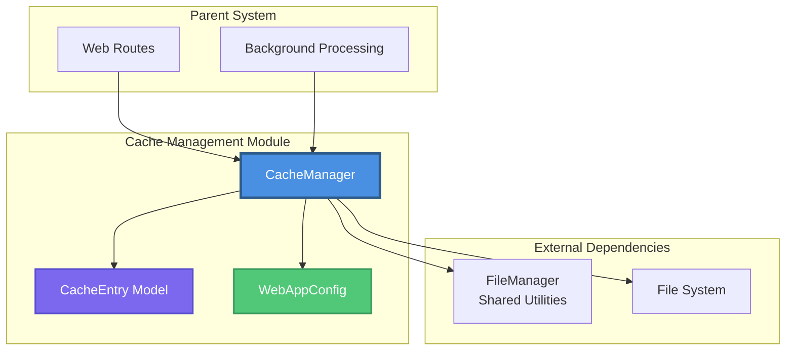
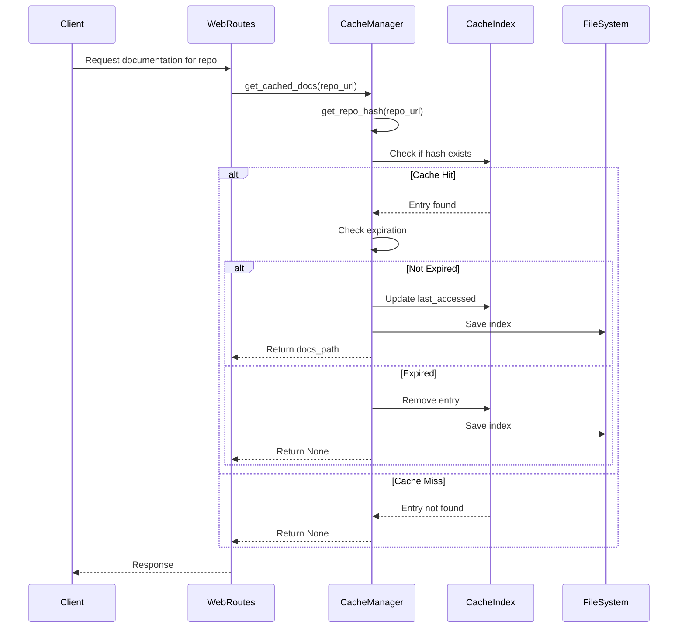
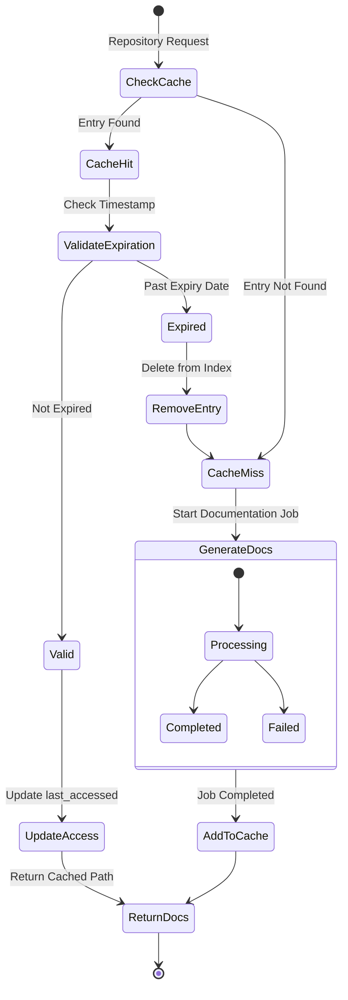
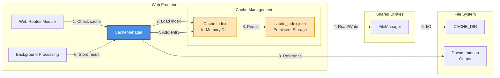
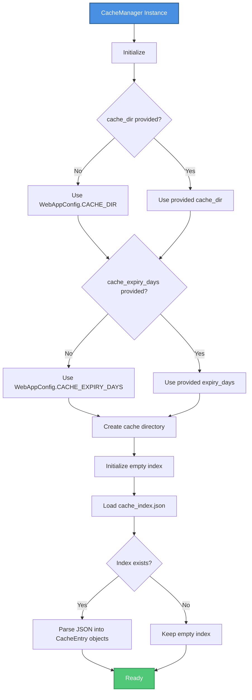
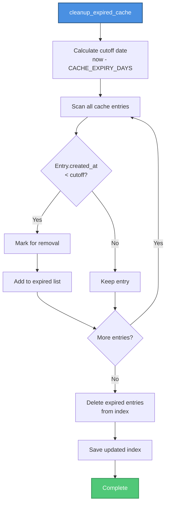

# Web Frontend - Cache Management

## Overview

The Cache Management module is a critical component of the CodeWiki Web Frontend responsible for efficiently managing cached documentation generation results. It implements a time-based expiration system with persistent storage to avoid redundant documentation generation for previously processed repositories.

This module serves as an optimization layer that:
- Reduces processing time for repeated repository requests
- Minimizes API calls to LLM services
- Provides fast access to previously generated documentation
- Manages storage through automatic cleanup of expired entries

## Module Architecture



## Core Components

### CacheManager

The `CacheManager` class is the primary interface for all cache operations. It maintains an in-memory index of cached entries backed by persistent JSON storage.

**Location:** `codewiki/src/fe/cache_manager.py`

**Key Responsibilities:**
- Load and persist cache index to disk
- Manage cache entries with expiration tracking
- Generate unique identifiers for repositories
- Clean up expired cache entries

**Core Methods:**

| Method | Purpose | Return Type |
|--------|---------|-------------|
| `get_cached_docs(repo_url)` | Retrieve cached documentation path | `Optional[str]` |
| `add_to_cache(repo_url, docs_path)` | Add new entry to cache | `None` |
| `remove_from_cache(repo_url)` | Remove entry from cache | `None` |
| `cleanup_expired_cache()` | Remove all expired entries | `None` |
| `get_repo_hash(repo_url)` | Generate SHA256 hash for repo URL | `str` |

### CacheEntry

A data model representing a single cache entry with metadata for tracking creation and access times.

**Location:** `codewiki/src/fe/models.py`

**Attributes:**

| Field | Type | Description |
|-------|------|-------------|
| `repo_url` | `str` | Original repository URL |
| `repo_url_hash` | `str` | SHA256 hash (16 chars) for indexing |
| `docs_path` | `str` | Path to generated documentation |
| `created_at` | `datetime` | Timestamp of cache creation |
| `last_accessed` | `datetime` | Timestamp of last access |

### WebAppConfig

Configuration class defining cache behavior and storage locations.

**Location:** `codewiki/src/fe/config.py`

**Cache-Related Settings:**

| Setting | Default Value | Description |
|---------|---------------|-------------|
| `CACHE_DIR` | `"./output/cache"` | Directory for cache storage |
| `CACHE_EXPIRY_DAYS` | `365` | Days before cache expires |

## Cache Data Flow



## Cache Lifecycle



## Component Interaction Diagram



## Cache Index Structure

The cache index is maintained both in-memory and persisted to disk as JSON:

```json
{
  "a1b2c3d4e5f6g7h8": {
    "repo_url": "https://github.com/user/repository",
    "repo_url_hash": "a1b2c3d4e5f6g7h8",
    "docs_path": "./output/cache/a1b2c3d4e5f6g7h8/docs",
    "created_at": "2024-01-15T10:30:00.000000",
    "last_accessed": "2024-01-20T14:22:00.000000"
  }
}
```

**Hash Generation:**
- Uses SHA256 hashing on the repository URL
- Truncated to 16 characters for compact identifiers
- Provides O(1) lookup performance

## Initialization and Configuration



## Integration Points

### With Web Routes Module

The Cache Manager integrates with the [Web Routes](Web Frontend - Web Routes.md) module to serve cached documentation:

```python
# Typical usage in web routes
cache_manager = CacheManager()

# Check cache before processing
cached_docs = cache_manager.get_cached_docs(repo_url)
if cached_docs:
    # Return cached documentation immediately
    return cached_docs
else:
    # Queue new documentation job
    background_worker.queue_job(repo_url)
```

### With Background Processing

Integration with [Background Processing](Web Frontend - Background Processing.md) for storing new results:

```python
# After job completion
docs_path = generate_documentation(repo_url)
cache_manager.add_to_cache(repo_url, docs_path)
```

### With Shared Utilities

The module depends on the [Shared Utilities](Shared Utilities.md) `FileManager` for:
- JSON serialization/deserialization
- File I/O operations
- Directory management

## Cache Operations

### Retrieving Cached Documentation

```python
def get_cached_docs(self, repo_url: str) -> Optional[str]:
    """
    Retrieve cached documentation path if available and valid.
    
    Process:
    1. Generate hash from repository URL
    2. Check if hash exists in cache index
    3. Validate entry hasn't expired
    4. Update last_accessed timestamp
    5. Return documentation path or None
    """
```

### Adding New Cache Entries

```python
def add_to_cache(self, repo_url: str, docs_path: str):
    """
    Store new documentation in cache.
    
    Process:
    1. Generate hash from repository URL
    2. Create CacheEntry with current timestamp
    3. Add to in-memory index
    4. Persist index to disk
    """
```

### Cache Cleanup



## Error Handling

The CacheManager implements defensive error handling to ensure robustness:

| Operation | Error Scenario | Handling Strategy |
|-----------|----------------|-------------------|
| Load Index | Corrupted JSON file | Print error, continue with empty index |
| Save Index | Write failure | Print error, in-memory state preserved |
| Get Cached Docs | Expired entry | Automatic removal from cache |
| Hash Generation | Invalid URL | Exception propagated to caller |

## Performance Characteristics

| Operation | Time Complexity | Notes |
|-----------|----------------|-------|
| `get_cached_docs()` | O(1) | Hash-based lookup |
| `add_to_cache()` | O(1) | Dictionary insertion + I/O |
| `remove_from_cache()` | O(1) | Dictionary deletion + I/O |
| `cleanup_expired_cache()` | O(n) | Linear scan of all entries |
| `load_cache_index()` | O(n) | Parse and reconstruct all entries |

**I/O Considerations:**
- Every cache modification triggers a full index write
- Optimized for read-heavy workloads (documentation retrieval)
- Suitable for moderate cache sizes (hundreds to thousands of entries)

## Configuration Reference

### Environment Variables

While not directly using environment variables, the `WebAppConfig` can be extended to support environment-based configuration:

```python
import os

class WebAppConfig:
    CACHE_DIR = os.getenv("CODEWIKI_CACHE_DIR", "./output/cache")
    CACHE_EXPIRY_DAYS = int(os.getenv("CODEWIKI_CACHE_EXPIRY_DAYS", "365"))
```

### Recommended Configurations

| Use Case | CACHE_EXPIRY_DAYS | Notes |
|----------|-------------------|-------|
| Development | 7 | Short expiry for testing |
| Production (Stable repos) | 365 | Annual refresh |
| Production (Active repos) | 30 | Monthly refresh |
| CI/CD Environments | 1 | Daily refresh |

## Best Practices

1. **Regular Cleanup**: Schedule periodic cache cleanup to prevent index bloat
   ```python
   # Run as scheduled task
   cache_manager.cleanup_expired_cache()
   ```

2. **Graceful Degradation**: Handle cache failures without impacting service
   ```python
   try:
       cached = cache_manager.get_cached_docs(repo_url)
   except Exception:
       cached = None  # Fall back to regeneration
   ```

3. **Cache Warming**: Pre-populate cache for frequently accessed repositories

4. **Monitoring**: Track cache hit/miss ratios for optimization

## Dependencies

### Internal Dependencies
- **[Shared Utilities](Shared Utilities.md)**: FileManager for JSON operations
- **[Web Frontend - Background Processing](Web Frontend - Background Processing.md)**: Consumes cache for job results
- **[Web Frontend - Web Routes](Web Frontend - Web Routes.md)**: Uses cache for request optimization

### External Dependencies
- `hashlib`: SHA256 hashing for repository identification
- `datetime`: Timestamp management
- `pathlib`: Path manipulation
- `typing`: Type hints for better code clarity
- `dataclasses`: Data model implementation

## Storage Layout

```
output/
├── cache/
│   ├── cache_index.json          # Persistent cache index
│   ├── a1b2c3d4e5f6g7h8/        # Cache entry directory (hash-based)
│   │   ├── docs/                 # Generated documentation
│   │   └── metadata.json         # Entry metadata
│   └── b2c3d4e5f6g7h8i9/
│       ├── docs/
│       └── metadata.json
└── temp/                         # Temporary processing files
```

## Summary

The Cache Management module provides an efficient, persistent caching layer for the CodeWiki Web Frontend. By leveraging hash-based lookups and time-based expiration, it significantly reduces redundant documentation generation while maintaining fresh content. The module's design emphasizes simplicity, reliability, and integration with the broader web application architecture.

Key benefits:
- **Performance**: O(1) cache lookups minimize response times
- **Reliability**: Persistent storage ensures cache survives restarts
- **Maintainability**: Automatic cleanup prevents storage bloat
- **Flexibility**: Configurable expiration policies adapt to different use cases
