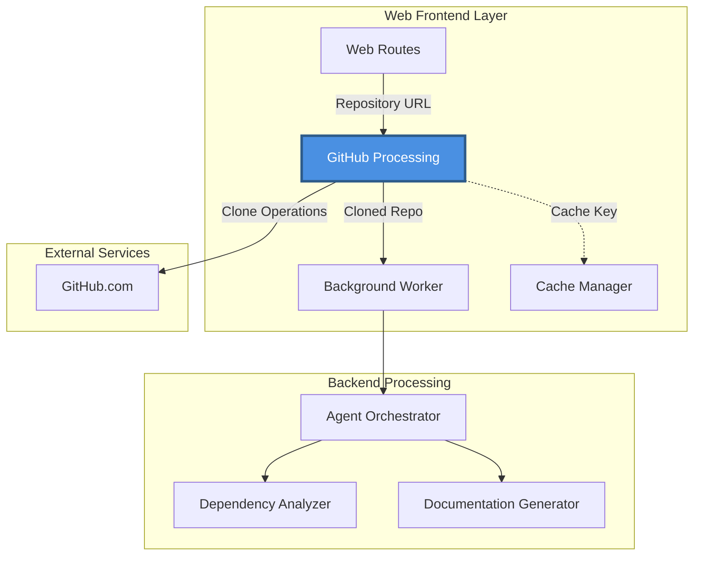
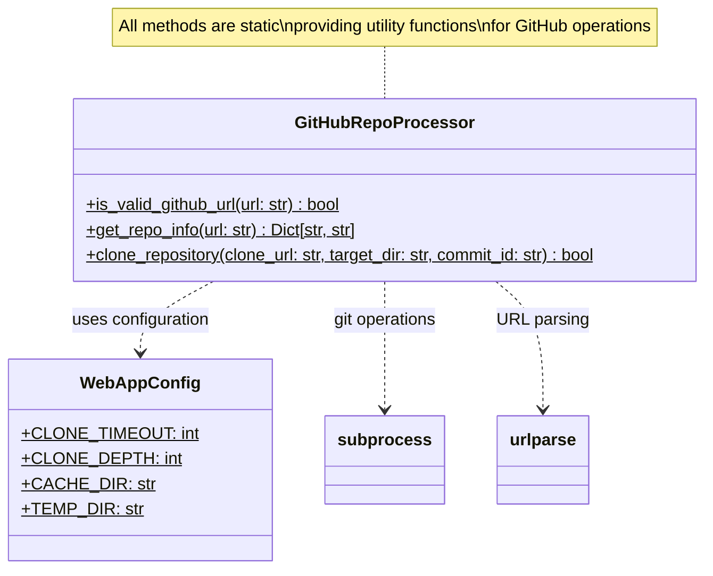
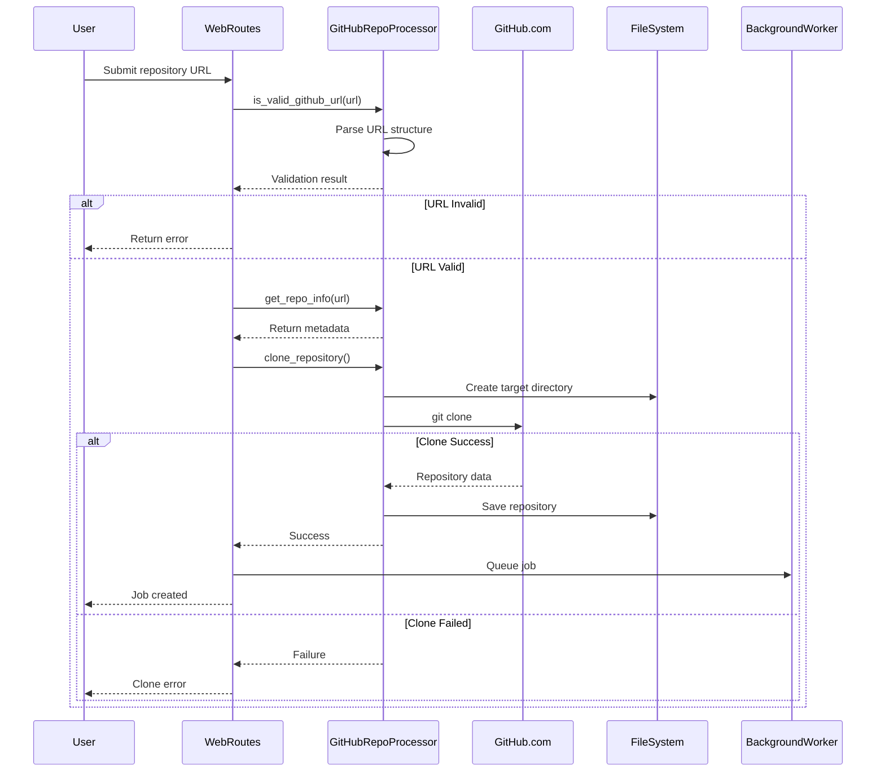
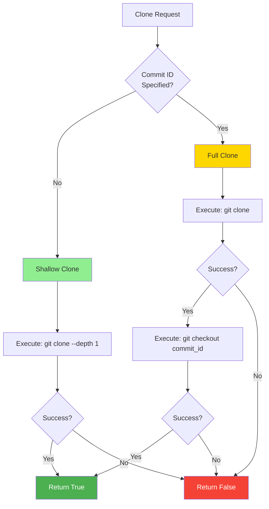

# Web Frontend - GitHub Processing

## Overview

The **GitHub Processing** module is a specialized component within the Web Frontend that handles all GitHub repository-related operations. It provides robust functionality for validating GitHub URLs, extracting repository metadata, and cloning repositories with support for both shallow clones and specific commit checkouts.

This module serves as the entry point for repository processing in the web application, bridging the gap between user-submitted GitHub URLs and the documentation generation pipeline.

## Architecture

### Module Position in System

The GitHub Processing module operates within the Web Frontend layer and acts as a critical interface between user input and the documentation generation system:



### Component Architecture

The module consists of a single, well-designed component that encapsulates all GitHub-related operations:



## Core Functionality

### GitHubRepoProcessor

The `GitHubRepoProcessor` class provides static utility methods for GitHub repository operations. It's designed as a stateless utility class, making it easy to use without instantiation.

#### Key Responsibilities

1. **URL Validation**: Validates GitHub repository URLs
2. **Metadata Extraction**: Extracts owner, repository name, and clone URLs
3. **Repository Cloning**: Handles git clone operations with configurable options

### Method Documentation

#### `is_valid_github_url(url: str) -> bool`

Validates whether a given URL is a valid GitHub repository URL.

**Validation Criteria:**
- Domain must be `github.com` or `www.github.com`
- Path must contain at least two segments (owner/repo)
- Both owner and repo names must be non-empty

**Example:**
```python
# Valid URLs
GitHubRepoProcessor.is_valid_github_url("https://github.com/owner/repo")  # True
GitHubRepoProcessor.is_valid_github_url("https://www.github.com/owner/repo.git")  # True

# Invalid URLs
GitHubRepoProcessor.is_valid_github_url("https://gitlab.com/owner/repo")  # False
GitHubRepoProcessor.is_valid_github_url("https://github.com/owner")  # False
```

#### `get_repo_info(url: str) -> Dict[str, str]`

Extracts repository metadata from a GitHub URL.

**Returns:**
```python
{
    'owner': 'repository-owner',
    'repo': 'repository-name',
    'full_name': 'repository-owner/repository-name',
    'clone_url': 'https://github.com/repository-owner/repository-name.git'
}
```

**Features:**
- Automatically strips `.git` suffix from repository names
- Constructs proper clone URL for git operations
- Returns comprehensive metadata for downstream processing

**Example:**
```python
info = GitHubRepoProcessor.get_repo_info("https://github.com/python/cpython")
# Returns:
# {
#     'owner': 'python',
#     'repo': 'cpython',
#     'full_name': 'python/cpython',
#     'clone_url': 'https://github.com/python/cpython.git'
# }
```

#### `clone_repository(clone_url: str, target_dir: str, commit_id: str = None) -> bool`

Clones a GitHub repository to the local filesystem with support for specific commit checkouts.

**Parameters:**
- `clone_url`: Git clone URL (e.g., `https://github.com/owner/repo.git`)
- `target_dir`: Local directory path for the cloned repository
- `commit_id`: Optional specific commit SHA to checkout

**Behavior:**

| Scenario | Clone Strategy | Git Command |
|----------|---------------|-------------|
| Default (no commit_id) | Shallow clone (depth=1) | `git clone --depth 1 <url>` |
| Specific commit | Full clone + checkout | `git clone <url>` + `git checkout <commit>` |

**Configuration Dependencies:**
- Uses `WebAppConfig.CLONE_TIMEOUT` (default: 300 seconds) for clone operation timeout
- Uses `WebAppConfig.CLONE_DEPTH` (default: 1) for shallow clone depth

**Error Handling:**
- Catches and logs exceptions during clone operations
- Captures stderr from git commands for error reporting
- Returns `False` on any failure, `True` on success

**Example:**
```python
# Shallow clone (latest commit only)
success = GitHubRepoProcessor.clone_repository(
    clone_url="https://github.com/owner/repo.git",
    target_dir="./output/temp/owner_repo"
)

# Clone specific commit
success = GitHubRepoProcessor.clone_repository(
    clone_url="https://github.com/owner/repo.git",
    target_dir="./output/temp/owner_repo",
    commit_id="abc123def456"
)
```

## Data Flow

### Repository Processing Workflow



### Clone Strategy Decision Flow



## Integration Points

### Dependencies

#### Internal Dependencies

- **[Web Frontend - Cache Management](Web%20Frontend%20-%20Cache%20Management.md)**: Uses `WebAppConfig` for:
  - Clone timeout configuration (`CLONE_TIMEOUT`)
  - Shallow clone depth (`CLONE_DEPTH`)
  - Directory paths for temporary storage

#### External Dependencies

- **Python Standard Library**:
  - `urllib.parse.urlparse`: URL parsing and validation
  - `subprocess`: Git command execution
  - `os`: File system operations

- **Git**: Requires git to be installed and accessible in the system PATH

### Consumers

The GitHub Processing module is primarily consumed by:

1. **[Web Frontend - Web Routes](Web%20Frontend%20-%20Web%20Routes.md)**: Validates and processes user-submitted repository URLs
2. **[Web Frontend - Background Processing](Web%20Frontend%20-%20Background%20Processing.md)**: Receives cloned repositories for documentation generation

### Configuration Requirements

The module depends on the following configuration values from `WebAppConfig`:

| Configuration | Type | Default | Purpose |
|--------------|------|---------|---------|
| `CLONE_TIMEOUT` | int | 300 | Maximum seconds to wait for clone operation |
| `CLONE_DEPTH` | int | 1 | Depth for shallow clones (optimizes bandwidth) |
| `TEMP_DIR` | str | "./output/temp" | Base directory for cloned repositories |

## Usage Patterns

### Basic Repository Processing

```python
from codewiki.src.fe.github_processor import GitHubRepoProcessor
from codewiki.src.fe.config import WebAppConfig

# Validate user input
github_url = "https://github.com/user/repository"
if not GitHubRepoProcessor.is_valid_github_url(github_url):
    raise ValueError("Invalid GitHub URL")

# Extract metadata
repo_info = GitHubRepoProcessor.get_repo_info(github_url)
print(f"Processing: {repo_info['full_name']}")

# Clone repository
target_dir = f"{WebAppConfig.TEMP_DIR}/{repo_info['owner']}_{repo_info['repo']}"
if GitHubRepoProcessor.clone_repository(repo_info['clone_url'], target_dir):
    print(f"Repository cloned to: {target_dir}")
else:
    print("Clone failed")
```

### Processing Specific Commits

```python
# Clone a specific commit for reproducible builds
commit_sha = "abc123def456789"
target_dir = f"./output/temp/{repo_info['owner']}_{repo_info['repo']}_{commit_sha}"

success = GitHubRepoProcessor.clone_repository(
    clone_url=repo_info['clone_url'],
    target_dir=target_dir,
    commit_id=commit_sha
)
```

### Integration with Web Routes

```python
# Typical usage in web route handler
async def handle_repository_submission(request):
    data = await request.json()
    repo_url = data.get('repository_url')
    commit_id = data.get('commit_id')
    
    # Step 1: Validate
    if not GitHubRepoProcessor.is_valid_github_url(repo_url):
        return {"error": "Invalid GitHub URL"}
    
    # Step 2: Extract metadata
    repo_info = GitHubRepoProcessor.get_repo_info(repo_url)
    
    # Step 3: Clone repository
    target_dir = generate_target_directory(repo_info)
    if GitHubRepoProcessor.clone_repository(
        repo_info['clone_url'], 
        target_dir, 
        commit_id
    ):
        # Step 4: Queue for processing
        job_id = queue_documentation_job(repo_info, target_dir)
        return {"job_id": job_id, "status": "queued"}
    else:
        return {"error": "Failed to clone repository"}
```

## Design Considerations

### Stateless Design

All methods are implemented as static methods, providing several benefits:
- **No State Management**: No need to manage instance state
- **Easy Testing**: Simple to unit test without setup
- **Thread Safety**: No shared state means thread-safe operations
- **Convenience**: Call directly without instantiation

### Shallow Clone Optimization

By default, the module uses shallow clones (`--depth 1`) which provides:
- **Faster Clones**: Only fetches the latest commit history
- **Reduced Bandwidth**: Significantly smaller data transfer
- **Storage Efficiency**: Minimal local storage requirements
- **Suitable for Documentation**: Only needs current code state

### Error Handling Strategy

The module implements defensive error handling:
- **Exception Catching**: All operations wrapped in try-except blocks
- **Subprocess Error Capture**: Captures stderr for debugging
- **Boolean Return**: Simple success/failure indication
- **Console Logging**: Prints errors for operational visibility

### Security Considerations

**URL Validation**: Strict validation prevents:
- Arbitrary git repository access
- Path traversal through malformed URLs
- Non-GitHub repository processing

**Git Command Safety**: Uses subprocess with:
- Explicit command arguments (not shell strings)
- Timeout protection against hanging operations
- Proper error capture and handling

## Performance Characteristics

### Clone Performance

| Scenario | Typical Time | Network Usage | Disk Usage |
|----------|--------------|---------------|------------|
| Shallow clone (small repo) | 5-15 seconds | ~1-10 MB | ~1-10 MB |
| Shallow clone (large repo) | 30-60 seconds | ~50-200 MB | ~50-200 MB |
| Full clone + checkout | 2-5x slower | Full history | Full history |

### Optimization Recommendations

1. **Use Shallow Clones**: Default behavior optimizes for speed
2. **Parallel Processing**: Clone operations are independent and can run concurrently
3. **Cleanup Old Clones**: Implement periodic cleanup of temporary directories
4. **Cache Popular Repos**: Consider caching frequently-accessed repositories

## Error Scenarios and Handling

### Common Error Cases

| Error Scenario | Detection | Recovery |
|---------------|-----------|----------|
| Invalid URL format | URL parsing failure | Return validation error to user |
| Non-GitHub URL | Domain validation | Reject with appropriate message |
| Private repository | Git authentication failure | Report access error |
| Network timeout | Subprocess timeout | Retry or report network issue |
| Invalid commit ID | Git checkout failure | Report commit not found |
| Disk space exhausted | OS error | Clean up and report |
| Git not installed | Command not found | Report system configuration error |

### Logging and Monitoring

The module prints error messages to console for operational monitoring:
- Clone failures with stderr output
- Checkout failures with commit details
- Exception messages for unexpected errors

**Recommendation**: Integrate with the application's logging framework for structured logging in production environments.

## Testing Strategies

### Unit Testing

```python
import pytest
from codewiki.src.fe.github_processor import GitHubRepoProcessor

class TestGitHubRepoProcessor:
    
    def test_valid_github_url(self):
        assert GitHubRepoProcessor.is_valid_github_url("https://github.com/owner/repo")
        assert GitHubRepoProcessor.is_valid_github_url("https://www.github.com/owner/repo")
    
    def test_invalid_urls(self):
        assert not GitHubRepoProcessor.is_valid_github_url("https://gitlab.com/owner/repo")
        assert not GitHubRepoProcessor.is_valid_github_url("https://github.com/owner")
        assert not GitHubRepoProcessor.is_valid_github_url("not-a-url")
    
    def test_get_repo_info(self):
        info = GitHubRepoProcessor.get_repo_info("https://github.com/python/cpython")
        assert info['owner'] == 'python'
        assert info['repo'] == 'cpython'
        assert info['full_name'] == 'python/cpython'
    
    def test_git_suffix_removal(self):
        info = GitHubRepoProcessor.get_repo_info("https://github.com/owner/repo.git")
        assert info['repo'] == 'repo'
        assert not info['repo'].endswith('.git')
```

### Integration Testing

For integration tests, use:
- Mock git repositories for predictable testing
- Temporary directories with cleanup
- Timeout handling verification
- Error scenario simulation

## Future Enhancements

### Potential Improvements

1. **Authentication Support**: Add support for private repositories via tokens
2. **Progress Reporting**: Stream clone progress for long-running operations
3. **Retry Logic**: Automatic retry with exponential backoff
4. **Repository Caching**: Cache frequently-accessed repositories
5. **Branch Support**: Explicit branch checkout instead of default branch
6. **Submodule Handling**: Option to clone with or without submodules
7. **Archive Downloads**: Support GitHub archive downloads as alternative to git clone

### Extensibility Points

The module can be extended to support:
- Additional Git hosting services (GitLab, Bitbucket)
- Custom clone options and flags
- Repository verification and integrity checks
- Pre-clone hooks for custom validation

## Related Documentation

- **[Web Frontend - Web Routes](Web%20Frontend%20-%20Web%20Routes.md)**: Primary consumer of GitHub processing
- **[Web Frontend - Background Processing](Web%20Frontend%20-%20Background%20Processing.md)**: Downstream processing of cloned repositories
- **[Web Frontend - Cache Management](Web%20Frontend%20-%20Cache%20Management.md)**: Configuration and caching infrastructure
- **[Agent Backend](Agent%20Backend.md)**: Documentation generation pipeline
- **[Dependency Analyzer](Dependency%20Analyzer.md)**: Code analysis after cloning

## Summary

The GitHub Processing module provides essential functionality for the Web Frontend's repository processing capabilities. Its focused, stateless design makes it reliable and easy to maintain, while its integration with WebAppConfig ensures consistent behavior across the application. The module's support for both shallow clones and specific commits provides the flexibility needed for various documentation generation scenarios.