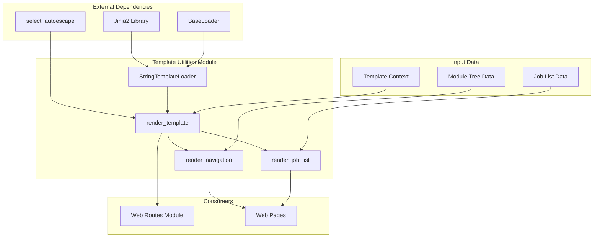
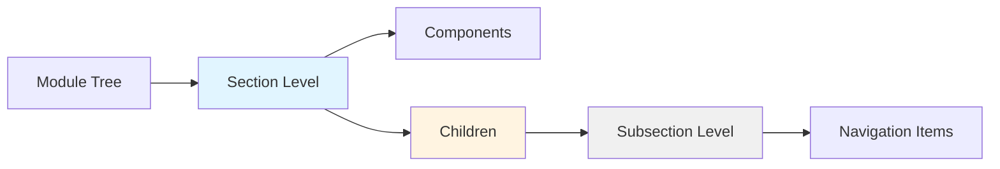
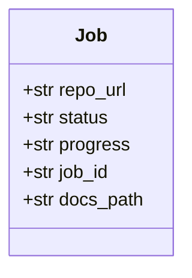
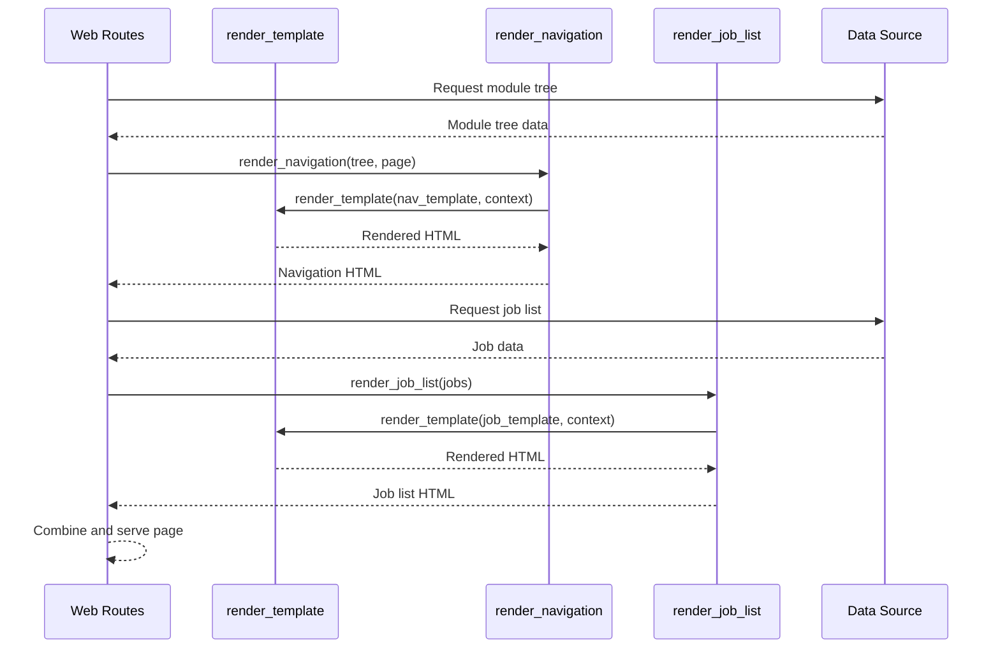
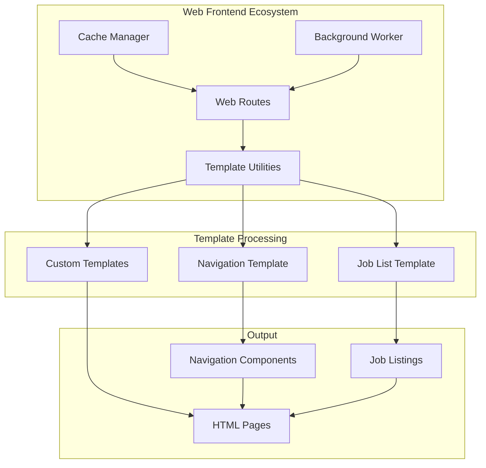
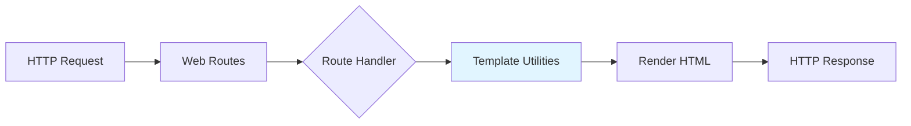
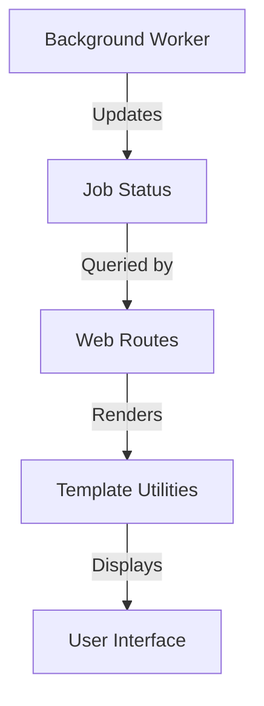

# Web Frontend - Template Utilities

## Overview

The Template Utilities module provides a lightweight, flexible template rendering system for the Web Frontend using Jinja2. This module serves as the presentation layer helper, enabling dynamic HTML generation for navigation components, job listings, and other web interface elements without the overhead of template files.

## Module Purpose

The Template Utilities module bridges the gap between backend data and frontend presentation by:
- Rendering HTML templates from strings using Jinja2
- Generating navigation components from module tree structures
- Displaying job status and progress information
- Providing a reusable template rendering infrastructure

## Architecture



## Core Components

### StringTemplateLoader

A custom Jinja2 loader that enables rendering templates from string values rather than files.

**Purpose:** Provides flexibility for dynamic template generation without requiring physical template files.

**Key Features:**
- Extends Jinja2's `BaseLoader`
- Accepts template content as a string
- Implements the `get_source` method required by Jinja2
- Returns template source with no upstream caching

**Implementation Details:**
```python
class StringTemplateLoader(BaseLoader):
    def __init__(self, template_string: str):
        self.template_string = template_string
    
    def get_source(self, environment, template):
        return self.template_string, None, lambda: True
```

**Use Cases:**
- Dynamic template generation based on runtime conditions
- Inline template definitions in code
- Template content from database or API responses
- Reduced file system dependencies

### render_template

The core template rendering function that processes Jinja2 templates with provided context data.

**Function Signature:**
```python
def render_template(template: str, context: Dict[str, Any]) -> str
```

**Parameters:**
- `template` (str): HTML template string with Jinja2 syntax
- `context` (Dict[str, Any]): Dictionary of variables for template substitution

**Returns:**
- `str`: Rendered HTML string

**Environment Configuration:**
- **Loader:** Uses `StringTemplateLoader` for string-based templates
- **Autoescape:** Enabled for HTML and XML to prevent XSS attacks
- **Trim blocks:** Removes first newline after block tags
- **Lstrip blocks:** Removes leading whitespace from block lines

**Example Usage:**
```python
template = """
<h1>{{ title }}</h1>
<p>Welcome, {{ user.name }}!</p>
"""
context = {
    'title': 'Dashboard',
    'user': {'name': 'Alice'}
}
html = render_template(template, context)
```

### render_navigation

Specialized function for rendering navigation menus from module tree structures.

**Function Signature:**
```python
def render_navigation(module_tree: Dict[str, Any], current_page: str = "") -> str
```

**Parameters:**
- `module_tree` (Dict[str, Any]): Dictionary representing the module tree
- `current_page` (str): Current page filename for active state highlighting

**Returns:**
- `str`: HTML string for navigation component

**Navigation Structure:**


**Generated HTML Structure:**
- Each section wrapped in `.nav-section` div
- Section headers with title formatting
- Active page highlighting via CSS class
- Nested subsections for hierarchical organization
- Links to overview pages and child modules

**Template Features:**
- Automatic title formatting (underscore replacement, title case)
- Active state detection for current page
- Support for both components and children sections
- Conditional rendering based on data availability

### render_job_list

Renders job status lists with progress tracking and action buttons.

**Function Signature:**
```python
def render_job_list(jobs: list) -> str
```

**Parameters:**
- `jobs` (list): List of job objects with status information

**Returns:**
- `str`: HTML string for job list display

**Job Object Structure:**


**Display Features:**
- Repository URL display
- Status badges with CSS class styling (`status-{status}`)
- Progress information (conditional)
- Documentation links for completed jobs
- Responsive job item layout

**Job Status States:**
- `pending` - Job queued
- `running` - Job in progress
- `completed` - Job finished successfully
- `failed` - Job encountered error

## Data Flow



## Component Interaction



## Template Security

The module implements several security best practices:

### XSS Prevention
- **Autoescape:** Automatically escapes HTML/XML content in variables
- **Context validation:** Type hints encourage proper data structures
- **No inline scripts:** Templates focus on structure, not behavior

### Template Injection Prevention
- **Controlled environment:** Jinja2 environment configured with security settings
- **No arbitrary code:** Templates limited to variable substitution and control flow
- **Sandboxed execution:** Templates run in isolated Jinja2 environment

## Usage Examples

### Basic Template Rendering

```python
from codewiki.src.fe.template_utils import render_template

template = """
<div class="user-profile">
    <h2>{{ user.name }}</h2>
    <p>Email: {{ user.email }}</p>
    
    <span class="badge">Admin</span>
    
</div>
"""

context = {
    'user': {
        'name': 'John Doe',
        'email': 'john@example.com',
        'is_admin': True
    }
}

html = render_template(template, context)
```

### Navigation Generation

```python
from codewiki.src.fe.template_utils import render_navigation

module_tree = {
    'dependency_analyzer': {
        'components': [...],
        'children': {
            'language_analyzers': {...},
            'data_models': {...}
        }
    },
    'agent_backend': {
        'components': [...]
    }
}

nav_html = render_navigation(module_tree, current_page='dependency_analyzer.md')
```

### Job List Display

```python
from codewiki.src.fe.template_utils import render_job_list

jobs = [
    {
        'repo_url': 'https://github.com/user/repo1',
        'status': 'completed',
        'progress': '100%',
        'job_id': 'job-123',
        'docs_path': '/docs/job-123'
    },
    {
        'repo_url': 'https://github.com/user/repo2',
        'status': 'running',
        'progress': '45%'
    }
]

job_html = render_job_list(jobs)
```

## Integration Points

### With Web Routes Module

The Template Utilities module is primarily consumed by the [Web Frontend - Web Routes](Web Frontend - Web Routes.md) module to generate dynamic HTML responses:



**Common Integration Patterns:**
- Route handlers use `render_navigation()` for consistent navigation across pages
- Job status endpoints use `render_job_list()` for real-time updates
- Custom page rendering using `render_template()` for specialized views

### With Background Worker

The module indirectly integrates with the [Web Frontend - Background Processing](Web Frontend - Background Processing.md) module:



## Design Patterns

### Strategy Pattern
The module employs the Strategy pattern through Jinja2's loader system:
- `StringTemplateLoader` is a strategy for loading templates from strings
- Can be replaced with file-based loaders without changing rendering logic

### Template Method Pattern
Specialized rendering functions (`render_navigation`, `render_job_list`) follow the Template Method pattern:
- Define template structure once
- Accept varying data through context
- Produce consistent output format

### Utility Pattern
The module follows a utility-focused design:
- Stateless functions
- No side effects
- Reusable across the application
- Easy to test and maintain

## Performance Considerations

### Template Compilation
- Jinja2 compiles templates to Python bytecode on first render
- Subsequent renders are faster due to compilation caching
- String templates avoid file system I/O overhead

### Memory Efficiency
- Templates loaded on demand
- No persistent template cache in memory
- Lightweight string-based approach reduces memory footprint

### Optimization Recommendations
1. **Pre-compile templates** for frequently used patterns
2. **Cache rendered output** for static content
3. **Minimize template complexity** for better rendering performance
4. **Use context processors** for shared data across templates

## Testing Strategies

### Unit Testing
```python
def test_render_template_basic():
    template = "<p>{{ message }}</p>"
    context = {'message': 'Hello'}
    result = render_template(template, context)
    assert result == "<p>Hello</p>"

def test_render_navigation_empty():
    result = render_navigation({}, "page.md")
    assert result == ""

def test_render_job_list_empty():
    result = render_job_list([])
    assert result == ""
```

### Integration Testing
- Test with real module tree data
- Verify navigation links are correctly generated
- Validate job status display with various states
- Test autoescape functionality with malicious input

## Error Handling

The module relies on Jinja2's error handling:

**Template Syntax Errors:**
- Raised when template contains invalid Jinja2 syntax
- Includes line numbers and error descriptions

**Context Errors:**
- Missing variables result in empty strings (Jinja2 default)
- Can be configured to raise errors for undefined variables

**Type Errors:**
- Invalid context types may cause rendering failures
- Type hints guide proper usage

## Configuration Options

The Jinja2 environment can be customized by modifying the `render_template` function:

**Current Configuration:**
```python
Environment(
    loader=StringTemplateLoader(template),
    autoescape=select_autoescape(['html', 'xml']),
    trim_blocks=True,
    lstrip_blocks=True
)
```

**Potential Extensions:**
- Add custom filters for date formatting, URL encoding, etc.
- Enable template caching for production
- Add global functions for common operations
- Configure strict undefined behavior

## Best Practices

### Template Design
1. **Keep templates simple** - Move complex logic to Python code
2. **Use meaningful variable names** - Improve template readability
3. **Leverage Jinja2 filters** - Built-in filters for common transformations
4. **Test edge cases** - Empty lists, None values, missing keys

### Context Preparation
1. **Validate data before rendering** - Ensure expected structure
2. **Use TypedDict or dataclasses** - Better type safety
3. **Document required context variables** - Maintain template documentation
4. **Sanitize user input** - Even with autoescape enabled

### Performance
1. **Cache rendered navigation** - Navigation rarely changes
2. **Batch render operations** - Reduce repeated template compilation
3. **Use async rendering** - For high-traffic applications
4. **Monitor rendering times** - Identify slow templates

## Related Modules

- **[Web Frontend - Web Routes](Web Frontend - Web Routes.md)** - Primary consumer of template utilities
- **[Web Frontend - Background Processing](Web Frontend - Background Processing.md)** - Provides job status data
- **[Web Frontend - Cache Management](Web Frontend - Cache Management.md)** - Can cache rendered templates
- **[Web Frontend - GitHub Processing](Web Frontend - GitHub Processing.md)** - Generates module tree data

## Future Enhancements

### Potential Improvements
1. **Template caching layer** - Cache compiled templates in memory
2. **Custom filter library** - Add domain-specific filters
3. **Template inheritance** - Support base templates and blocks
4. **Async rendering** - Support asynchronous template rendering
5. **Template validation** - Pre-validate templates before deployment

### Extension Points
- Custom Jinja2 extensions for domain-specific functionality
- Plugin system for custom loaders
- Hook system for pre/post rendering processing
- Integration with component-based frontend frameworks

## Summary

The Template Utilities module provides a robust, secure, and flexible foundation for HTML generation in the Web Frontend. By leveraging Jinja2's powerful templating engine with a custom string-based loader, it enables dynamic content rendering while maintaining simplicity and performance. The module's focused design makes it easy to test, maintain, and extend as the application evolves.
