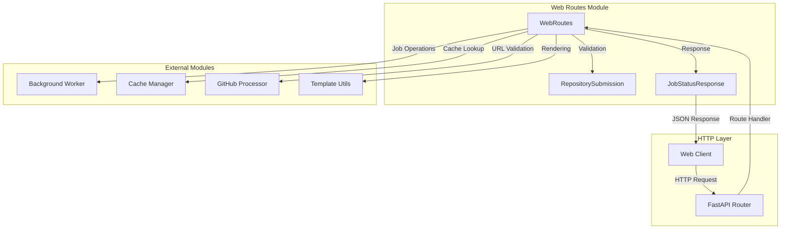
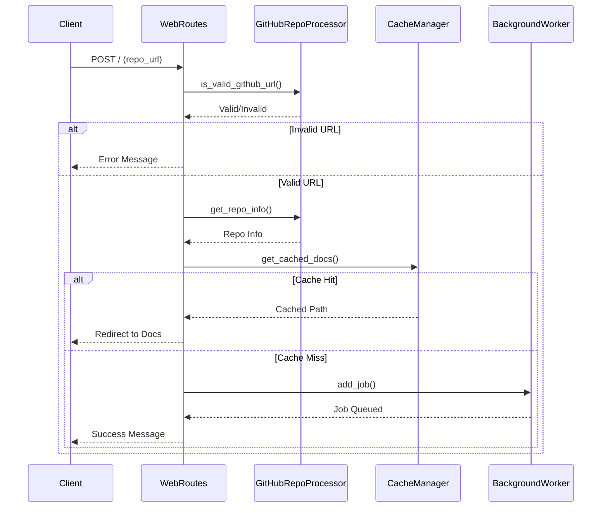
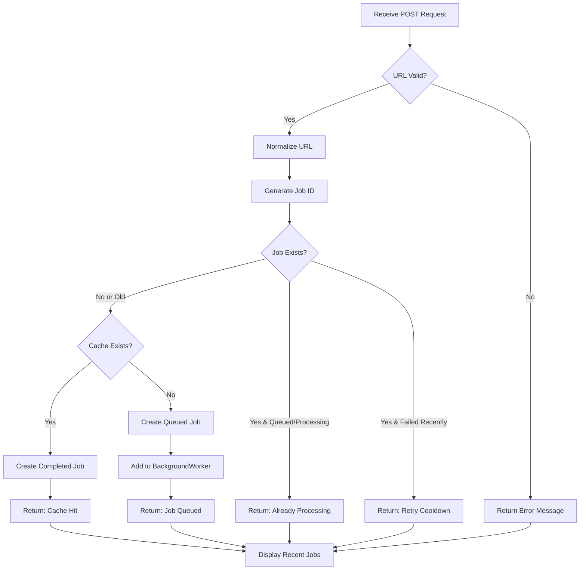
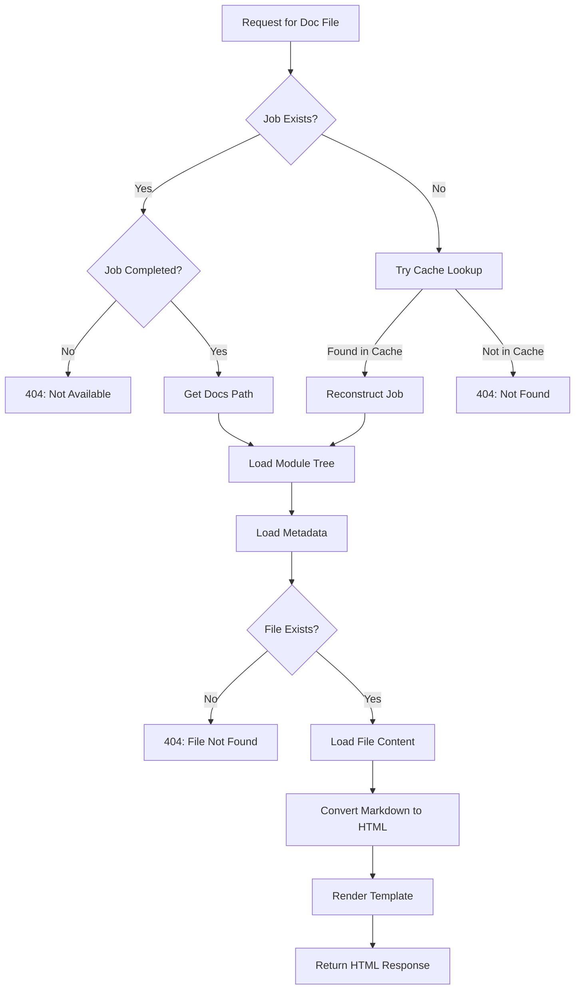
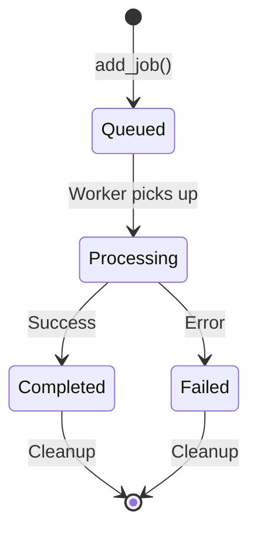
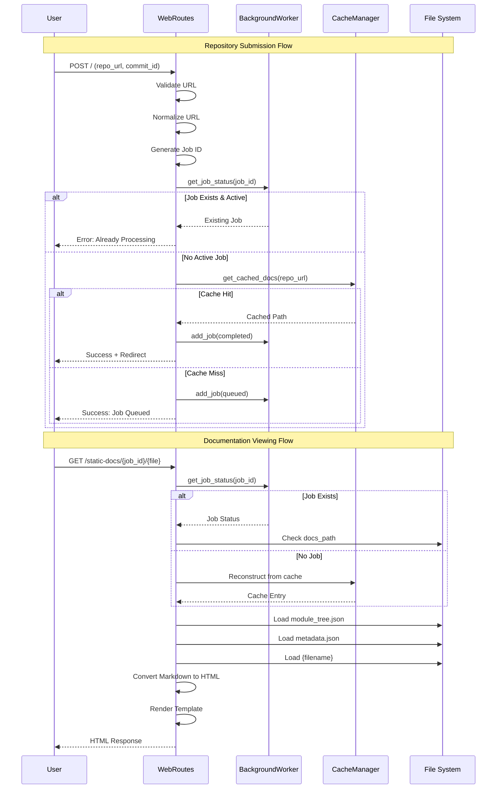

# Web Frontend - Web Routes

## Overview

The **Web Frontend - Web Routes** module serves as the HTTP interface layer for the CodeWiki documentation generation system. It handles all incoming web requests, manages user interactions, and coordinates between the frontend presentation layer and backend processing services. This module acts as the gateway through which users submit GitHub repositories for documentation generation and retrieve generated documentation.

The module implements a RESTful API using FastAPI, providing endpoints for repository submission, job status tracking, and documentation viewing. It integrates with the Background Processing, Cache Management, and GitHub Processing modules to deliver a seamless user experience.

## Core Components

### WebRoutes

The `WebRoutes` class is the central component responsible for handling all HTTP requests and routing logic. It manages:

- **Repository Submission**: Validates and queues GitHub repositories for documentation generation
- **Job Management**: Tracks and reports job status to clients
- **Documentation Serving**: Retrieves and serves generated documentation files
- **Cache Integration**: Checks cache before processing to optimize performance
- **Job Cleanup**: Maintains job history by removing expired entries

### Data Models

The module defines several data models for request/response handling:

- **RepositorySubmission**: Pydantic model for validating repository URL submissions
- **JobStatusResponse**: Pydantic model for API responses containing job status information

## Architecture



### Component Interactions



## API Endpoints

### Index Page (GET)

**Endpoint**: `GET /`

**Purpose**: Displays the main web interface with repository submission form and recent job list.

**Handler**: `WebRoutes.index_get()`

**Process Flow**:
1. Retrieves all jobs from BackgroundWorker
2. Sorts jobs by creation time (most recent first)
3. Limits display to last 100 jobs
4. Renders template with job list and empty form

**Response**: HTML page with submission form and job status list

---

### Repository Submission (POST)

**Endpoint**: `POST /`

**Purpose**: Accepts GitHub repository URLs and initiates documentation generation.

**Handler**: `WebRoutes.index_post()`

**Request Body**:
- `repo_url` (form field, required): GitHub repository URL
- `commit_id` (form field, optional): Specific commit hash to process

**Process Flow**:



**Validation Rules**:
- Repository URL must be a valid GitHub URL (validated by `GitHubRepoProcessor.is_valid_github_url()`)
- URL is normalized to standard format (`https://github.com/owner/repo`)
- Duplicate submissions are prevented (checks for queued/processing jobs)
- Failed jobs have a cooldown period (default: 3 minutes)

**Cache Check**:
- System checks cache before queuing new job
- If documentation exists in cache and is valid, returns immediately
- Creates a completed job entry for cached results

**Response**: HTML page with status message and updated job list

---

### Job Status API

**Endpoint**: `GET /api/job/{job_id}`

**Purpose**: Returns JSON-formatted job status for AJAX polling.

**Handler**: `WebRoutes.get_job_status()`

**Path Parameters**:
- `job_id`: Unique job identifier (format: `owner--repo`)

**Response Model**: `JobStatusResponse`

**Fields**:
- `job_id`: Unique identifier
- `repo_url`: GitHub repository URL
- `status`: Current status (`queued`, `processing`, `completed`, `failed`)
- `created_at`: Job creation timestamp
- `started_at`: Processing start timestamp (nullable)
- `completed_at`: Completion timestamp (nullable)
- `error_message`: Error details if failed (nullable)
- `progress`: Current progress message
- `docs_path`: Path to generated documentation (nullable)
- `main_model`: LLM model used (nullable)
- `commit_id`: Specific commit processed (nullable)

**HTTP Status Codes**:
- `200 OK`: Job found, returns status
- `404 Not Found`: Job ID doesn't exist

**Example Response**:
```json
{
  "job_id": "facebook--react",
  "repo_url": "https://github.com/facebook/react",
  "status": "completed",
  "created_at": "2024-01-15T10:30:00",
  "started_at": "2024-01-15T10:30:05",
  "completed_at": "2024-01-15T10:45:30",
  "error_message": null,
  "progress": "Documentation generation completed",
  "docs_path": "/output/docs/facebook--react-docs",
  "main_model": "gpt-4",
  "commit_id": null
}
```

---

### View Documentation

**Endpoint**: `GET /docs/{job_id}`

**Purpose**: Redirects to the documentation viewer for completed jobs.

**Handler**: `WebRoutes.view_docs()`

**Path Parameters**:
- `job_id`: Unique job identifier

**Process Flow**:
1. Retrieves job status from BackgroundWorker
2. Validates job exists and is completed
3. Verifies documentation path exists
4. Redirects to static documentation viewer

**HTTP Status Codes**:
- `302 Found`: Redirect to `/static-docs/{job_id}/`
- `404 Not Found`: Job not found or not completed

---

### Serve Generated Documentation

**Endpoint**: `GET /static-docs/{job_id}/{filename}`

**Purpose**: Serves generated documentation files with navigation and metadata.

**Handler**: `WebRoutes.serve_generated_docs()`

**Path Parameters**:
- `job_id`: Unique job identifier
- `filename`: Documentation file to serve (default: `overview.md`)

**Process Flow**:



**Features**:
- **Cache Fallback**: If job status doesn't exist, attempts to reconstruct from cache
- **Navigation Support**: Loads module tree for sidebar navigation
- **Metadata Integration**: Includes repository metadata in rendered page
- **Markdown Rendering**: Converts markdown content to HTML before serving

**Response**: HTML page with rendered documentation, navigation, and metadata

## Data Models

### RepositorySubmission

**Purpose**: Validates repository submission form data.

**Type**: Pydantic BaseModel

**Fields**:
- `repo_url` (HttpUrl): Valid URL to GitHub repository

**Validation**: Automatic URL format validation via Pydantic

---

### JobStatusResponse

**Purpose**: API response model for job status queries.

**Type**: Pydantic BaseModel

**All Fields Required/Optional**:
```python
job_id: str                          # Unique job identifier
repo_url: str                        # Repository URL
status: str                          # Job status enum
created_at: datetime                 # Creation timestamp
started_at: Optional[datetime]       # Processing start
completed_at: Optional[datetime]     # Completion time
error_message: Optional[str]         # Error details
progress: str                        # Progress message (default: "")
docs_path: Optional[str]             # Documentation path
main_model: Optional[str]            # LLM model used
commit_id: Optional[str]             # Commit hash
```

**Serialization**: Automatically serializable to JSON via Pydantic

## Integration Points

### Background Processing Integration

The module integrates with [Web Frontend - Background Processing](Web Frontend - Background Processing.md) through the `BackgroundWorker` interface:

**Operations Used**:
- `add_job(job_id, job)`: Queue new documentation job
- `get_job_status(job_id)`: Retrieve job status
- `get_all_jobs()`: Retrieve all jobs for display
- `save_job_statuses()`: Persist job state changes

**Job Lifecycle Management**:


### Cache Management Integration

Integration with [Web Frontend - Cache Management](Web Frontend - Cache Management.md) via `CacheManager`:

**Operations Used**:
- `get_cached_docs(repo_url)`: Check for existing documentation
- Used to avoid redundant processing and improve response times

**Cache-Aware Processing**:
1. User submits repository URL
2. System checks cache first
3. If cached version exists and is valid, return immediately
4. Otherwise, queue for processing

### GitHub Processing Integration

Uses [Web Frontend - GitHub Processing](Web Frontend - GitHub Processing.md) for URL validation:

**Operations Used**:
- `GitHubRepoProcessor.is_valid_github_url(url)`: Validate URL format
- `GitHubRepoProcessor.get_repo_info(url)`: Extract repository metadata

**URL Normalization**:
- Converts various GitHub URL formats to canonical form
- Ensures consistent cache keys and job IDs

### Template Utilities Integration

Leverages [Web Frontend - Template Utilities](Web Frontend - Template Utilities.md) for rendering:

**Operations Used**:
- `render_template(template, context)`: Render HTML templates
- Templates: `WEB_INTERFACE_TEMPLATE`, `DOCS_VIEW_TEMPLATE`

## URL and Job ID Management

### URL Normalization

The `_normalize_github_url()` method ensures consistent URL representation:

**Process**:
1. Parse URL using `GitHubRepoProcessor.get_repo_info()`
2. Extract owner/repo name
3. Construct canonical URL: `https://github.com/{owner}/{repo}`
4. Fallback to basic normalization (strip trailing slash, lowercase)

**Examples**:
- `github.com/owner/repo` → `https://github.com/owner/repo`
- `https://github.com/owner/repo.git` → `https://github.com/owner/repo`
- `https://github.com/owner/repo/` → `https://github.com/owner/repo`

### Job ID Conversion

**Repository to Job ID**:
```python
def _repo_full_name_to_job_id(self, full_name: str) -> str:
    return full_name.replace('/', '--')
```

**Job ID to Repository**:
```python
def _job_id_to_repo_full_name(self, job_id: str) -> str:
    return job_id.replace('--', '/')
```

**Example**:
- Repository: `facebook/react`
- Job ID: `facebook--react`

## Job Cleanup Mechanism

The `cleanup_old_jobs()` method maintains job history hygiene:

**Cleanup Rules**:
- Removes jobs older than `WebAppConfig.JOB_CLEANUP_HOURS` (default: 24,000 hours ≈ 1000 days)
- Only removes jobs with status `completed` or `failed`
- Active jobs (`queued`, `processing`) are never removed

**Implementation**:
```python
def cleanup_old_jobs(self):
    cutoff = datetime.now() - timedelta(hours=WebAppConfig.JOB_CLEANUP_HOURS)
    all_jobs = self.background_worker.get_all_jobs()
    expired_jobs = [
        job_id for job_id, job in all_jobs.items()
        if job.created_at < cutoff and job.status in ['completed', 'failed']
    ]
    
    for job_id in expired_jobs:
        if job_id in self.background_worker.job_status:
            del self.background_worker.job_status[job_id]
```

**When Called**:
- Before processing new repository submissions (POST `/`)
- Ensures job list doesn't grow indefinitely

## Error Handling

### HTTP Exception Handling

The module uses FastAPI's `HTTPException` for error responses:

**Common Error Scenarios**:

| Status Code | Scenario | Handler |
|------------|----------|---------|
| 404 | Job not found | `get_job_status()`, `view_docs()` |
| 404 | Documentation not available | `view_docs()`, `serve_generated_docs()` |
| 404 | File not found | `serve_generated_docs()` |
| 500 | Error reading file | `serve_generated_docs()` |

### User-Facing Error Messages

The module provides user-friendly error messages for common issues:

- **Invalid URL**: "Please enter a valid GitHub repository URL"
- **Already Processing**: "Repository is already being processed (Job ID: {id})"
- **Recent Failure**: "Repository recently failed processing. Please wait a few minutes before retrying"
- **Queue Addition Failed**: Detailed error message with traceback

## Configuration Dependencies

The module relies on `WebAppConfig` for various settings:

| Configuration | Purpose | Default |
|--------------|---------|---------|
| `RETRY_COOLDOWN_MINUTES` | Cooldown period for retrying failed jobs | 3 minutes |
| `JOB_CLEANUP_HOURS` | Age threshold for job cleanup | 24,000 hours |

## Request Flow Diagram



## Best Practices

### URL Handling
- Always normalize URLs before cache lookup or job creation
- Use job IDs (not URLs) for all internal references
- Validate URLs before processing to avoid errors downstream

### Cache Utilization
- Check cache before queuing jobs
- Use cache to reconstruct job status when state is lost
- Update cache access timestamps on retrieval

### Error Management
- Provide clear, actionable error messages to users
- Log detailed errors (with traceback) for debugging
- Use appropriate HTTP status codes

### Job Management
- Prevent duplicate job submissions
- Implement cooldown periods for failed jobs
- Regularly clean up old job entries

## Related Modules

- **[Web Frontend - Background Processing](Web Frontend - Background Processing.md)**: Job execution and status tracking
- **[Web Frontend - Cache Management](Web Frontend - Cache Management.md)**: Documentation caching layer
- **[Web Frontend - GitHub Processing](Web Frontend - GitHub Processing.md)**: Repository cloning and metadata extraction
- **[Web Frontend - Template Utilities](Web Frontend - Template Utilities.md)**: Template rendering utilities
- **[Agent Backend](Agent Backend.md)**: Documentation generation engine
- **[Shared Utilities](Shared Utilities.md)**: Common utilities and file management
