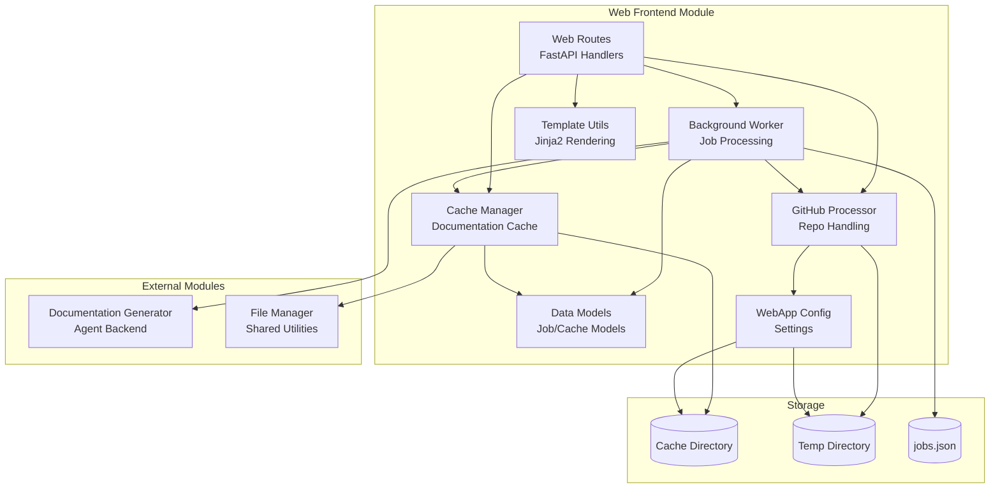
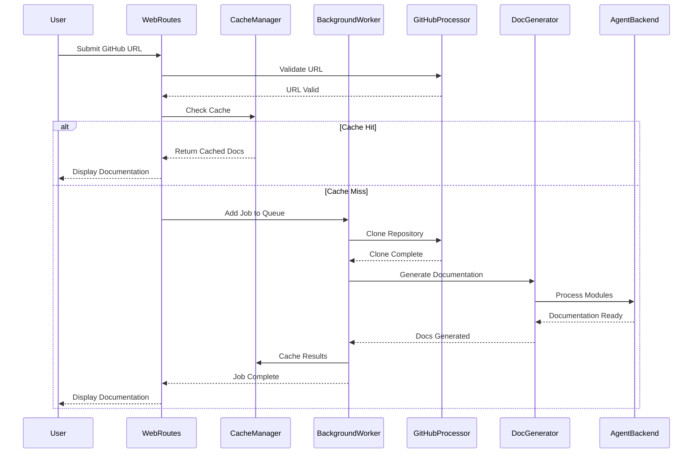
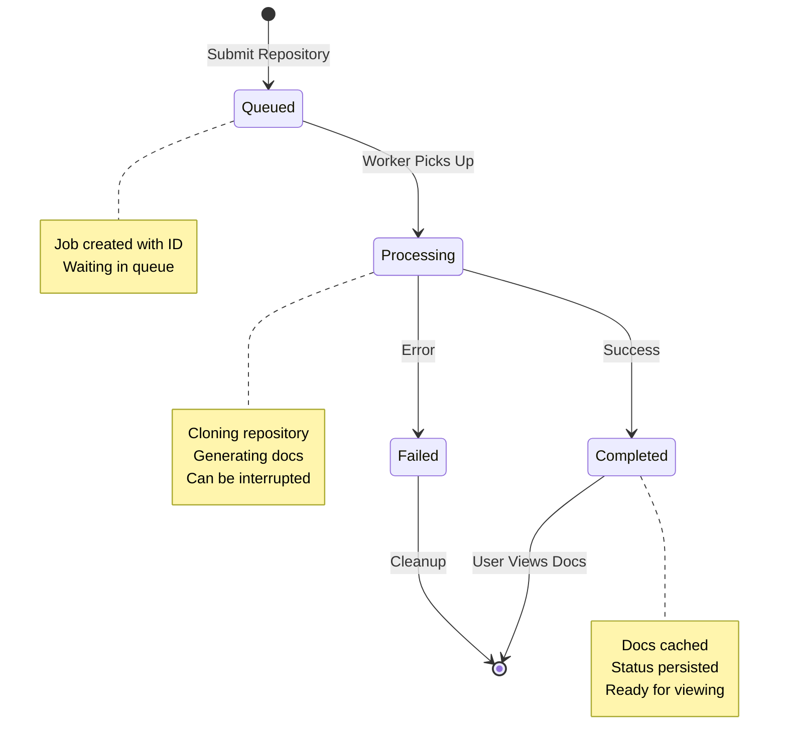

# Web Frontend Module

## Overview

The Web Frontend module provides a comprehensive web interface for the CodeWiki documentation generation system. It enables users to submit GitHub repositories for automated documentation generation, track processing status, and view generated documentation through an intuitive web interface.

## Purpose

This module serves as the primary user interface layer of the CodeWiki system, handling:
- Web-based repository submission and job management
- Background processing of documentation generation jobs
- Intelligent caching of generated documentation
- GitHub repository validation and cloning
- RESTful API endpoints for job status tracking
- Dynamic documentation viewing and navigation

## Architecture



## Component Overview

### Core Components

| Component | File | Purpose |
|-----------|------|---------|
| **WebRoutes** | `routes.py` | FastAPI route handlers for web interface and API endpoints |
| **BackgroundWorker** | `background_worker.py` | Manages background job queue and documentation generation |
| **CacheManager** | `cache_manager.py` | Handles caching and retrieval of generated documentation |
| **GitHubRepoProcessor** | `github_processor.py` | Validates and clones GitHub repositories |
| **WebAppConfig** | `config.py` | Configuration settings for directories, timeouts, and cache policies |
| **StringTemplateLoader** | `template_utils.py` | Custom Jinja2 template loader for string-based templates |

### Data Models

| Model | Purpose |
|-------|---------|
| **JobStatus** | Tracks the lifecycle of documentation generation jobs |
| **CacheEntry** | Represents cached documentation with metadata |
| **RepositorySubmission** | Pydantic model for form submissions |
| **JobStatusResponse** | API response model for job status queries |

## Sub-modules

The Web Frontend module is organized into specialized sub-modules:

### 1. [Background Processing](Web Frontend - Background Processing.md)
Manages asynchronous job queue and documentation generation lifecycle. Handles job persistence, error recovery, and integration with the Agent Backend module.
- **Key Component**: `BackgroundWorker` - Thread-based job processor with queue management
- **Features**: Job lifecycle tracking, cache integration, error handling, automatic recovery

### 2. [Cache Management](Web Frontend - Cache Management.md)
Provides intelligent caching of documentation results with expiry management and persistent storage.
- **Key Component**: `CacheManager` - Manages documentation cache with hash-based indexing
- **Features**: Cache expiry, persistent index, automatic cleanup, hash-based lookup

### 3. [GitHub Processing](Web Frontend - GitHub Processing.md)
Handles GitHub URL validation, repository information extraction, and git operations for cloning repositories.
- **Key Component**: `GitHubRepoProcessor` - Validates and processes GitHub repositories
- **Features**: URL validation, repo info extraction, shallow cloning, commit checkout

### 4. [Web Routes](Web Frontend - Web Routes.md)
Implements FastAPI routes for the web interface and RESTful API endpoints for job management and documentation viewing.
- **Key Component**: `WebRoutes` - FastAPI route handler with template rendering
- **Features**: Form processing, job status API, documentation serving, automatic cleanup

### 5. [Template Utilities](Web Frontend - Template Utilities.md)
Provides Jinja2-based template rendering utilities for dynamic HTML generation.
- **Key Component**: `StringTemplateLoader` - Custom Jinja2 loader for string templates
- **Features**: Template rendering, navigation generation, job list rendering

## Key Workflows

### Documentation Generation Flow



### Job Lifecycle



## Dependencies

### Internal Dependencies

The Web Frontend module integrates with other CodeWiki modules:

- **[Agent Backend](Agent Backend.md)**: Uses `DocumentationGenerator` for generating documentation from code repositories
- **[Shared Utilities](Shared Utilities.md)**: Leverages `FileManager` for file I/O operations and `Config` for configuration management

### External Dependencies

- **FastAPI**: Web framework for API endpoints and routing
- **Jinja2**: Template engine for HTML rendering
- **Pydantic**: Data validation and serialization
- **asyncio**: Asynchronous processing support
- **subprocess**: Git operations for repository cloning

## Configuration

The `WebAppConfig` class provides centralized configuration:

```python
# Directory Configuration
CACHE_DIR = "./output/cache"        # Documentation cache storage
TEMP_DIR = "./output/temp"          # Temporary repository clones
OUTPUT_DIR = "./output"             # General output directory

# Queue & Cache Settings
QUEUE_SIZE = 100                    # Maximum concurrent jobs
CACHE_EXPIRY_DAYS = 365            # Documentation cache lifetime
JOB_CLEANUP_HOURS = 24000          # Job status retention period
RETRY_COOLDOWN_MINUTES = 3         # Minimum time between retries

# Server Settings
DEFAULT_HOST = "127.0.0.1"
DEFAULT_PORT = 8000

# Git Settings
CLONE_TIMEOUT = 300                # Git clone timeout (seconds)
CLONE_DEPTH = 1                    # Shallow clone depth
```

## API Endpoints

### Web Interface

| Endpoint | Method | Purpose |
|----------|--------|---------|
| `/` | GET | Display main page with job submission form |
| `/` | POST | Submit repository for documentation generation |
| `/docs/{job_id}` | GET | View generated documentation |
| `/static-docs/{job_id}/{filename}` | GET | Serve documentation files |

### REST API

| Endpoint | Method | Purpose | Response |
|----------|--------|---------|----------|
| `/api/jobs/{job_id}` | GET | Get job status | `JobStatusResponse` |

## Data Persistence

### Job Status Storage
- **Location**: `{CACHE_DIR}/jobs.json`
- **Content**: Serialized job status entries
- **Purpose**: Recovery and persistence across restarts

### Cache Index Storage
- **Location**: `{CACHE_DIR}/cache_index.json`
- **Content**: Cache entry metadata
- **Purpose**: Track cached documentation with access timestamps

## Error Handling

The module implements comprehensive error handling:

1. **Job Processing Errors**: Captured and stored in `JobStatus.error_message`
2. **Cache Errors**: Graceful fallback with cache rebuild capability
3. **Git Clone Errors**: Timeout handling and validation
4. **Template Errors**: Fallback to basic rendering

## Usage Example

```python
from codewiki.src.fe.background_worker import BackgroundWorker
from codewiki.src.fe.cache_manager import CacheManager
from codewiki.src.fe.routes import WebRoutes

# Initialize components
cache_manager = CacheManager()
background_worker = BackgroundWorker(cache_manager)
background_worker.start()

# Create route handler
web_routes = WebRoutes(background_worker, cache_manager)

# Submit a job
job = JobStatus(
    job_id="owner--repo",
    repo_url="https://github.com/owner/repo",
    status="queued",
    created_at=datetime.now()
)
background_worker.add_job(job.job_id, job)

# Check job status
status = background_worker.get_job_status(job.job_id)
```

## Performance Considerations

1. **Cache Strategy**: Documentation is cached for up to 1 year to minimize regeneration overhead
2. **Shallow Clones**: Uses git shallow clone (depth=1) for faster repository downloads
3. **Background Processing**: Jobs processed asynchronously to avoid blocking web requests
4. **Queue Management**: Configurable queue size prevents resource exhaustion
5. **Automatic Cleanup**: Old jobs and expired cache entries are periodically removed

## Security Considerations

1. **URL Validation**: Strict GitHub URL validation prevents arbitrary repository access
2. **Path Sanitization**: Job IDs are URL-safe and don't contain path traversal characters
3. **Timeout Protection**: Git operations have configurable timeouts
4. **Sandboxed Output**: Generated documentation served from controlled directory

## Integration Points

### With Agent Backend
The BackgroundWorker creates and manages `DocumentationGenerator` instances from the Agent Backend module to process repositories:

```python
from codewiki.src.be.documentation_generator import DocumentationGenerator

doc_generator = DocumentationGenerator(config, commit_id)
await doc_generator.run()
```

### With Shared Utilities
File operations are delegated to the FileManager for consistent I/O handling:

```python
from codewiki.src.utils import file_manager

data = file_manager.load_json(file_path)
file_manager.save_json(data, file_path)
```

## Related Modules

- **[Agent Backend](Agent Backend.md)**: Core documentation generation engine
- **[CLI Application](CLI Application.md)**: Alternative command-line interface
- **[Dependency Analyzer](Dependency Analyzer.md)**: Code analysis capabilities
- **[Shared Utilities](Shared Utilities.md)**: Common utilities and configuration
