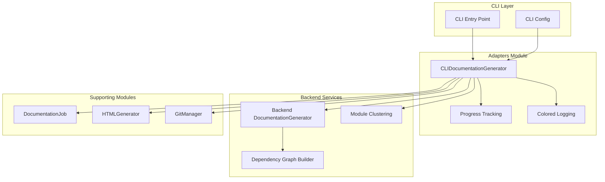
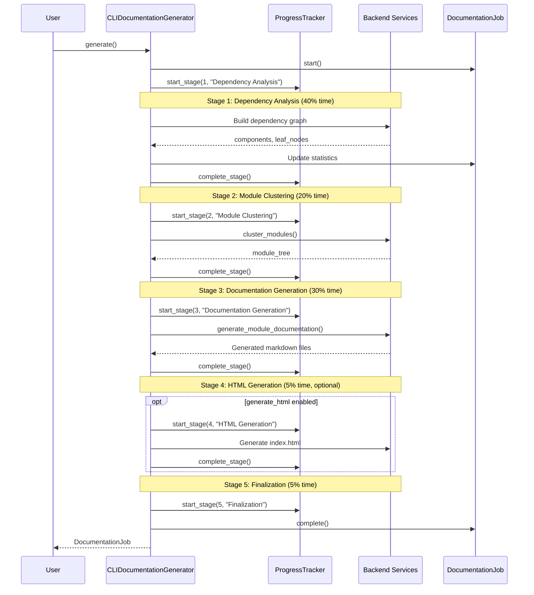
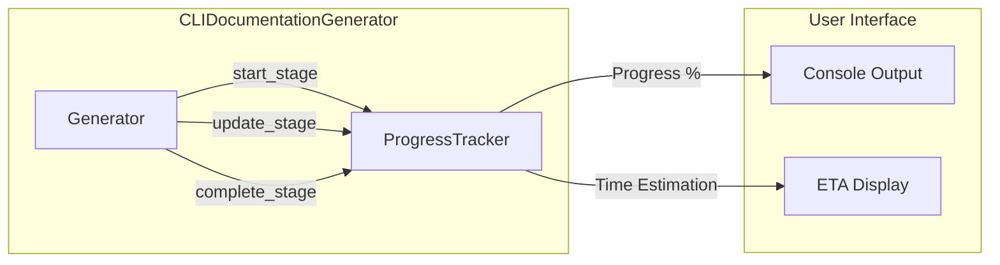
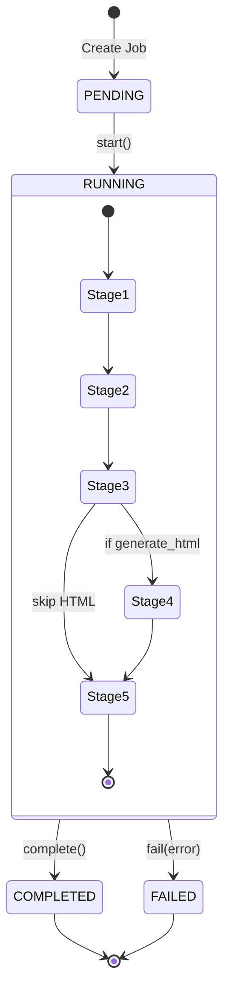
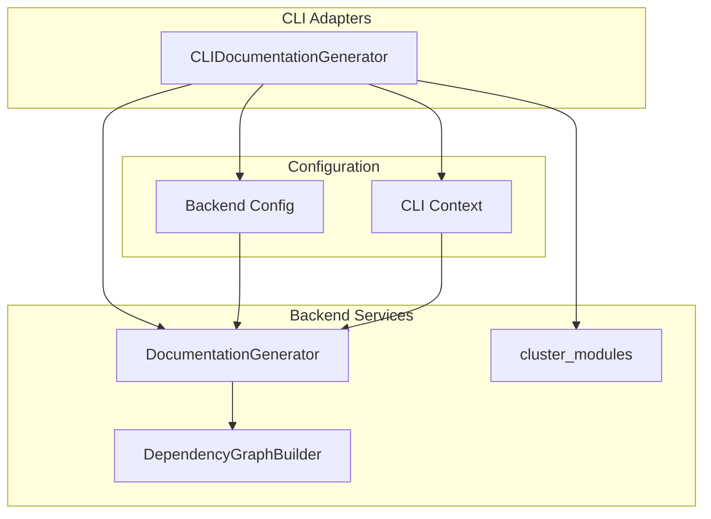
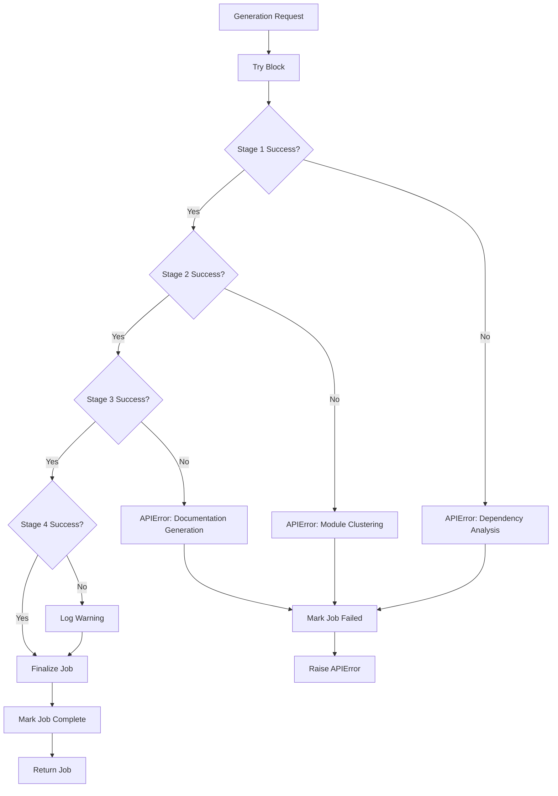

# CLI Adapters Module

## Overview

The **CLI Adapters Module** serves as the critical integration layer between the command-line interface and the backend documentation generation system. This module adapts backend services for CLI-specific use cases, providing enhanced user experience through progress tracking, colored logging, and comprehensive error handling.

The primary component, `CLIDocumentationGenerator`, orchestrates the entire documentation generation workflow from dependency analysis through final HTML generation, while maintaining job state and providing real-time feedback to users.

## Architecture



## Core Component

### CLIDocumentationGenerator

The `CLIDocumentationGenerator` class is the centerpiece of the adapters module, providing a CLI-optimized interface for documentation generation.

**Key Responsibilities:**

1. **Workflow Orchestration** - Coordinates the 5-stage documentation generation pipeline
2. **Progress Tracking** - Provides real-time progress updates with ETA estimation
3. **Error Handling** - Converts backend errors into user-friendly CLI messages
4. **Logging Configuration** - Sets up colored, contextual logging for backend operations
5. **State Management** - Maintains job state throughout the generation process

**Initialization:**

```python
generator = CLIDocumentationGenerator(
    repo_path=Path("/path/to/repository"),
    output_dir=Path("/path/to/output"),
    config={
        'base_url': 'https://api.openai.com/v1',
        'api_key': 'your-api-key',
        'main_model': 'gpt-4',
        'cluster_model': 'gpt-3.5-turbo',
        'fallback_model': 'gpt-3.5-turbo',
        'max_tokens': 32768,
        'max_depth': 2
    },
    verbose=True,
    generate_html=True
)
```

## Generation Workflow

The documentation generation process follows a structured 5-stage pipeline:



### Stage Details

#### Stage 1: Dependency Analysis (40% of total time)

- **Purpose:** Parse source files and build dependency graph
- **Actions:**
  - Initialize dependency analyzer
  - Parse source files using language-specific analyzers
  - Build component relationship graph
  - Identify leaf nodes for documentation
- **Outputs:** Component list, leaf node count, file analysis statistics

#### Stage 2: Module Clustering (20% of total time)

- **Purpose:** Group related components into logical modules
- **Actions:**
  - Use LLM to analyze component relationships
  - Cluster components into coherent modules
  - Generate module tree structure
  - Save module tree to JSON
- **Outputs:** Module tree structure, module count

#### Stage 3: Documentation Generation (30% of total time)

- **Purpose:** Generate markdown documentation for each module
- **Actions:**
  - Generate documentation for leaf modules
  - Create repository overview
  - Generate metadata
  - Collect generated file list
- **Outputs:** Markdown files (.md), metadata.json

#### Stage 4: HTML Generation (5% of total time, optional)

- **Purpose:** Create browsable HTML viewer
- **Actions:**
  - Detect repository information
  - Load module tree and metadata
  - Generate self-contained index.html
- **Outputs:** index.html with embedded viewer

#### Stage 5: Finalization (5% of total time)

- **Purpose:** Complete job and verify outputs
- **Actions:**
  - Verify metadata exists
  - Finalize job state
  - Calculate total generation time
- **Outputs:** Completed DocumentationJob

## Component Interactions

### Progress Tracking Integration



The adapter integrates with [ProgressTracker](utilities.md#progresstracker) to provide:
- **Visual Feedback:** Colored stage indicators and progress messages
- **Time Estimation:** ETA calculations based on stage weights
- **Verbose Mode:** Detailed step-by-step progress in verbose mode

### Job State Management



The adapter maintains job state using the [DocumentationJob](job_management.md#documentationjob) model, tracking:
- Job lifecycle (start, completion, failure)
- Generated files list
- Module count and statistics
- Error messages and timestamps

### Backend Service Integration



The adapter bridges CLI and backend by:
1. **Converting Configuration:** Transforms CLI arguments to backend Config format
2. **Setting Context:** Enables CLI context for backend logging behavior
3. **Handling Async:** Manages async backend operations from synchronous CLI

## Logging Configuration

The adapter configures backend logging for optimal CLI experience:

### Verbose Mode
```
[00:15] Phase 1/5: Dependency Analysis
[00:15]   Initializing dependency analyzer...
[00:16]   Parsing source files...
[00:18]   Found 127 leaf nodes
[00:18]   Dependency Analysis complete (3.2s)
```

### Non-Verbose Mode
```
[1/5] Dependency Analysis
[2/5] Module Clustering
...
```

**Key Features:**
- **Colored Output:** Uses [ColoredFormatter](dependency_analyzer.md#logging-utilities) for visual clarity
- **Log Level Control:** INFO in verbose mode, WARNING+ otherwise
- **Error Isolation:** Backend errors routed to stderr
- **Duplicate Prevention:** Prevents log propagation to root logger

## Error Handling



**Error Types:**
- **APIError:** LLM API failures with detailed error messages
- **FileSystemError:** File I/O issues (handled gracefully)
- **Generic Exceptions:** Wrapped with context and re-raised as APIError

## Dependencies and Integration

### Internal Dependencies

| Module | Component | Purpose |
|--------|-----------|---------|
| [job_management](job_management.md) | DocumentationJob | Job state tracking |
| [job_management](job_management.md) | LLMConfig | LLM configuration model |
| [utilities](utilities.md) | ProgressTracker | Progress reporting |
| [html_generation](html_generation.md) | HTMLGenerator | HTML viewer generation |
| [Agent Backend](agent_backend.md) | DocumentationGenerator | Core generation logic |
| [Dependency Analyzer](dependency_analyzer.md) | ColoredFormatter | Log formatting |

### Backend Integration Points

```python
# Configuration Bridge
backend_config = BackendConfig.from_cli(
    repo_path=str(self.repo_path),
    output_dir=str(self.output_dir),
    llm_base_url=self.config.get('base_url'),
    llm_api_key=self.config.get('api_key'),
    main_model=self.config.get('main_model'),
    cluster_model=self.config.get('cluster_model'),
    # ... additional configuration
)

# Context Setting
set_cli_context(True)  # Enables CLI-specific backend behavior
```

## Usage Examples

### Basic Documentation Generation

```python
from pathlib import Path
from codewiki.cli.adapters.doc_generator import CLIDocumentationGenerator

# Initialize generator
generator = CLIDocumentationGenerator(
    repo_path=Path("./my-project"),
    output_dir=Path("./docs"),
    config={
        'base_url': 'https://api.openai.com/v1',
        'api_key': os.environ.get('OPENAI_API_KEY'),
        'main_model': 'gpt-4',
        'cluster_model': 'gpt-3.5-turbo'
    },
    verbose=True
)

# Generate documentation
job = generator.generate()

# Check results
if job.status == JobStatus.COMPLETED:
    print(f"Generated {job.module_count} modules")
    print(f"Files: {', '.join(job.files_generated)}")
else:
    print(f"Generation failed: {job.error_message}")
```

### With HTML Generation

```python
generator = CLIDocumentationGenerator(
    repo_path=Path("./my-project"),
    output_dir=Path("./docs"),
    config=config,
    verbose=True,
    generate_html=True  # Enable HTML viewer
)

job = generator.generate()
# Output includes index.html for GitHub Pages
```

### Verbose vs Quiet Mode

```python
# Verbose mode - detailed progress
generator_verbose = CLIDocumentationGenerator(
    repo_path=repo_path,
    output_dir=output_dir,
    config=config,
    verbose=True  # Shows detailed stage progress
)

# Quiet mode - minimal output
generator_quiet = CLIDocumentationGenerator(
    repo_path=repo_path,
    output_dir=output_dir,
    config=config,
    verbose=False  # Only shows stage names
)
```

## Configuration Options

The adapter accepts the following configuration parameters:

| Parameter | Type | Default | Description |
|-----------|------|---------|-------------|
| `base_url` | str | Required | LLM API base URL |
| `api_key` | str | Required | LLM API key |
| `main_model` | str | Required | Primary model for documentation |
| `cluster_model` | str | Required | Model for module clustering |
| `fallback_model` | str | Optional | Fallback model if main fails |
| `max_tokens` | int | 32768 | Maximum tokens per request |
| `max_token_per_module` | int | 36369 | Max tokens for module docs |
| `max_token_per_leaf_module` | int | 16000 | Max tokens for leaf modules |
| `max_depth` | int | 2 | Maximum module tree depth |
| `agent_instructions` | str | Optional | Custom instructions for LLM |

## Output Artifacts

The generation process produces the following files:

```
output_directory/
├── module_tree.json          # Module hierarchy
├── metadata.json             # Generation metadata
├── index.html                # HTML viewer (if enabled)
├── Overview.md               # Repository overview
├── module1.md                # Module documentation
├── module2.md
└── ...                       # Additional module docs
```

### metadata.json Structure

```json
{
  "generation_info": {
    "main_model": "gpt-4",
    "timestamp": "2024-01-15T10:30:00",
    "commit_id": "abc123def456"
  },
  "statistics": {
    "total_components": 245,
    "max_depth": 2,
    "files_analyzed": 87
  }
}
```

## Best Practices

1. **Use Verbose Mode for Debugging:** Enable verbose output when troubleshooting generation issues
2. **Validate Configuration:** Ensure all required LLM parameters are provided before generation
3. **Handle API Errors:** Wrap generation calls in try-except blocks to handle APIError exceptions
4. **Check Job Status:** Always verify job.status after generation to confirm success
5. **Leverage Progress Tracking:** Use progress callbacks for long-running generations

## Performance Considerations

- **Stage Weights:** Progress estimation uses predefined weights (40% analysis, 20% clustering, 30% generation, etc.)
- **Caching:** Module tree caching prevents redundant LLM calls on re-runs
- **Async Execution:** Documentation generation runs asynchronously for better performance
- **Resource Management:** Large repositories may require increased token limits

## Related Modules

- **[job_management](job_management.md)** - Job models and state management
- **[utilities](utilities.md)** - Progress tracking and logging utilities
- **[html_generation](html_generation.md)** - HTML viewer generation
- **[Agent Backend](agent_backend.md)** - Core documentation generation logic
- **[Dependency Analyzer](dependency_analyzer.md)** - Source code analysis
- **[config_management](config_management.md)** - Configuration loading and validation
