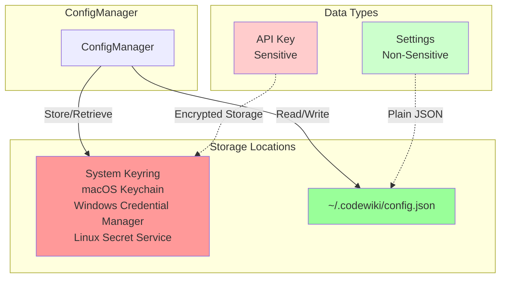
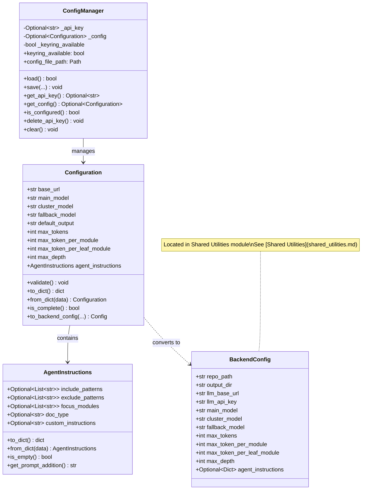
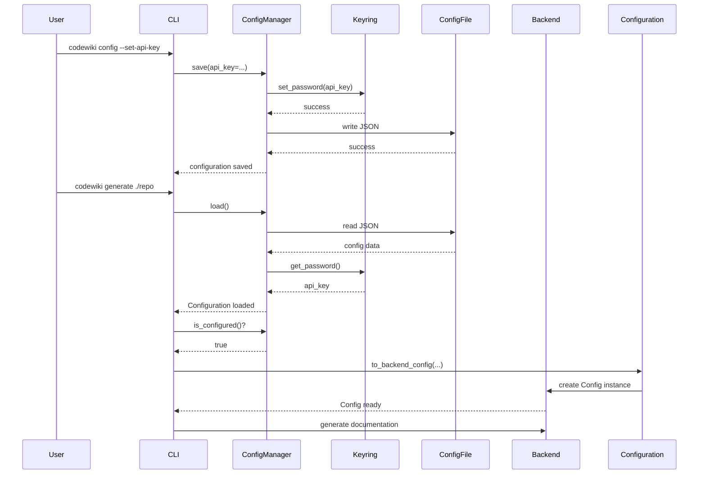
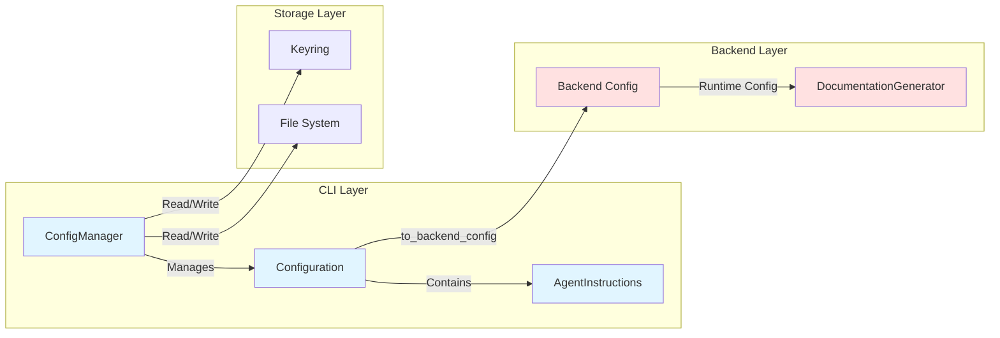
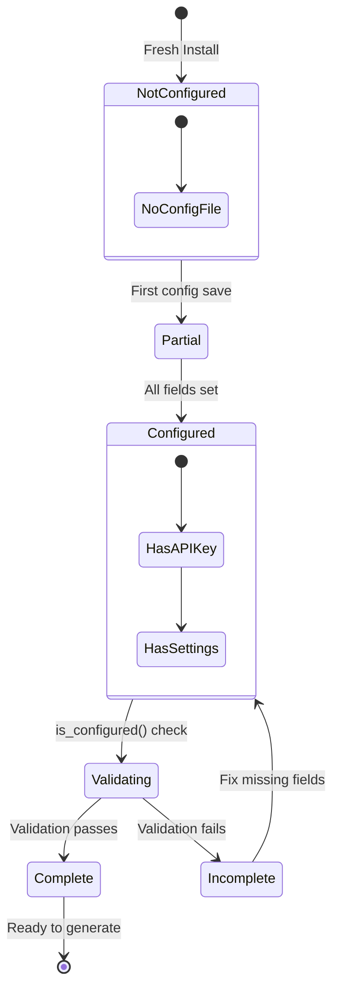

# Config Management Module

## Overview

The **Config Management** module is the configuration subsystem of the CLI Application responsible for managing persistent user settings, secure credential storage, and bridging CLI configuration to backend runtime configuration. It provides a secure, user-friendly interface for managing API keys and documentation generation settings.

### Purpose

- **Secure Credential Management**: Store API keys in system keychains (macOS Keychain, Windows Credential Manager, Linux Secret Service)
- **Persistent Configuration**: Maintain user preferences across sessions in `~/.codewiki/config.json`
- **Customization**: Allow users to customize documentation generation behavior through agent instructions
- **Configuration Bridge**: Convert CLI configuration to backend runtime configuration for documentation generation

### Key Features

✓ **Secure Storage** - API keys stored in system keychain, not plain text  
✓ **Validation** - Comprehensive validation of URLs, model names, and settings  
✓ **Customization** - Fine-grained control over documentation generation  
✓ **Migration-Ready** - Version-controlled configuration for future upgrades  
✓ **Error Handling** - Graceful fallbacks and clear error messages

---

## Core Components

### 1. ConfigManager

**Location**: `codewiki.cli.config_manager.ConfigManager`

The `ConfigManager` is the main entry point for configuration management. It handles loading, saving, and validating user configuration with secure keyring integration.

#### Responsibilities

- Load and save configuration from `~/.codewiki/config.json`
- Secure API key management via system keyring
- Configuration validation and completeness checking
- Keyring availability detection and fallback handling

#### Key Methods

| Method | Description |
|--------|-------------|
| `load()` | Load configuration from file and keyring |
| `save(...)` | Save configuration with optional parameter updates |
| `get_api_key()` | Retrieve API key from keyring |
| `get_config()` | Get current Configuration object |
| `is_configured()` | Check if configuration is complete and valid |
| `delete_api_key()` | Remove API key from keyring |
| `clear()` | Clear all configuration data |

#### Storage Architecture



### 2. Configuration

**Location**: `codewiki.cli.models.config.Configuration`

The `Configuration` dataclass represents persistent user settings stored in the configuration file. It bridges the gap between user preferences and backend runtime configuration.

#### Attributes

| Attribute | Type | Default | Description |
|-----------|------|---------|-------------|
| `base_url` | `str` | Required | LLM API base URL |
| `main_model` | `str` | Required | Primary model for documentation generation |
| `cluster_model` | `str` | Required | Model for module clustering |
| `fallback_model` | `str` | `"glm-4p5"` | Fallback model when primary fails |
| `default_output` | `str` | `"docs"` | Default output directory |
| `max_tokens` | `int` | `32768` | Maximum tokens for LLM response |
| `max_token_per_module` | `int` | `36369` | Maximum tokens per module for clustering |
| `max_token_per_leaf_module` | `int` | `16000` | Maximum tokens per leaf module |
| `max_depth` | `int` | `2` | Maximum depth for hierarchical decomposition |
| `agent_instructions` | `AgentInstructions` | `AgentInstructions()` | Custom agent instructions |

#### Key Methods

| Method | Description |
|--------|-------------|
| `validate()` | Validate all configuration fields |
| `to_dict()` | Convert to dictionary for JSON serialization |
| `from_dict(data)` | Create Configuration from dictionary |
| `is_complete()` | Check if all required fields are set |
| `to_backend_config(...)` | Convert to backend Config instance |

### 3. AgentInstructions

**Location**: `codewiki.cli.models.config.AgentInstructions`

Customizable instructions for the documentation agent that allow users to control file filtering, module focus, documentation type, and provide custom LLM instructions.

#### Attributes

| Attribute | Type | Description |
|-----------|------|-------------|
| `include_patterns` | `Optional[List[str]]` | File patterns to include (e.g., `["*.cs", "*.py"]`) |
| `exclude_patterns` | `Optional[List[str]]` | File/directory patterns to exclude (e.g., `["*Tests*", "*test*"]`) |
| `focus_modules` | `Optional[List[str]]` | Modules to document in more detail |
| `doc_type` | `Optional[str]` | Type of documentation (`"api"`, `"architecture"`, `"user-guide"`, `"developer"`) |
| `custom_instructions` | `Optional[str]` | Free-form instructions for the documentation agent |

#### Supported Documentation Types

| Type | Focus |
|------|-------|
| `api` | API documentation: endpoints, parameters, return types, usage examples |
| `architecture` | Architecture documentation: system design, component relationships, data flow |
| `user-guide` | User guide documentation: how to use features, step-by-step tutorials |
| `developer` | Developer documentation: code structure, contribution guidelines, implementation details |

---

## Architecture

### Component Relationships



### Configuration Flow



### Integration with Backend



---

## Configuration Lifecycle

### 1. Initial Setup



### 2. Configuration Validation

The configuration system performs validation at multiple levels:

#### Level 1: Keyring Availability
- Checks if system keychain is accessible
- Falls back gracefully if unavailable
- Warns user about keychain issues

#### Level 2: Field Validation
- **URLs**: Validated for proper format and protocol
- **Model Names**: Checked for non-empty strings
- **Token Limits**: Must be positive integers
- **Paths**: Validated for accessibility

#### Level 3: Completeness Check
- Required fields: `base_url`, `main_model`, `cluster_model`, API key
- Optional fields: `fallback_model`, `default_output`, `agent_instructions`
- Configuration ready when `is_configured()` returns `True`

---

## Usage Examples

### Setting Up Configuration

```python
from codewiki.cli.config_manager import ConfigManager

# Initialize config manager
config_mgr = ConfigManager()

# First-time setup
config_mgr.save(
    api_key="sk-...",
    base_url="https://api.openai.com/v1",
    main_model="gpt-4",
    cluster_model="gpt-3.5-turbo"
)

# Check if configured
if config_mgr.is_configured():
    print("Configuration complete!")
```

### Customizing Agent Instructions

```python
from codewiki.cli.models.config import Configuration, AgentInstructions

# Create custom instructions
instructions = AgentInstructions(
    include_patterns=["*.cs", "*.csproj"],
    exclude_patterns=["*Tests*", "*Specs*"],
    focus_modules=["src/core", "src/api"],
    doc_type="api",
    custom_instructions="Include code examples for each API endpoint"
)

# Save with configuration
config_mgr.save(
    base_url="https://api.openai.com/v1",
    main_model="gpt-4",
    cluster_model="gpt-3.5-turbo"
)

# Update agent instructions
config = config_mgr.get_config()
config.agent_instructions = instructions
config_mgr.save()  # Persist changes
```

### Converting to Backend Config

```python
# Load existing configuration
config_mgr = ConfigManager()
config_mgr.load()

# Get configuration object
config = config_mgr.get_config()
api_key = config_mgr.get_api_key()

# Convert to backend config for documentation generation
backend_config = config.to_backend_config(
    repo_path="/path/to/repository",
    output_dir="/path/to/output",
    api_key=api_key,
    runtime_instructions=None  # Use persistent instructions
)

# Now ready for documentation generation
# See [Agent Backend](agent_backend.md) for usage
```

### Merging Runtime and Persistent Instructions

```python
from codewiki.cli.models.config import AgentInstructions

# Load configuration
config_mgr = ConfigManager()
config_mgr.load()
config = config_mgr.get_config()

# Override at runtime
runtime_instructions = AgentInstructions(
    doc_type="architecture"  # Override persistent doc_type
)

# Convert with runtime override
backend_config = config.to_backend_config(
    repo_path="/path/to/repository",
    output_dir="/path/to/output",
    api_key=config_mgr.get_api_key(),
    runtime_instructions=runtime_instructions
)

# Runtime instructions take precedence over persistent settings
```

---

## Security Considerations

### API Key Storage

The config management module prioritizes security through:

1. **System Keyring Integration**
   - Uses the `keyring` library for secure storage
   - Leverages OS-native credential managers:
     - **macOS**: Keychain Access
     - **Windows**: Credential Manager
     - **Linux**: Secret Service (GNOME Keyring, KWallet)

2. **Separation of Concerns**
   - API keys never stored in configuration files
   - Non-sensitive settings stored in plain JSON
   - Clear separation between sensitive and non-sensitive data

3. **No Fallback to Plain Text**
   - If keyring unavailable, raises clear error
   - Does not silently fall back to insecure storage
   - Guides user to fix keyring issues

### Best Practices

```python
# ✓ GOOD: Check keyring availability before setup
config_mgr = ConfigManager()
if not config_mgr.keyring_available:
    print("Warning: System keychain not available")
    # Guide user to configure keychain

# ✓ GOOD: Verify configuration before use
if config_mgr.is_configured():
    # Proceed with documentation generation
    pass
else:
    print("Please run: codewiki config")

# ✗ BAD: Never log or print API keys
api_key = config_mgr.get_api_key()
# print(f"API Key: {api_key}")  # DON'T DO THIS

# ✓ GOOD: Clear configuration when done
config_mgr.clear()  # Removes API key from keychain
```

### Configuration File Security

**Location**: `~/.codewiki/config.json`

**Contents**:
```json
{
  "version": "1.0",
  "base_url": "https://api.openai.com/v1",
  "main_model": "gpt-4",
  "cluster_model": "gpt-3.5-turbo",
  "fallback_model": "glm-4p5",
  "default_output": "docs",
  "max_tokens": 32768,
  "max_token_per_module": 36369,
  "max_token_per_leaf_module": 16000,
  "max_depth": 2,
  "agent_instructions": {
    "include_patterns": ["*.py"],
    "exclude_patterns": ["*test*"],
    "focus_modules": ["src/core"],
    "doc_type": "api",
    "custom_instructions": "..."
  }
}
```

**Note**: API key is **NOT** included in this file. It's stored separately in the system keychain.

---

## Error Handling

### Common Errors and Solutions

| Error | Cause | Solution |
|-------|-------|----------|
| `ConfigurationError: System keychain unavailable` | Keyring not configured | Install and configure system keychain service |
| `ConfigurationError: Cannot create config directory` | Permission denied | Check home directory permissions |
| `ConfigurationError: Failed to load configuration` | Invalid JSON or corrupted file | Delete `~/.codewiki/config.json` and reconfigure |
| `ConfigurationError: Validation failed` | Invalid URL or model name | Check configuration values |

### Error Handling Pattern

```python
from codewiki.cli.config_manager import ConfigManager
from codewiki.cli.utils.errors import ConfigurationError

try:
    config_mgr = ConfigManager()
    
    if not config_mgr.load():
        print("No configuration found. Please run: codewiki config")
        exit(1)
    
    if not config_mgr.is_configured():
        print("Configuration incomplete. Please run: codewiki config")
        exit(1)
        
except ConfigurationError as e:
    print(f"Configuration error: {e}")
    exit(1)
```

---

## Integration Points

### Dependencies

The config management module integrates with several other modules:

| Module | Integration Point | Purpose |
|--------|------------------|---------|
| **[Shared Utilities](shared_utilities.md)** | `Config` class | Converts CLI configuration to backend runtime configuration |
| **[Job Management](job_management.md)** | `LLMConfig` | Provides LLM configuration settings |
| **CLI Utilities** | Validation & FS utils | File operations and input validation |

### Related Modules

- **[CLI Application Overview](cli_application.md)**: Overall CLI architecture
- **[Job Management](job_management.md)**: Uses configuration for job execution
- **[Agent Backend](agent_backend.md)**: Consumes backend Config for documentation generation
- **[Shared Utilities](shared_utilities.md)**: Provides the backend Config class

---

## Configuration Reference

### Default Values

| Setting | Default | Description |
|---------|---------|-------------|
| `fallback_model` | `"glm-4p5"` | Model used when primary model fails |
| `default_output` | `"docs"` | Default output directory for generated documentation |
| `max_tokens` | `32768` | Maximum tokens in LLM response |
| `max_token_per_module` | `36369` | Token limit for module clustering |
| `max_token_per_leaf_module` | `16000` | Token limit for leaf module documentation |
| `max_depth` | `2` | Maximum depth for hierarchical decomposition |

### Environment Variables

The configuration system does not use environment variables for security reasons. All configuration is managed through the config file and keyring.

### Configuration File Location

- **Config File**: `~/.codewiki/config.json`
- **Keyring Service**: `codewiki`
- **Keyring Account**: `api_key`

---

## Troubleshooting

### Keyring Issues

**Problem**: "System keychain unavailable" error

**Solutions**:

**macOS**:
```bash
# Ensure Keychain Access is working
security find-generic-password -s "codewiki" -a "api_key"
```

**Linux**:
```bash
# Install secret service
sudo apt-get install gnome-keyring  # Ubuntu/Debian
sudo dnf install gnome-keyring       # Fedora
```

**Windows**:
- Windows Credential Manager is built-in and should work automatically

### Configuration Migration

The configuration system supports versioning for future migrations:

```python
# Current version: "1.0"
# Future versions will implement migration logic in ConfigManager.load()
```

### Debugging Configuration

```python
from codewiki.cli.config_manager import ConfigManager

config_mgr = ConfigManager()

# Check keyring status
print(f"Keyring available: {config_mgr.keyring_available}")

# Check configuration file
print(f"Config file: {config_mgr.config_file_path}")
print(f"File exists: {config_mgr.config_file_path.exists()}")

# Load and inspect
if config_mgr.load():
    config = config_mgr.get_config()
    print(f"Configured: {config_mgr.is_configured()}")
    print(f"Base URL: {config.base_url}")
    print(f"Main Model: {config.main_model}")
```

---

## Summary

The Config Management module provides a secure, user-friendly configuration system for the CodeWiki CLI application. It separates sensitive credentials from general settings, validates user input, and bridges CLI configuration to backend runtime configuration. The module's design prioritizes security through system keychain integration while maintaining flexibility through customizable agent instructions.

**Key Takeaways**:
- ✓ API keys stored securely in system keychain
- ✓ Configuration persisted in `~/.codewiki/config.json`
- ✓ Customizable agent instructions for fine-grained control
- ✓ Seamless integration with backend configuration system
- ✓ Comprehensive validation and error handling

For information about using this configuration in documentation generation jobs, see [Job Management](job_management.md). For details about the backend configuration system, see [Shared Utilities](shared_utilities.md).
