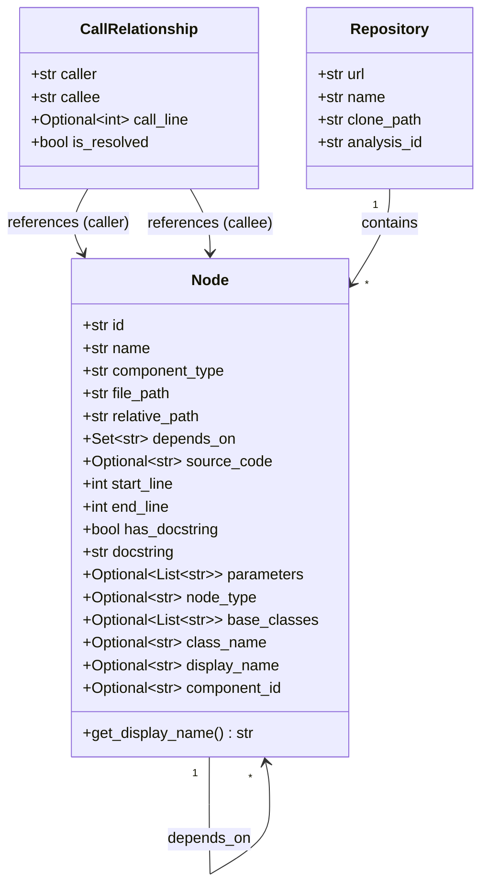
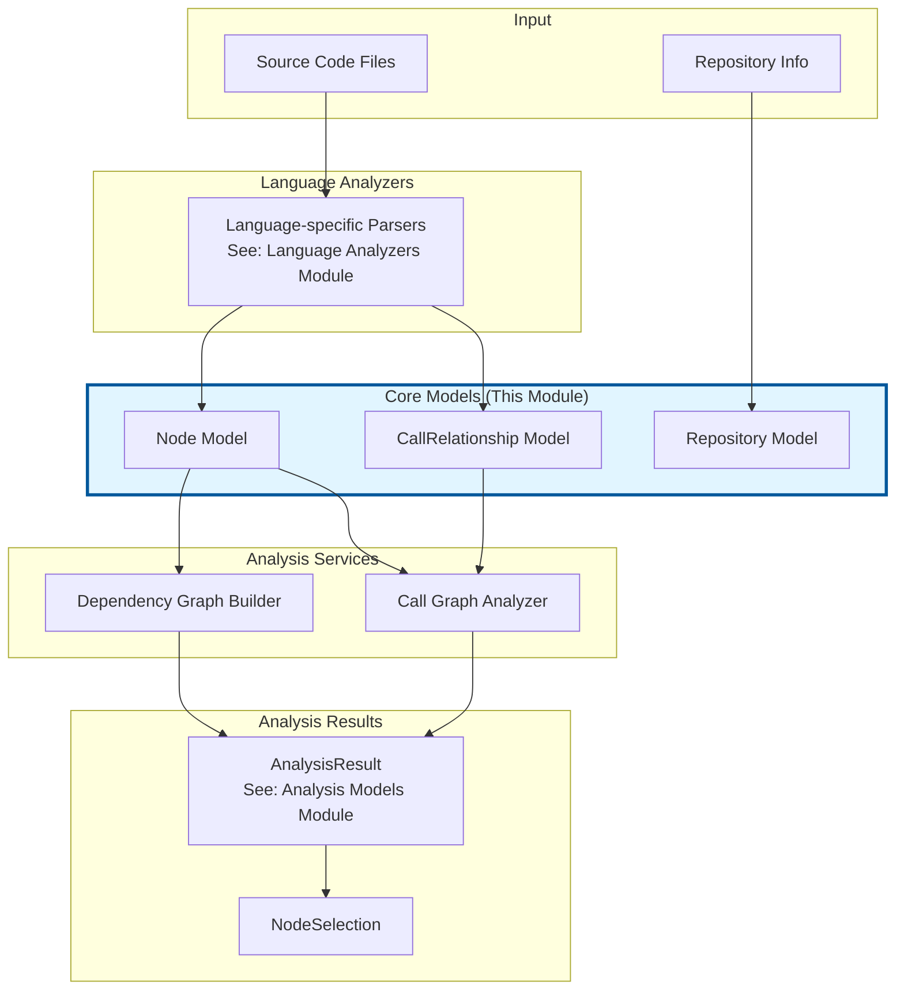
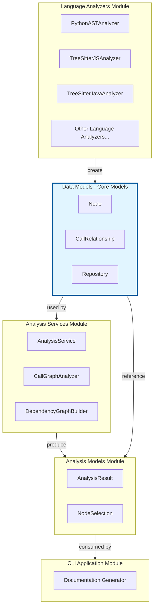

# Data Models - Core Models

## Overview

The **Data Models - Core Models** module provides the foundational data structures for representing code components, their relationships, and repository information within the CodeWiki dependency analysis system. These core models serve as the building blocks for the entire [Dependency Analyzer](dependency_analyzer.md) system and are used across all analysis and processing pipelines.

This module defines three essential Pydantic models:
- **Node**: Represents individual code components (functions, classes, methods)
- **CallRelationship**: Captures function/method call dependencies
- **Repository**: Stores repository metadata for analysis tracking

## Core Components

### 1. Node Model

The `Node` model is the central data structure representing a single code component within the analyzed repository. It captures comprehensive metadata about functions, classes, methods, and other code constructs.

#### Attributes

| Attribute | Type | Default | Description |
|-----------|------|---------|-------------|
| `id` | `str` | Required | Unique identifier for the node |
| `name` | `str` | Required | Name of the code component |
| `component_type` | `str` | Required | Type categorization (e.g., "function", "class", "method") |
| `file_path` | `str` | Required | Absolute file path in the repository |
| `relative_path` | `str` | Required | Relative path from repository root |
| `depends_on` | `Set[str]` | `set()` | Set of node IDs this component depends on |
| `source_code` | `Optional[str]` | `None` | Full source code of the component |
| `start_line` | `int` | `0` | Starting line number in the file |
| `end_line` | `int` | `0` | Ending line number in the file |
| `has_docstring` | `bool` | `False` | Whether the component has documentation |
| `docstring` | `str` | `""` | The docstring content |
| `parameters` | `Optional[List[str]]` | `None` | Function/method parameters |
| `node_type` | `Optional[str]` | `None` | Language-specific node type |
| `base_classes` | `Optional[List[str]]` | `None` | Parent classes (for class nodes) |
| `class_name` | `Optional[str]` | `None` | Containing class name (for methods) |
| `display_name` | `Optional[str]` | `None` | Human-readable display name |
| `component_id` | `Optional[str]` | `None` | Component identifier for documentation |

#### Methods

```python
def get_display_name(self) -> str:
    """Returns the display name or falls back to the node name"""
```

#### Design Considerations

The `Node` model is designed to be:
- **Language-agnostic**: Generic enough to represent code components from Python, JavaScript, Java, C++, and other supported languages
- **Extensible**: Uses optional fields to accommodate different types of code constructs
- **Query-friendly**: Uses sets for dependencies to enable efficient relationship lookups

### 2. CallRelationship Model

The `CallRelationship` model captures the dynamic relationships between code components, specifically function and method calls.

#### Attributes

| Attribute | Type | Default | Description |
|-----------|------|---------|-------------|
| `caller` | `str` | Required | Node ID of the calling function/method |
| `callee` | `str` | Required | Node ID of the called function/method |
| `call_line` | `Optional[int]` | `None` | Line number where the call occurs |
| `is_resolved` | `bool` | `False` | Whether the call target was successfully resolved |

#### Use Cases

- **Call graph construction**: Building directed graphs of function dependencies
- **Impact analysis**: Understanding which functions might be affected by changes
- **Dead code detection**: Identifying unused functions
- **Documentation generation**: Mapping component interactions

### 3. Repository Model

The `Repository` model stores metadata about the repository being analyzed.

#### Attributes

| Attribute | Type | Default | Description |
|-----------|------|---------|-------------|
| `url` | `str` | Required | Repository URL (Git remote) |
| `name` | `str` | Required | Repository name |
| `clone_path` | `str` | Required | Local filesystem path where repository is cloned |
| `analysis_id` | `str` | Required | Unique identifier for this analysis session |

## Architecture & Relationships

### Model Relationship Diagram



### Data Flow in Analysis Pipeline



### Component Interaction with Other Modules



## Integration with System Components

### Relationship with Language Analyzers

The [Language Analyzers](language_analyzers.md) module is responsible for parsing source code files and creating `Node` and `CallRelationship` instances:

- **PythonASTAnalyzer**: Creates nodes for Python functions, classes, and methods
- **TreeSitterJSAnalyzer**: Creates nodes for JavaScript functions and classes
- **TreeSitterJavaAnalyzer**: Creates nodes for Java classes and methods
- Other analyzers follow the same pattern

Each language analyzer populates:
- Basic node metadata (id, name, file_path, line numbers)
- Language-specific attributes (parameters, base_classes, node_type)
- Dependency relationships (depends_on, CallRelationship instances)

### Relationship with Analysis Services

The [Analysis Services](analysis_services.md) module consumes these core models to:

1. **CallGraphAnalyzer**: Uses `Node` and `CallRelationship` to build call graphs
2. **DependencyGraphBuilder**: Constructs dependency graphs from node relationships
3. **AnalysisService**: Orchestrates the analysis and produces `AnalysisResult`

### Relationship with Analysis Models

The [Analysis Models](data_models_analysis_models.md) module builds upon these core models:

- `AnalysisResult` contains collections of `Node` and `CallRelationship` instances
- `NodeSelection` references nodes by their IDs for filtered analysis

## Usage Examples

### Creating a Node

```python
from codewiki.src.be.dependency_analyzer.models.core import Node

# Creating a function node
function_node = Node(
    id="main.py:process_data",
    name="process_data",
    component_type="function",
    file_path="/path/to/repo/main.py",
    relative_path="main.py",
    start_line=42,
    end_line=58,
    source_code="def process_data(input):\n    ...",
    has_docstring=True,
    docstring="Process input data and return results",
    parameters=["input", "options"],
    depends_on={"utils.py:validate", "utils.py:transform"}
)

# Creating a class node
class_node = Node(
    id="models.py:UserManager",
    name="UserManager",
    component_type="class",
    file_path="/path/to/repo/models.py",
    relative_path="models.py",
    base_classes=["BaseManager"],
    has_docstring=True
)
```

### Creating Call Relationships

```python
from codewiki.src.be.dependency_analyzer.models.core import CallRelationship

# Resolved call relationship
call = CallRelationship(
    caller="main.py:process_data",
    callee="utils.py:validate",
    call_line=45,
    is_resolved=True
)

# Unresolved call (e.g., dynamic dispatch)
unresolved_call = CallRelationship(
    caller="main.py:process_data",
    callee="unknown:dynamic_method",
    call_line=48,
    is_resolved=False
)
```

### Creating a Repository

```python
from codewiki.src.be.dependency_analyzer.models.core import Repository

repo = Repository(
    url="https://github.com/user/repository.git",
    name="user/repository",
    clone_path="/tmp/repos/user/repository",
    analysis_id="analysis-2024-01-15-001"
)
```

### Working with Nodes

```python
# Accessing node display name
display_name = node.get_display_name()

# Checking dependencies
if "utils.py:validate" in node.depends_on:
    print(f"{node.name} depends on validate function")

# Accessing source code
if node.source_code:
    lines = node.source_code.split('\n')
    print(f"Function has {len(lines)} lines")
```

## Model Design Patterns

### Unique Identification Strategy

Nodes are identified using a composite ID format:
```
<relative_path>:<component_name>
```

Examples:
- `main.py:process_data` - Function in main.py
- `models.py:UserManager` - Class in models.py
- `models.py:UserManager.create` - Method in UserManager class

This ensures:
- **Uniqueness**: Full path + name combination prevents collisions
- **Traceability**: Easy to locate the source file
- **Human-readable**: Developers can quickly identify the component

### Dependency Representation

Dependencies are represented in two complementary ways:

1. **Static Dependencies** (`Node.depends_on`):
   - Captures import/module-level dependencies
   - Stored as a set for O(1) lookup
   - Includes all components this node references

2. **Dynamic Call Relationships** (`CallRelationship`):
   - Captures specific function/method calls
   - Includes line number information
   - Tracks resolution status

### Extensibility Through Optional Fields

The `Node` model uses optional fields to accommodate different scenarios:

- **Functions**: `parameters`, `class_name` (if method)
- **Classes**: `base_classes`, `node_type`
- **All types**: `source_code`, `docstring`, `display_name`

This design allows the same model to represent diverse code constructs without requiring separate models for each type.

## Data Validation

As Pydantic models, all three core models benefit from:

- **Type checking**: Automatic validation of field types
- **Default values**: Sensible defaults for optional fields
- **Serialization**: Built-in JSON/dict conversion
- **Immutability**: Models can be made immutable if needed

Example validation:

```python
from pydantic import ValidationError

try:
    node = Node(
        id="test",
        name="test_func"
        # Missing required fields: component_type, file_path, relative_path
    )
except ValidationError as e:
    print(f"Validation error: {e}")
```

## Performance Considerations

### Set-based Dependencies

Using `Set[str]` for `depends_on` provides:
- **O(1)** membership testing
- **Automatic deduplication** of dependencies
- **Efficient set operations** (union, intersection, difference)

### Memory Optimization

For large repositories:
- `source_code` is optional to avoid loading all code into memory
- `component_id` allows referencing nodes without full object instances
- Sets are more memory-efficient than lists for unique identifiers

## Related Modules

- **[Analysis Models](data_models_analysis_models.md)**: Higher-level models that aggregate core models
- **[Language Analyzers](language_analyzers.md)**: Create Node and CallRelationship instances from source code
- **[Analysis Services](analysis_services.md)**: Process and analyze core models
- **[Core Graph Processing](core_graph_processing.md)**: Build graphs from node relationships
- **[CLI Application](cli_application.md)**: Uses models for documentation generation

## Best Practices

1. **Always provide unique IDs**: Use the `relative_path:name` format consistently
2. **Include source code for documentation**: Set `source_code` when nodes will be documented
3. **Track call resolution**: Mark `is_resolved=False` for dynamic or ambiguous calls
4. **Use display_name**: Provide human-readable names for complex components
5. **Validate early**: Let Pydantic catch type errors during model creation

## Summary

The Data Models - Core Models module provides the essential data structures for code analysis within CodeWiki. These models form the foundation for understanding code structure, dependencies, and relationships across multiple programming languages. Their design prioritizes flexibility, performance, and ease of use while maintaining strong typing through Pydantic validation.
