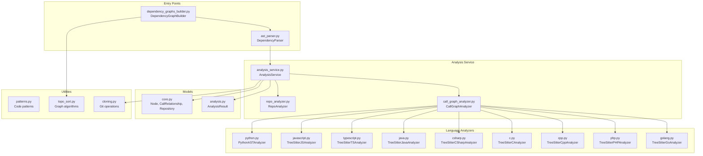

# Dependency Analyzer Module

## Overview

The **Dependency Analyzer Module** is a multi-language source code analysis engine that extracts code components (functions, classes, methods, structs, interfaces) and their relationships from repositories. It supports 9 programming languages and builds a comprehensive call graph for documentation generation.

**Supported Languages:** Python, JavaScript, TypeScript, Java, C#, C, C++, PHP, Go

## Architecture



## Core Components

### 1. DependencyParser (ast_parser.py)

Main entry point for parsing repositories and extracting components.

```python
from codewiki.src.be.dependency_analyzer.ast_parser import DependencyParser

parser = DependencyParser(
    repo_path="/path/to/repo",
    include_patterns=["*.py", "*.js"],  # Optional
    exclude_patterns=["*test*"]         # Optional
)

# Parse repository
components = parser.parse_repository()

# Save dependency graph
parser.save_dependency_graph("output/dependency_graph.json")
```

**Key Methods:**
- `parse_repository()` - Parses all files and returns component dictionary
- `save_dependency_graph()` - Exports components to JSON

### 2. AnalysisService (analysis_service.py)

Centralized service orchestrating the complete analysis workflow.

```python
from codewiki.src.be.dependency_analyzer.analysis.analysis_service import AnalysisService

service = AnalysisService()

# Analyze local repository
result = service.analyze_local_repository(
    repo_path="/path/to/repo",
    max_files=100,
    languages=["python", "javascript"]
)

# Analyze GitHub repository
result = service.analyze_repository_full(
    github_url="https://github.com/user/repo",
    include_patterns=["*.py"],
    exclude_patterns=["tests/*"]
)
```

**Supported Languages:** `python`, `javascript`, `typescript`, `java`, `csharp`, `c`, `cpp`, `php`, `go`

### 3. CallGraphAnalyzer (call_graph_analyzer.py)

Multi-language call graph analysis coordinator.

```python
from codewiki.src.be.dependency_analyzer.analysis.call_graph_analyzer import CallGraphAnalyzer

analyzer = CallGraphAnalyzer()

# Extract code files from file tree
code_files = analyzer.extract_code_files(file_tree)

# Analyze files
result = analyzer.analyze_code_files(code_files, repo_dir)
# Returns: functions, relationships, visualization data
```

### 4. RepoAnalyzer (repo_analyzer.py)

Repository structure analysis with filtering capabilities.

```python
from codewiki.src.be.dependency_analyzer.analysis.repo_analyzer import RepoAnalyzer

analyzer = RepoAnalyzer(
    include_patterns=["*.py"],
    exclude_patterns=["tests/*"]
)

result = analyzer.analyze_repository_structure(repo_dir)
# Returns: file_tree, summary (total_files, total_size_kb)
```

## Language Analyzers

Each language has a dedicated analyzer using AST parsing:

| Language | Analyzer | Parser | Extracts |
|----------|----------|--------|----------|
| Python | `python.py` | `ast` module | Classes, functions, methods, inheritance |
| JavaScript | `javascript.py` | `tree-sitter-javascript` | Classes, functions, methods, arrow functions |
| TypeScript | `typescript.py` | `tree-sitter-typescript` | Classes, interfaces, types, enums, functions |
| Java | `java.py` | `tree-sitter-java` | Classes, interfaces, enums, records, methods |
| C# | `csharp.py` | `tree-sitter-c-sharp` | Classes, interfaces, structs, enums, records |
| C | `c.py` | `tree-sitter-c` | Functions, structs, global variables |
| C++ | `cpp.py` | `tree-sitter-cpp` | Classes, structs, functions, methods, namespaces |
| PHP | `php.py` | `tree-sitter-php` | Classes, interfaces, traits, enums, functions |
| Go | `golang.py` | `tree-sitter-go` | Functions, methods, structs, interfaces |

### Analyzer Pattern

All analyzers follow a consistent pattern:

```python
def analyze_<language>_file(
    file_path: str,
    content: str,
    repo_path: str = None
) -> Tuple[List[Node], List[CallRelationship]]:
    """Analyze a file and return nodes and relationships."""
```

## Data Models

### Node (core.py)

Represents a code component (function, class, method, etc.):

```python
class Node(BaseModel):
    id: str                    # Unique identifier
    name: str                  # Component name
    component_type: str        # "function", "class", "method", etc.
    file_path: str             # Absolute file path
    relative_path: str         # Path relative to repo root
    depends_on: Set[str]       # IDs of dependencies
    source_code: Optional[str] # Source code snippet
    start_line: int            # Start line number
    end_line: int              # End line number
    has_docstring: bool        # Has documentation
    docstring: str             # Documentation text
    parameters: Optional[List[str]]  # Parameter names
    node_type: Optional[str]   # Specific node type
    base_classes: Optional[List[str]]  # For inheritance
    class_name: Optional[str]  # Containing class for methods
    display_name: Optional[str]  # Human-readable name
    component_id: Optional[str]  # Alias for id
```

### CallRelationship (core.py)

Represents a dependency between components:

```python
class CallRelationship(BaseModel):
    caller: str           # ID of calling component
    callee: str           # ID of called component
    call_line: Optional[int]  # Line number of call
    is_resolved: bool     # Whether callee was found in repo
```

### AnalysisResult (analysis.py)

Complete analysis result:

```python
class AnalysisResult(BaseModel):
    repository: Repository           # Repo metadata
    functions: List[Node]            # All extracted nodes
    relationships: List[CallRelationship]  # All relationships
    file_tree: Dict[str, Any]        # Repository structure
    summary: Dict[str, Any]          # Statistics
    visualization: Dict[str, Any]    # Cytoscape graph data
    readme_content: Optional[str]    # README file content
```

## Graph Algorithms (topo_sort.py)

### Cycle Detection and Resolution

```python
from codewiki.src.be.dependency_analyzer.topo_sort import (
    detect_cycles, resolve_cycles, topological_sort
)

# Detect cycles using Tarjan's algorithm
cycles = detect_cycles(graph)  # Returns list of cycles

# Resolve cycles by breaking edges
acyclic_graph = resolve_cycles(graph)

# Topological sort (dependencies first)
ordered = topological_sort(graph)
```

### Leaf Node Extraction

```python
from codewiki.src.be.dependency_analyzer.topo_sort import get_leaf_nodes

leaf_nodes = get_leaf_nodes(graph, components)
# Returns nodes that no other nodes depend on
```

## File Patterns (patterns.py)

### Default Ignore Patterns

The analyzer ignores common non-source directories and files:
- Version control: `.git`, `.svn`
- Dependencies: `node_modules`, `venv`, `__pycache__`
- Build artifacts: `*.o`, `*.class`, `dist/`, `build/`
- IDE files: `.idea`, `.vscode`
- Test directories: `tests/`, `test/`, `__tests__`

### Code Extensions Mapping

```python
CODE_EXTENSIONS = {
    ".py": "python",
    ".js": "javascript",
    ".ts": "typescript",
    ".java": "java",
    ".cs": "csharp",
    ".c": "c",
    ".cpp": "cpp",
    ".go": "go",
    ".php": "php",
    # ... and more
}
```

## Usage Examples

### Basic Repository Analysis

```python
from codewiki.src.be.dependency_analyzer.ast_parser import DependencyParser

parser = DependencyParser("/path/to/repo")
components = parser.parse_repository()

print(f"Found {len(components)} components")
for comp_id, component in components.items():
    print(f"  {component.display_name} ({component.component_type})")
    print(f"    Depends on: {component.depends_on}")
```

### Filtered Analysis

```python
# Only analyze Python files, exclude tests
parser = DependencyParser(
    "/path/to/repo",
    include_patterns=["*.py"],
    exclude_patterns=["*test*", "tests/*", "__pycache__/*"]
)
components = parser.parse_repository()
```

### GitHub Repository Analysis

```python
from codewiki.src.be.dependency_analyzer.analysis.analysis_service import AnalysisService

service = AnalysisService()
result = service.analyze_repository_full("https://github.com/user/repo")

print(f"Repository: {result.repository.name}")
print(f"Functions: {len(result.functions)}")
print(f"Relationships: {len(result.relationships)}")
```

### Building Dependency Graph

```python
from codewiki.src.be.dependency_analyzer.dependency_graphs_builder import DependencyGraphBuilder
from codewiki.src.config import Config

config = Config(repo_path="/path/to/repo")
builder = DependencyGraphBuilder(config)

components, leaf_nodes = builder.build_dependency_graph()
print(f"Components: {len(components)}")
print(f"Leaf nodes: {len(leaf_nodes)}")
```

## Error Handling

The module handles various error conditions:

- **Syntax Errors:** Files with syntax errors are skipped with warnings
- **Unsupported Languages:** Files with unsupported extensions are filtered out
- **Git Errors:** Repository cloning failures raise `RuntimeError`
- **File Access:** Permission errors during file reading are logged and skipped

## Performance Considerations

- **File Limits:** Use `max_files` parameter to limit analysis scope
- **Pattern Filtering:** Use include/exclude patterns to reduce file count
- **Lazy Loading:** Language analyzers are imported on-demand
- **Cycle Resolution:** Large cycles are broken arbitrarily to ensure acyclic graph

## Dependencies

### Required Packages

```
tree-sitter
tree-sitter-javascript
tree-sitter-typescript
tree-sitter-java
tree-sitter-c-sharp
tree-sitter-c
tree-sitter-cpp
tree-sitter-php
tree-sitter-go
pydantic
```

### Internal Dependencies

- `codewiki.src.config` - Configuration management
- `codewiki.src.utils.file_manager` - File I/O utilities

<!-- ORACLE-ENHANCED
Generated by codebase-oracle to validate and enhance CodeWiki output.
Validation timestamp: 2026-02-12
Audience: new engineer, feature owner
Primary tasks: add language support, debug parsing issues
-->

## Oracle Validation

### Validation Status

| Section | Status | Notes |
|---------|--------|-------|
| Components | Validated | All 9 analyzers present and functional |
| Dependencies | Validated | Tree-sitter based parsers for 8 languages, Python uses stdlib ast |
| Language Analyzers | Validated | Each analyzer extracts appropriate node types for its language |
| AST Parsing Flow | Validated | Two-phase: extract nodes, then extract relationships |
| Graph Building | Validated | topo_sort.py provides cycle detection and resolution |

### Claim Ledger

| Claim | Evidence | Confidence | Impact |
|-------|----------|------------|--------|
| 9 languages supported | `analysis_service.py:23-33` SUPPORTED_LANGUAGES | ▓▓▓▓▓ | Core functionality |
| Python uses stdlib ast | `analyzers/python.py:1,15` import ast, PythonASTAnalyzer | ▓▓▓▓▓ | No external dependency |
| Other languages use tree-sitter | `analyzers/golang.py:14` import tree_sitter_go | ▓▓▓▓▓ | Consistent parsing approach |
| GoAnalyzer extracts structs/interfaces | `analyzers/golang.py:177-194` _extract_nodes | ▓▓▓▓▓ | Critical for Go support |
| GoAnalyzer handles method receivers | `analyzers/golang.py:460-519` _extract_method_receiver_type | ▓▓▓▓░ | Complex pointer receiver logic |
| PHPAnalyzer skips template files | `analyzers/php.py:99-120` _is_template_file | ▓▓▓▓▓ | Avoids analyzing Blade/Twig |
| PHPAnalyzer has NamespaceResolver | `analyzers/php.py:40-84` class NamespaceResolver | ▓▓▓▓▓ | Handles PHP namespaces |
| TypeScript analyzer has depth limit | `analyzers/typescript.py:60` max_depth=500 | ▓▓▓▓▓ | Prevents stack overflow |
| Cycle detection uses Tarjan's algorithm | `topo_sort.py:40-98` detect_cycles | ▓▓▓▓▓ | Efficient SCC detection |
| Leaf nodes filtered by type | `topo_sort.py:293-366` get_leaf_nodes | ▓▓▓▓░ | Go repos keep functions |
| RepoAnalyzer filters symlinks | `analysis/repo_analyzer.py:48-58` symlink check | ▓▓▓▓▓ | Security feature |
| CallGraphAnalyzer deduplicates relationships | `analysis/call_graph_analyzer.py:378-394` _deduplicate_relationships | ▓▓▓▓▓ | Reduces noise |
| Java analyzer extracts 6 node types | `analyzers/java.py:72-102` _extract_nodes | ▓▓▓▓▓ | class, interface, enum, record, annotation, method |
| C++ analyzer detects methods inside classes | `analyzers/cpp.py:91-94` _find_containing_class_for_method | ▓▓▓▓░ | Distinguishes functions from methods |
| C analyzer extracts global variables | `analyzers/c.py:97-114` declaration handling | ▓▓▓▓▓ | Unique to C analyzer |

### Design Rationale and Trade-offs

1. **Tree-sitter vs Native Parsers**
   - Python uses stdlib `ast` for zero-dependency parsing
   - Other languages use tree-sitter for consistent AST access
   - Trade-off: Tree-sitter adds dependencies but provides unified parsing interface

2. **Two-Pass Analysis**
   - First pass extracts all nodes (functions, classes, etc.)
   - Second pass extracts relationships (calls, inheritance)
   - Rationale: Allows forward references to be resolved

3. **Component ID Format**
   - Format: `{module_path}.{name}` or `{module_path}.{class}.{method}`
   - Module path derived from relative file path
   - Trade-off: Simple string IDs vs complex hierarchical structures

4. **Cycle Breaking Strategy**
   - Arbitrarily removes edges to break cycles
   - No semantic analysis of which edge is "least important"
   - Rationale: Documentation generation tolerates approximate ordering

5. **Go-Specific Leaf Node Handling**
   - Go repos include functions/methods as leaf nodes
   - Other languages only include class-like types by default
   - Rationale: Go often exposes behavior through functions on structs

### Failure Modes and Recovery

| Failure | Cause | Recovery | Location |
|---------|-------|----------|----------|
| Syntax error in file | Invalid source code | Skip file, log warning | Each analyzer's parse call |
| Tree-sitter init failure | Missing language library | Return empty results | `javascript.py:30-38` |
| Recursion limit exceeded | Deeply nested AST | Stop traversal at max depth | `php.py:246-248` |
| File permission error | Access denied | Skip file, continue | `cloning.py:200-218` |
| Git clone timeout | Large repo/network issues | Cleanup and raise RuntimeError | `cloning.py:155-164` |
| Cycle in dependency graph | Circular dependencies | Break cycle arbitrarily | `topo_sort.py:100-141` |
| Unresolved call relationship | Cross-file call not found | Mark is_resolved=False | `call_graph_analyzer.py:349-376` |

### Blast Radius and Safe Change Plan

**Adding a New Language:**
1. Create `analyzers/{language}.py` with `analyze_{language}_file()` function
2. Add to `SUPPORTED_LANGUAGES` in `analysis_service.py:23`
3. Add file extension to `CODE_EXTENSIONS` in `utils/patterns.py:178`
4. Add analyzer method to `CallGraphAnalyzer` in `call_graph_analyzer.py:119-140`
5. Add visualization class in `call_graph_analyzer.py:414-428`

**Modifying Node Model:**
- Changes to `models/core.py` affect all analyzers
- Must update all `Node()` constructor calls in 9 analyzer files
- Database/serialization compatibility may break

**Modifying Call Resolution:**
- Changes to `_resolve_call_relationships()` affect cross-file call resolution
- Test with multi-file repositories
- May impact documentation accuracy significantly

**Modifying Pattern Filtering:**
- Changes to `DEFAULT_IGNORE_PATTERNS` affect all analyses
- May accidentally exclude source files
- Test with diverse repository structures

### Unknowns and Verification

| Unknown | Verification Approach | Priority |
|---------|----------------------|----------|
| How well does Go receiver type normalization handle complex generics? | Test with `Receiver[T, U]` patterns | Medium |
| Does PHP namespace resolver handle group use statements correctly? | Test with `use App\{User, Post};` | Medium |
| Are C++ template instantiations captured as relationships? | Analyze template-heavy codebase | Low |
| How does TypeScript handle ambient declarations (`.d.ts`)? | Test with DefinitelyTyped-style files | Low |
| Does Java analyzer capture lambda expressions? | Check for lambda/method reference support | Low |
| Are JavaScript class fields with arrow functions correctly identified? | Test React component patterns | Medium |

### Confidence Assessment

| Area | Confidence | Rationale |
|------|------------|-----------|
| Core architecture | ▓▓▓▓▓ | Clean separation of concerns, consistent patterns |
| Python analyzer | ▓▓▓▓▓ | Uses stdlib, well-tested ast module |
| Tree-sitter integration | ▓▓▓▓░ | Consistent pattern, but external dependency |
| Go support | ▓▓▓▓░ | Recently added, complex receiver logic |
| PHP support | ▓▓▓▓░ | Namespace resolution is complex |
| C/C++ support | ▓▓▓░░ | Less tested, preprocessor not handled |
| Cycle resolution | ▓▓▓▓░ | Algorithm correct but edge selection arbitrary |
| Cross-file resolution | ▓▓▓░░ | Limited by simple name matching |
