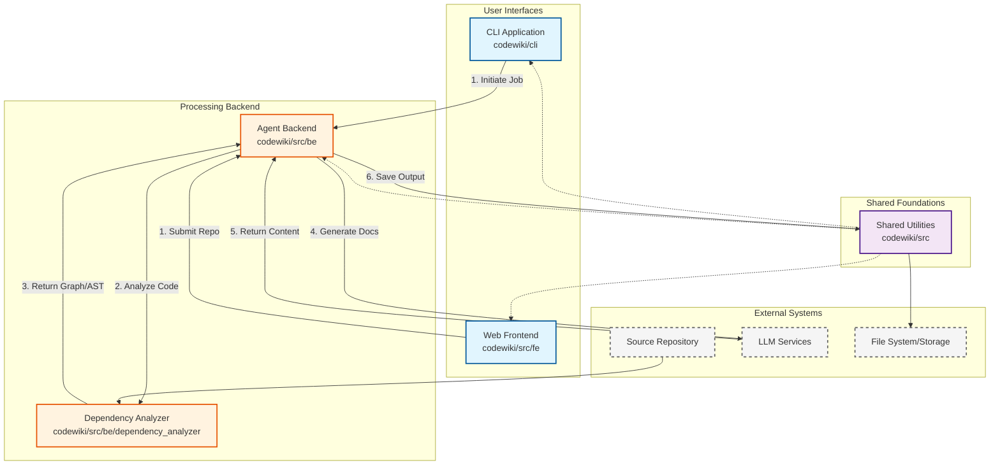

# CodeWiki Repository Overview

## Purpose

CodeWiki is an automated documentation generation system designed to transform code repositories into comprehensive, structured documentation using AI (Large Language Models). It bridges the gap between raw source code and human-readable documentation by analyzing code structure, mapping dependencies, and orchestrating AI agents to write detailed explanations.

The system supports multiple programming languages (Python, JavaScript, TypeScript, Java, C#, C, C++, PHP, Go) and provides both a Command Line Interface (CLI) for local development workflows and a Web Frontend for hosted services.

## End-to-End Architecture

The CodeWiki architecture is divided into three primary layers: **User Interfaces**, **Processing Backend**, and **Shared Foundations**.

## Core Modules Documentation

The repository is organized into the following core modules:

- **[CLI Application](CLI%20Application.md)**: Provides the command-line interface for users to configure settings, validate repositories, and trigger documentation generation jobs locally.
- **[Dependency Analyzer](Dependency%20Analyzer.md)**: The analytical engine responsible for parsing source code, extracting ASTs (Abstract Syntax Trees), and building dependency graphs to understand code structure.
- **[Agent Backend](Agent%20Backend.md)**: The core processing unit that orchestrates AI agents. It uses the dependency graph to cluster code into logical modules and interacts with LLMs to generate documentation text.
- **[Web Frontend](Web%20Frontend.md)**: A FastAPI-based web application that allows users to submit GitHub repositories for documentation generation and view the results via a web interface.
- **[Shared Utilities](Shared%20Utilities.md)**: Contains foundational components like `Config` (configuration management) and `FileManager` (I/O operations) used across all other modules.