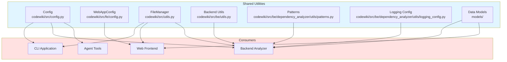
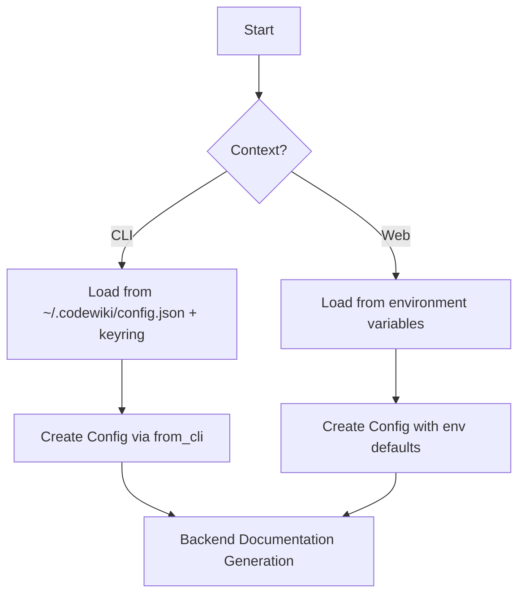

# Shared Utilities Module

## Overview

The **Shared Utilities** module provides common functionality, configuration, and utilities used across both the CLI and web frontend components of CodeWiki. It serves as the foundation layer that other modules depend on for consistent behavior and shared resources.

### Purpose

- **Centralized Configuration**: Unified configuration management for both CLI and web contexts
- **Common Utilities**: Shared file I/O, token counting, and validation functions
- **Data Models**: Pydantic and dataclass models for cross-module communication
- **Pattern Definitions**: Language-agnostic patterns for code analysis
- **Logging**: Colored logging configuration for better developer experience

### Key Features

- **Dual Context Support** - Works in both CLI and web application contexts
- **Environment-Based Configuration** - Uses environment variables with sensible defaults
- **Type Safety** - Heavy use of Pydantic models and Python type hints
- **Language Agnostic** - Supports 15+ programming languages for analysis

---

## Core Components

### 1. Config (`codewiki/src/config.py`)

The main configuration class used by the backend documentation generation system.

#### Key Attributes

| Attribute | Type | Default | Description |
|-----------|------|---------|-------------|
| `repo_path` | `str` | Required | Path to the repository being analyzed |
| `output_dir` | `str` | Required | Base output directory |
| `dependency_graph_dir` | `str` | Required | Directory for dependency graph files |
| `docs_dir` | `str` | Required | Directory for generated documentation |
| `max_depth` | `int` | `2` | Maximum depth for hierarchical decomposition |
| `llm_base_url` | `str` | `LLM_BASE_URL` env | LLM API base URL |
| `llm_api_key` | `str` | `LLM_API_KEY` env | LLM API key |
| `main_model` | `str` | `MAIN_MODEL` env | Primary model for documentation |
| `cluster_model` | `str` | `CLUSTER_MODEL` env | Model for module clustering |
| `fallback_model` | `str` | `FALLBACK_MODEL_1` | Fallback model when primary fails |
| `max_tokens` | `int` | `32768` | Maximum tokens for LLM response |
| `max_token_per_module` | `int` | `36369` | Maximum tokens per module for clustering |
| `max_token_per_leaf_module` | `int` | `16000` | Maximum tokens per leaf module |
| `agent_instructions` | `Optional[Dict]` | `None` | Custom agent instructions |

#### Factory Methods

| Method | Description |
|--------|-------------|
| `from_args(args)` | Create Config from argparse.Namespace |
| `from_cli(...)` | Create Config for CLI context with explicit parameters |

#### Agent Instructions Properties

| Property | Description |
|----------|-------------|
| `include_patterns` | File patterns to include (from agent_instructions) |
| `exclude_patterns` | File patterns to exclude (from agent_instructions) |
| `focus_modules` | Modules to focus on for detailed documentation |
| `doc_type` | Type of documentation to generate |
| `custom_instructions` | Free-form custom instructions |

### 2. WebAppConfig (`codewiki/src/fe/config.py`)

Configuration class for the web application frontend.

#### Key Attributes

| Attribute | Type | Default | Description |
|-----------|------|---------|-------------|
| `CACHE_DIR` | `str` | `"./output/cache"` | Directory for cached results |
| `TEMP_DIR` | `str` | `"./output/temp"` | Directory for temporary files |
| `OUTPUT_DIR` | `str` | `"./output"` | Base output directory |
| `QUEUE_SIZE` | `int` | `100` | Maximum job queue size |
| `CACHE_EXPIRY_DAYS` | `int` | `365` | Cache expiration in days |
| `JOB_CLEANUP_HOURS` | `int` | `24000` | Job cleanup interval in hours |
| `RETRY_COOLDOWN_MINUTES` | `int` | `3` | Retry cooldown period |
| `DEFAULT_HOST` | `str` | `"127.0.0.1"` | Default server host |
| `DEFAULT_PORT` | `int` | `8000` | Default server port |
| `CLONE_TIMEOUT` | `int` | `300` | Git clone timeout in seconds |
| `CLONE_DEPTH` | `int` | `1` | Git clone depth (shallow clone) |

### 3. FileManager (`codewiki/src/utils.py`)

Static utility class for file I/O operations.

#### Methods

| Method | Description |
|--------|-------------|
| `ensure_directory(path)` | Create directory if it doesn't exist |
| `save_json(data, filepath)` | Save data as JSON to file |
| `load_json(filepath)` | Load JSON from file, returns None if not exists |
| `save_text(content, filepath)` | Save text content to file |
| `load_text(filepath)` | Load text content from file |

### 4. Backend Utilities (`codewiki/src/be/utils.py`)

Utilities specific to the backend documentation generation.

#### Functions

| Function | Description |
|----------|-------------|
| `is_complex_module(components, core_component_ids)` | Check if a module spans multiple files |
| `count_tokens(text)` | Count tokens in text using tiktoken (GPT-4 encoding) |
| `validate_mermaid_diagrams(md_file_path, relative_path)` | Validate Mermaid diagrams in markdown files |
| `extract_mermaid_blocks(content)` | Extract mermaid code blocks from markdown |
| `validate_single_diagram(diagram_content, diagram_num, line_start)` | Validate a single mermaid diagram |

### 5. Pattern Definitions (`codewiki/src/be/dependency_analyzer/utils/patterns.py`)

Language-agnostic patterns for code analysis.

#### Key Constants

| Constant | Description |
|----------|-------------|
| `DEFAULT_IGNORE_PATTERNS` | Set of file/directory patterns to ignore during analysis |
| `DEFAULT_INCLUDE_PATTERNS` | List of file extensions to include |
| `CODE_EXTENSIONS` | Mapping of file extensions to language names |
| `ENTRY_POINT_PATTERNS` | Filename patterns for entry points (main.py, index.js, etc.) |
| `ENTRY_POINT_PATH_PATTERNS` | Path patterns for entry points (cmd/, src/, etc.) |
| `ENTRY_POINT_NAME_PATTERNS` | Partial name matches for entry points |
| `HIGH_CONNECTIVITY_PATTERNS` | Patterns for files likely to have many connections |
| `SOURCE_DIRECTORY_PATTERNS` | Common source directory patterns |
| `FUNCTION_DEFINITION_PATTERNS` | Language-specific function definition patterns |
| `CRITICAL_FUNCTION_NAMES` | Set of critical function names (main, init, run, etc.) |
| `EXPORT_PATTERNS` | Patterns for exported/public functions |
| `FALLBACK_PATTERNS` | Fallback patterns when standard detection fails |

#### Helper Functions

| Function | Description |
|----------|-------------|
| `get_function_patterns_for_language(language)` | Get function patterns for a specific language |
| `is_entry_point_file(filename)` | Check if filename matches entry point patterns |
| `is_entry_point_path(filepath)` | Check if path matches entry point patterns |
| `has_high_connectivity_potential(filename, filepath)` | Check if file likely has high connectivity |
| `is_critical_function(func_name, code_snippet)` | Check if function is critical |
| `find_fallback_entry_points(code_files, max_files)` | Find fallback entry points |
| `find_fallback_connectivity_files(code_files, max_files)` | Find fallback high-connectivity files |

### 6. Logging Configuration (`codewiki/src/be/dependency_analyzer/utils/logging_config.py`)

Colored logging setup for better developer experience.

#### Classes and Functions

| Name | Description |
|------|-------------|
| `ColoredFormatter` | Custom formatter with colored output for different log levels |
| `setup_logging(level)` | Set up colored logging for the entire application |
| `setup_module_logging(module_name, level)` | Set up colored logging for a specific module |

#### Color Scheme

| Level | Color |
|-------|-------|
| DEBUG | Blue |
| INFO | Cyan |
| WARNING | Yellow |
| ERROR | Red |
| CRITICAL | Bright Red |

### 7. Data Models

#### Core Models (`codewiki/src/be/dependency_analyzer/models/core.py`)

| Model | Description |
|-------|-------------|
| `Node` | Represents a code component (function, class, etc.) |
| `CallRelationship` | Represents a function call relationship |
| `Repository` | Represents a repository being analyzed |

#### Analysis Models (`codewiki/src/be/dependency_analyzer/models/analysis.py`)

| Model | Description |
|-------|-------------|
| `AnalysisResult` | Result of analyzing a repository |
| `NodeSelection` | Selected nodes for partial export |

#### Frontend Models (`codewiki/src/fe/models.py`)

| Model | Description |
|-------|-------------|
| `RepositorySubmission` | Pydantic model for repository submission form |
| `JobStatusResponse` | Pydantic model for job status API response |
| `JobStatus` | Dataclass tracking documentation generation job status |
| `CacheEntry` | Represents a cached documentation result |

---

## Architecture

### Module Dependencies



### Configuration Context Detection



---

## Constants Reference

### Path Constants (`codewiki/src/config.py`)

| Constant | Value | Description |
|----------|-------|-------------|
| `OUTPUT_BASE_DIR` | `'output'` | Base output directory |
| `DEPENDENCY_GRAPHS_DIR` | `'dependency_graphs'` | Dependency graphs subdirectory |
| `DOCS_DIR` | `'docs'` | Documentation subdirectory |
| `FIRST_MODULE_TREE_FILENAME` | `'first_module_tree.json'` | Initial module tree filename |
| `MODULE_TREE_FILENAME` | `'module_tree.json'` | Final module tree filename |
| `OVERVIEW_FILENAME` | `'overview.md'` | Overview documentation filename |

### Token Limits (`codewiki/src/config.py`)

| Constant | Value | Description |
|----------|-------|-------------|
| `MAX_DEPTH` | `2` | Default max depth for decomposition |
| `DEFAULT_MAX_TOKENS` | `32768` | Default max tokens for LLM response |
| `DEFAULT_MAX_TOKEN_PER_MODULE` | `36369` | Default max tokens per module |
| `DEFAULT_MAX_TOKEN_PER_LEAF_MODULE` | `16000` | Default max tokens per leaf module |

### Environment-Based Defaults (`codewiki/src/config.py`)

| Variable | Environment Variable | Default Value |
|----------|---------------------|---------------|
| `MAIN_MODEL` | `MAIN_MODEL` | `claude-sonnet-4` |
| `FALLBACK_MODEL_1` | `FALLBACK_MODEL_1` | `glm-4p5` |
| `CLUSTER_MODEL` | `CLUSTER_MODEL` | `MAIN_MODEL` value |
| `LLM_BASE_URL` | `LLM_BASE_URL` | `http://0.0.0.0:4000/` |
| `LLM_API_KEY` | `LLM_API_KEY` | `sk-1234` |

---

## Usage Examples

### Creating Configuration

```python
from codewiki.src.config import Config

# From CLI arguments
import argparse
parser = argparse.ArgumentParser()
parser.add_argument('--repo-path', required=True)
args = parser.parse_args(['--repo-path', '/path/to/repo'])

config = Config.from_args(args)
```

```python
# For CLI context with explicit parameters
config = Config.from_cli(
    repo_path="/path/to/repo",
    output_dir="./docs",
    llm_base_url="https://api.openai.com/v1",
    llm_api_key="sk-...",
    main_model="gpt-4",
    cluster_model="gpt-3.5-turbo",
    max_tokens=32768,
    agent_instructions={
        "include_patterns": ["*.py"],
        "exclude_patterns": ["*test*"],
        "doc_type": "api"
    }
)
```

### Using FileManager

```python
from codewiki.src.utils import file_manager

# Ensure directory exists
file_manager.ensure_directory("./output/docs")

# Save and load JSON
data = {"key": "value"}
file_manager.save_json(data, "./output/data.json")
loaded = file_manager.load_json("./output/data.json")

# Save and load text
file_manager.save_text("Hello World", "./output/hello.txt")
text = file_manager.load_text("./output/hello.txt")
```

### Counting Tokens

```python
from codewiki.src.be.utils import count_tokens

text = "This is some text to count tokens for."
token_count = count_tokens(text)  # Returns integer token count
```

### Setting Up Colored Logging

```python
import logging
from codewiki.src.be.dependency_analyzer.utils.logging_config import setup_logging, setup_module_logging

# Setup for entire application
setup_logging(level=logging.DEBUG)

# Setup for specific module
logger = setup_module_logging('my_module', level=logging.INFO)
logger.info("This will be displayed in cyan")
logger.warning("This will be displayed in yellow")
```

### Using Pattern Functions

```python
from codewiki.src.be.dependency_analyzer.utils.patterns import (
    is_entry_point_file,
    has_high_connectivity_potential,
    get_function_patterns_for_language
)

# Check if file is an entry point
is_entry = is_entry_point_file("main.py")  # True

# Check connectivity potential
has_connectivity = has_high_connectivity_potential(
    "router.py",
    "/path/to/src/router.py"
)  # True

# Get function patterns for a language
patterns = get_function_patterns_for_language("python")
# Returns: ["def {name}"]
```

---

## Integration Points

### Dependencies

The Shared Utilities module is used by:

| Module | Integration Point | Purpose |
|--------|------------------|---------|
| **[CLI Application](cli_application.md)** | `Config`, `FileManager` | Configuration and file operations |
| **[Agent Backend](agent_backend.md)** | `Config`, `count_tokens`, `validate_mermaid_diagrams` | Documentation generation |
| **[Dependency Analyzer](dependency_analyzer.md)** | `patterns`, `models`, `logging_config` | Code analysis |
| **[Web Frontend](web_frontend.md)** | `WebAppConfig`, `FileManager`, models | Web application |

---

## Summary

The Shared Utilities module provides the foundational layer for CodeWiki, offering:

- **Unified Configuration** - Consistent config across CLI and web contexts
- **Common Operations** - File I/O, token counting, validation
- **Language Support** - Patterns for 15+ programming languages
- **Developer Experience** - Colored logging and type-safe models

**Key Takeaways**:
- Configuration adapts to CLI or web context automatically
- FileManager provides simple, static file operations
- Pattern definitions enable language-agnostic code analysis
- Pydantic models ensure type safety across module boundaries

For details on CLI configuration management, see [Config Management](config_management.md). For web frontend configuration, see [Web Frontend](web_frontend.md).

---

<!-- ORACLE-ENHANCED
Generated by codebase-oracle to validate and enhance CodeWiki output.
Validation timestamp: 2026-02-12
Audience: new engineer, feature owner
Primary tasks: modify configuration, understand shared patterns
-->

## Oracle Validation

### Validation Status

| Section | Status | Notes |
|---------|--------|-------|
| Config (`codewiki/src/config.py`) | Validated | Dataclass with factory methods |
| WebAppConfig (`codewiki/src/fe/config.py`) | Validated | Class-based constants |
| FileManager (`codewiki/src/utils.py`) | Validated | Static utility class |
| Backend Utils (`codewiki/src/be/utils.py`) | Validated | Token counting, mermaid validation |
| Patterns (`codewiki/src/be/dependency_analyzer/utils/patterns.py`) | Validated | Language-agnostic patterns |
| Logging Config (`codewiki/src/be/dependency_analyzer/utils/logging_config.py`) | Validated | Colored formatter |
| Core Models (`codewiki/src/be/dependency_analyzer/models/core.py`) | Validated | Pydantic BaseModel |
| Analysis Models (`codewiki/src/be/dependency_analyzer/models/analysis.py`) | Validated | Pydantic BaseModel |
| Frontend Models (`codewiki/src/fe/models.py`) | Validated | Pydantic + dataclass |

### Claim Ledger

| Claim | Evidence | Confidence | Impact |
|-------|----------|------------|--------|
| Config uses `@dataclass` | `codewiki/src/config.py:46` | ▓▓▓▓▓ | Type safety, auto-generated methods |
| Config has CLI context detection | `codewiki/src/config.py:26-35` | ▓▓▓▓▓ | Dual-mode operation (CLI vs web) |
| Config provides `from_args` factory | `codewiki/src/config.py:129-146` | ▓▓▓▓▓ | argparse integration |
| Config provides `from_cli` factory | `codewiki/src/config.py:148-202` | ▓▓▓▓▓ | Explicit CLI configuration |
| Config has agent_instructions properties | `codewiki/src/config.py:67-100` | ▓▓▓▓▓ | Dynamic property access to nested dict |
| Config has `get_prompt_addition` method | `codewiki/src/config.py:102-127` | ▓▓▓▓▓ | Generates LLM prompt additions |
| WebAppConfig uses class variables | `codewiki/src/fe/config.py:10-34` | ▓▓▓▓▓ | Simple constant container |
| WebAppConfig has `ensure_directories` | `codewiki/src/fe/config.py:36-46` | ▓▓▓▓▓ | Directory initialization |
| FileManager uses `@staticmethod` | `codewiki/src/utils.py:10-44` | ▓▓▓▓▓ | No instance state required |
| FileManager has singleton instance | `codewiki/src/utils.py:45` | ▓▓▓▓▓ | Global access point |
| Backend utils use tiktoken for token counting | `codewiki/src/be/utils.py:30-38` | ▓▓▓▓▓ | GPT-4 encoding |
| Mermaid validation uses dual parsers | `codewiki/src/be/utils.py:145-185` | ▓▓▓▓▓ | Fallback from mermaid-parser-py to mermaid-py |
| Patterns module defines 140+ ignore patterns | `codewiki/src/be/dependency_analyzer/utils/patterns.py:10-140` | ▓▓▓▓▓ | Comprehensive file filtering |
| Patterns supports 15+ languages | `codewiki/src/be/dependency_analyzer/utils/patterns.py:178-202` | ▓▓▓▓▓ | Language-agnostic analysis |
| Entry point patterns cover 8+ languages | `codewiki/src/be/dependency_analyzer/utils/patterns.py:204-265` | ▓▓▓▓▓ | Multi-language entry detection |
| ColoredFormatter uses colorama | `codewiki/src/be/dependency_analyzer/utils/logging_config.py:29-32` | ▓▓▓▓▓ | Cross-platform color support |
| Core models use Pydantic BaseModel | `codewiki/src/be/dependency_analyzer/models/core.py:1-44` | ▓▓▓▓▓ | Validation and serialization |
| Node has 18 fields | `codewiki/src/be/dependency_analyzer/models/core.py:7-44` | ▓▓▓▓▓ | Comprehensive component representation |
| Frontend models mix Pydantic and dataclass | `codewiki/src/fe/models.py:9-55` | ▓▓▓▓▓ | API vs internal use |
| DEFAULT_MAX_TOKENS is 32768 | `codewiki/src/config.py:18` | ▓▓▓▓▓ | LLM response limit |
| DEFAULT_MAX_TOKEN_PER_MODULE is 36369 | `codewiki/src/config.py:19` | ▓▓▓▓▓ | Module clustering limit |
| DEFAULT_MAX_TOKEN_PER_LEAF_MODULE is 16000 | `codewiki/src/config.py:20` | ▓▓▓▓▓ | Leaf module limit |
| MAIN_MODEL defaults to 'claude-sonnet-4' | `codewiki/src/config.py:40` | ▓▓▓▓▓ | Primary LLM model |
| FALLBACK_MODEL_1 defaults to 'glm-4p5' | `codewiki/src/config.py:41` | ▓▓▓▓▓ | Fallback LLM model |
| dotenv loaded at module import | `codewiki/src/config.py:6-7` | ▓▓▓▓▓ | Environment variable support |

### Design Rationale and Trade-offs

**1. Dual Config Classes (Config vs WebAppConfig)**
- **Rationale**: CLI and web have different configuration needs
- **Trade-off**: Some duplication vs proper separation of concerns
- **Config**: Runtime configuration with LLM settings, paths, agent instructions
- **WebAppConfig**: Static constants for web server settings

**2. Dataclass vs Pydantic for Config**
- **Rationale**: Config uses `@dataclass` for simplicity; models use Pydantic for validation
- **Trade-off**: Less validation vs faster instantiation
- **Impact**: Config is created frequently; validation done at higher layers

**3. Static FileManager vs Instance Methods**
- **Rationale**: File operations are stateless
- **Trade-off**: Singleton pattern provides convenience but limits testability
- **Alternative**: Could use dependency injection for better testing

**4. Global tiktoken Encoder**
- **Rationale**: Encoder initialization is expensive; reuse across calls
- **Trade-off**: Global state vs performance
- **Location**: `codewiki/src/be/utils.py:30`

**5. Dual Mermaid Validation Parsers**
- **Rationale**: mermaid-parser-py is faster but may fail; mermaid-py is fallback
- **Trade-off**: Complexity vs reliability
- **Implementation**: Try/except with stderr redirection to suppress JS errors

### Failure Modes and Recovery

| Failure Mode | Cause | Recovery |
|--------------|-------|----------|
| Config file not found | First run or deleted | Use environment defaults or prompt user |
| Invalid JSON in config | Corruption | Catch JSONDecodeError, use defaults |
| tiktoken encoding failure | Unsupported model | Fallback to approximate token count |
| Mermaid parser segfault | Complex diagrams | Sequential validation, stderr suppression |
| Keyring unavailable | System not configured | Clear error message, guide user |
| Colorama init failure | Terminal doesn't support colors | Graceful degradation to plain text |

### Blast Radius and Safe Change Plan

**Changing Config defaults** (e.g., `DEFAULT_MAX_TOKENS`):
- **Blast Radius**: All documentation generation jobs
- **Safe Change**: Update constant, test with sample repos, monitor token usage
- **Rollback**: Revert constant value

**Adding new pattern to `DEFAULT_IGNORE_PATTERNS`**:
- **Blast Radius**: File discovery in dependency analyzer
- **Safe Change**: Add pattern, verify with test repos
- **Risk**: May exclude legitimate files

**Modifying Node model**:
- **Blast Radius**: All serialization/deserialization, database if persisted
- **Safe Change**: Add optional fields only, avoid renaming existing fields
- **Migration**: Pydantic handles missing fields gracefully

**Changing token limits**:
- **Blast Radius**: Module decomposition, LLM API costs
- **Safe Change**: Adjust incrementally, monitor API usage
- **Validation**: Ensure limits don't exceed LLM context windows

### Unknowns and Verification

| Unknown | Verification Method | Priority |
|---------|---------------------|----------|
| Are all CODE_EXTENSIONS actually supported? | Check analyzers in `codewiki/src/be/dependency_analyzer/analyzers/` | Medium |
| Does mermaid validation work offline? | Test without internet connection | Low |
| Are pattern constants used consistently? | Search for hardcoded patterns in analyzers | Medium |
| Is CLI context detection reliable? | Review usage in CLI entry points | Medium |
| Are token counts accurate for non-English? | Test with Unicode content | Low |

### Confidence Assessment

| Area | Confidence | Notes |
|------|------------|-------|
| Configuration structure | ▓▓▓▓▓ | Well-defined, documented |
| FileManager utilities | ▓▓▓▓▓ | Simple, well-tested patterns |
| Token counting | ▓▓▓▓░ | Depends on tiktoken, may not match actual LLM |
| Mermaid validation | ▓▓▓▓░ | Dual parser approach adds complexity |
| Pattern definitions | ▓▓▓▓▓ | Comprehensive, language-agnostic |
| Logging configuration | ▓▓▓▓▓ | Standard colorama usage |
| Data models | ▓▓▓▓▓ | Pydantic provides validation |
| Cross-module dependencies | ▓▓▓▓░ | Some implicit dependencies exist |

---

*Oracle Validation Complete*
